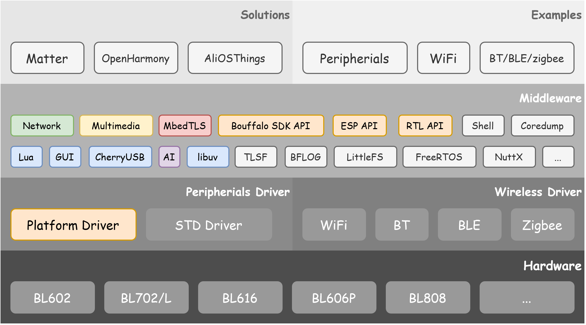

[](LICENSE)

[English Version](README.md)

# 简介

**BouffaloSDK** 是 Bouffalo Lab 提供的 IOT 和 MCU 软件开发包，支持博流智能所有系列芯片，也是 **bl_mcu_sdk** 和 **bl_iot_sdk** 的结合体。

# SDK 架构



# 代码目录

| 名称 | 描述|
|:---:|:------:|
| bsp/board |  包含时钟、引脚、内存管理和 console 的板级初始化 |
| bsp/common | 板级相关的常用外设驱动|
| components| 组件|
|docs | 快速上手、 api、demo 文档|
|drivers/lhal| 博流智能系列芯片通用外设驱动，支持所有系列芯片|
|drivers/soc| 博流智能系列芯片非通用外设驱动|
|drivers/rfparam| 射频参数配置|
|examples| 官方示例代码|
|tools| 工具 |

# LHAL 支持

**LHAL** 是博流为统一通用外设接口而设计的驱动库，代码精炼并且支持博流所有系列芯片，方便用户使用和移植到其他平台。

备注：**√** 表示已支持；**×** 表示未支持；**○** 表示已支持但未测试；**-** 表示没有该外设。

|   外设       |    BL602/BL604 |    BL702/BL704/BL706 | BL616/BL618 |   BL808  |
|:------------:|:--------------:|:--------------------:|:-----------:|:--------:|
|  ADC         |      ○         |      √             |   √           |   ○      |
|  CAM         |      -         |      √             |   √           |   √      |
|  CKS         |      ○         |      √             |   √           |   ○      |
|  CSI         |      -         |      -             |   -           |   √      |
|  DAC         |      ○         |      √             |   √           |   ○      |
|  DMA         |      ○         |      √             |   √           |   √      |
|  EFUSE       |      ×         |      √             |   √           |   √      |
|  EMAC        |      -         |      √             |   √           |   √      |
|  FLASH       |      √         |      √             |   √           |   √      |
|  GPIO        |      ○         |      √             |   √           |   √      |
|  I2C         |      ○         |      √             |   √           |   ○      |
|  I2S         |      ○         |      ○             |   √           |   ○      |
|  IR          |      ○         |      √             |   √           |   ○      |
|  MJPEG       |      ×         |      ×             |   √           |   √      |
|  PWM_v1      |      ○         |      √             |   -           |   -      |
|  PWM_v2      |      -         |      -             |   √           |   √      |
|  RTC         |      ○         |      √             |   √           |   √      |
|  SEC_AES     |      ○         |      √             |   √           |   √      |
|  SEC_SHA     |      ○         |      √             |   √           |   √      |
|  SEC_TRNG    |      ○         |      √             |   √           |   √      |
|  SEC_PKA     |      ○         |      √             |   √           |   √      |
|  SPI         |      ○         |      √             |   √           |   √      |
|  TIMER       |      ○         |      √             |   √           |   √      |
|  UART        |      √         |      √             |   √           |   √      |
|  USB_v1      |      -         |      √             |   -           |   -      |
|  USB_v2      |      -         |      -             |   √           |   √      |
|  WDG         |      ○         |      √             |   √           |   ○      |

# Wireless 支持

|   外设       |    BL602/BL604 |    BL702/BL704/BL706 | BL616/BL618 |   BL808  |
|:------------:|:--------------:|:--------------------:|:-----------:|:--------:|
|  WIFI4       |      ×         |      -             |   -           |   ×      |
|  WIFI6       |      -         |      -             |   √           |   -      |
|  BT          |      -         |      -             |   √          |   ×      |
|  BLE         |      ×         |      ×             |   √           |   ×      |
|  ZIGBEE      |      -         |      ×             |   ×           |   ×      |

备注：**√** 表示已支持；**×** 表示未支持；**○** 表示已支持但未测试；**-** 表示没有该外设。

# 环境搭建

## 工具链

- windows 下使用 [riscv64-unknown-elf-gcc](https://gitee.com/bouffalolab/toolchain_gcc_t-head_windows)
- Linux 下使用 [riscv64-unknown-elf-gcc](https://gitee.com/bouffalolab/toolchain_gcc_t-head_linux)
- T-HEAD 官方没有提供 macos toolchain, 需要自行编译，参考 [build_toolchain_macos](https://github.com/p4ddy1/pine_ox64/blob/main/build_toolchain_macos.md)
- 编译 linux 时使用 [linux-riscv64-linux-gcc](https://gitee.com/bouffalolab/linuxtoolchain_gcc_t-head)

## 命令行编译

在进行命令行编译之前，需要根据你的操作系统，选择对应的工具链，并配置到系统环境变量，并安装了 **make** 或者 **ninja** 工具，然后才能进行下面操作。更详细的搭建过程，参考 [BouffaloSDK 环境搭建](https://bl-mcu-sdk.readthedocs.io/zh_CN/latest/get_started/get_started.html).

- 进入要编译的 demo 目录，且该目录下有 `main.c` 和 `Makefile` 文件
- 执行下面命令即可,以 **BL616** 为例

```
cd examples/helloworld
make CHIP=bl616 BOARD=bl616dk
```

- 如果使用 **BL808** 或者 **BL606P** ,需要添加 **CPU_ID**

```
cd examples/helloworld
make CHIP=bl808 BOARD=bl808dk CPU_ID=m0
```

如果你想使用 **ninja** 编译，你可以尝试：

```
cd examples/helloworld
make ninja CHIP=bl616 BOARD=bl616dk
```

```
cd examples/helloworld
make ninja CHIP=bl808 BOARD=bl808dk CPU_ID=m0
```

## CDK 编译

TODO

## 调试

当前仅支持使用 CKLink 调试。详细参考 [BouffaloSDK 调试指南](https://bl-mcu-sdk.readthedocs.io/zh_CN/latest/get_started/eclipse.html)。

## 固件烧录

需要注意，如果使用的是 linux，linux 由于权限问题会拒绝访问串口设备，所以，为了方便后续使用，将你自己的用户名添加到 `dialout` 中。然后重启 linux 生效。或者在命令的前面加上 `sudo`。

```
sudo usermod -aG dialout xxx # xxx 是你自己的用户名
```

```
cd examples/helloworld
make flash CHIP=chip_name COMX=xxx # chip_name should be bl602/bl702/bl616/bl808/bl606p, COMX in Windows, /dev/ttyxxx in Linux
```

- 如果使用 **BL808** 或者 **BL606P** ,需要添加 **CPU_ID**

```
cd examples/helloworld
make flash CHIP=chip_name CPU_ID=m0 COMX=xxx # chip_name should be bl602/bl702/bl616/bl808/bl606p, COMX in Windows, /dev/ttyxxx in Linux
```

如果使用串口烧录而非 USB 烧录，不同的 USB2TTL 芯片支持的最高波特率不一样,烧录的时候需要注意。

| 芯片 | 波特率|
|:---:|:------:|
| ch340 |  <= 500K |
| cp2102 |  <= 2M |
| ft232 |  <= 2M |
| bl702 |  <= 8M |
| bl616 |  <= 10M |

### Flash Cube 使用文档

参考 [bouffalo_flash_cube doc](tools/bflb_tools/bouffalo_flash_cube/docs/FlashCube_User_Guide.pdf)

# 资源

## 芯片手册

芯片数据手册和参考手册见 [文档](https://github.com/bouffalolab/bl_docs)。

## 文档教程

获取更多 BouffaloSDK 开发相关的教程，如环境搭建、 api 手册、外设 demo 等，请参考：

- [BouffaloSDK 文档教程](https://bl-mcu-sdk.readthedocs.io/zh_CN/latest/)

## 视频教程

## LCD 支持列表

[LCD Support List](bsp/common/lcd/README.md)

## Cam Sensor 支持列表

[Cam Sensor Support List](bsp/common/image_sensor/README.md)

TODO

## 论坛

博流开发者交流论坛: [https://bbs.bouffalolab.com/](https://bbs.bouffalolab.com/)