=========
Overview
=========

This directory stores boot2 and mfg files, which are used by IOT functions.

\<version\> indicates the version number information, \<commit\> indicates the commit.

- boot2_bl616_isp_debug_<version>.bin: normal boot2 image with debug log.

- boot2_bl616_isp_release_<version>.bin: normal boot2 image without debug log.

- mfg_bl616_gu_<commit>_autoboot_<version>.bin: autoboot mfg image.

- mfg_bl616_gu_<commit>_<version>.bin: Non-autoboot mfg image.

=========
Instruction
=========

No Encryption or Sign
=====================

1. Copy the boot2_bl616_isp_debug_<version>.bin( or boot2_bl616_isp_release_<version>.bin) and mfg files to the ../config directory, and delete the previous boot2 and mfg files in that directory to make sure only one boot2 and mfg image.

.. code-block:: bash

    $ cp boot2_bl616_isp_release_<version>.bin mfg_bl616_gu_<commit>_<version>.bin ../config

2. Execute 'make' in the testcase directory, the updated bin files will be generated in the build/build_out directory.

.. code-block:: bash

    $ cd examples/wifi/sta/wifi_http
    $ make

Boot2 and APP use the same key
==============================

Encryption
----------

The boot2, APP firmware and mfg firmware use the same key. For example, the key is 12345678123456781234567812345678.

1. Copy the boot2_bl616_isp_debug_<version>.bin( or boot2_bl616_isp_release_<version>.bin) and mfg files to the ../config directory, and delete the previous boot2 and mfg files in that directory to make sure only one boot2 and mfg image.

.. code-block:: bash

    $ cp boot2_bl616_isp_release_<version>.bin mfg_bl616_gu_<commit>_<version>.bin ../config

2. Enter the testcase directory, and update the proj.conf file by adding the following content.

.. code-block:: bash

    $ cd examples/wifi/sta/wifi_http
    update proj.conf:
    set(CONFIG_AES_KEY 12345678123456781234567812345678)
    set(CONFIG_AES_IV 12345678123456781234567800000000)

3. Execute 'make' in the testcase directory.

.. code-block:: bash

    $ make

4. The updated bin files will be generated in the build/build_out directory.

The encrypted AES IV is stored in the header of the firmware and will be programmed to the flash along with the firmware.
The location of the AES IV in the firmware header is shown in the following figure.
The firmware header offset 0x100 location stores the 16-byte AES IV.

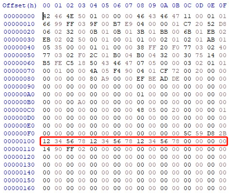

The comparison of the firmware content before and after encryption is shown in the following figure.
The left side is the plaintext of the firmware before encryption, and the right side is the ciphertext of the firmware after encryption.
The ciphertext on the right side is what is ultimately stored on the flash.

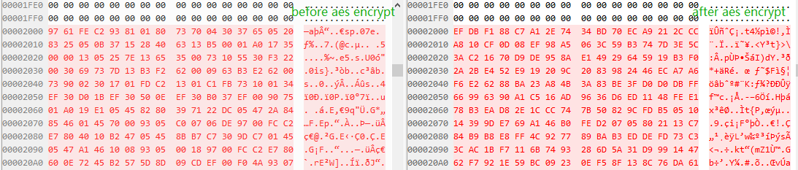

The AES key is stored in the chip's eFuse.
The bits [31:28] of 0xDC are '0001', which indicates that the APP uses the same key as boot2.
When the AES-128 mode is selected, a 16-byte key will be stored in the eFuse,
as shown in the figure below, the 16-byte key is stored at the 0x3C offset in the eFuse data.
To prevent the key from being maliciously obtained, the eFuse region storing the key can be set with read and write protection.

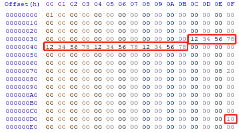

Sign
----

The boot2, APP firmware and mfg firmware use the same key.

1. Copy the boot2_bl616_isp_debug_<version>.bin( or boot2_bl616_isp_release_<version>.bin) and mfg files to the ../config directory, and delete the previous boot2 and mfg files in that directory to make sure only one boot2 and mfg image.

.. code-block:: bash

    $ cp boot2_bl616_isp_release_<version>.bin mfg_bl616_gu_<commit>_<version>.bin ../config

2. Enter the testcase directory, and update the proj.conf file by adding the following content.

.. code-block:: bash

    $ cd examples/wifi/sta/wifi_http
    update proj.conf:
    set(CONFIG_PUBLIC_KEY publickey_uecc.pem)
    set(CONFIG_PRIVATE_KEY privatekey_uecc.pem)

3. Execute 'make' in the testcase directory, You can sign both boot2 and firmwares together:

.. code-block:: bash

    $ make

4. The updated bin files will be generated in the build/build_out directory.

The content of the signed firmware itself has not changed, the main change is the addition of the public key and signature at the beginning of the firmware, as shown in the figure below.
The 64-byte public key is stored at the 0x100 offset address in the firmware header, and the 64-byte signature value is stored at the 0x148 offset address.

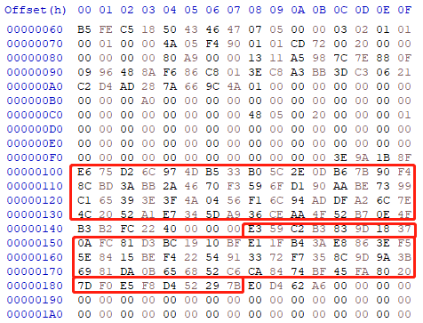

The public key hash is stored in the chip's eFuse. As shown in the figure, the bits [27:26] of 0xDC are '01', which indicates that the APP uses the same key as boot2.
The 32-byte public key hash is stored at the 0x1C offset address in the eFuse data.

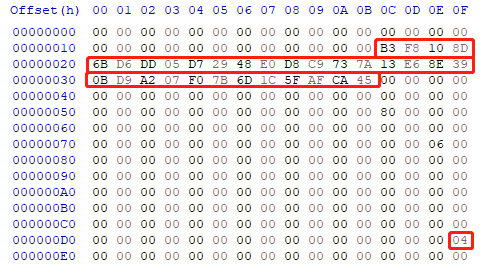

Encryption and Sign
-------------------

The boot2, APP firmware and mfg firmware use the same key.

1. Copy the boot2_bl616_isp_debug_<version>.bin( or boot2_bl616_isp_release_<version>.bin) and mfg files to the ../config directory, and delete the previous boot2 and mfg files in that directory to make sure only one boot2 and mfg image.

.. code-block:: bash

    $ cp boot2_bl616_isp_release_<version>.bin mfg_bl616_gu_<commit>_<version>.bin ../config

2. Enter the testcase directory, and update the proj.conf file by adding the following content.

.. code-block:: bash

    $ cd examples/wifi/sta/wifi_http
    update proj.conf:
    set(CONFIG_AES_KEY 12345678123456781234567812345678)
    set(CONFIG_AES_IV 12345678123456781234567800000000)
    set(CONFIG_PUBLIC_KEY publickey_uecc.pem)
    set(CONFIG_PRIVATE_KEY privatekey_uecc.pem)

3. Execute 'make' in testcase directory.

.. code-block:: bash

    $ make

4. The updated bin files will be generated in the build/build_out directory.
The public key, signature and the encrypted AES IV are stored in the header of the firmware and will be programmed to the flash along with the firmware.
The 64-byte public key is stored at the 0x100 offset address in the firmware header, and the 64-byte signature value is stored at the 0x148 offset address.
The 16-byte AES IV is stored at the 0x18C offset address.

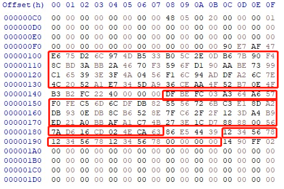

The public key hash and AES key are stored in the chip's eFuse. As shown in the figure:
The bits [31:28] of 0xDC are '0001', indicating that the APP uses the same key for encryption as boot2.
The bits [27:26] of 0xDC are '01', indicating that the APP uses the same key for signing as boot2.
The 32-byte public key hash is stored at the offset address 0x1C in the eFuse data.
The 16-byte key is stored at the offset 0x3C in the eFuse data. To prevent the key from being maliciously obtained, the eFuse region storing the key can be set with read and write protection.

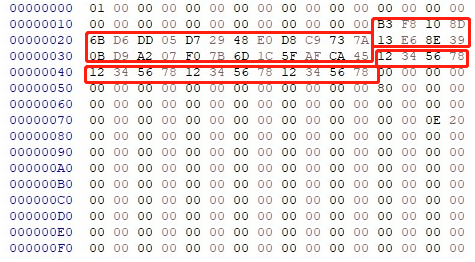

Boot2 and APP use individual keys
=================================

Encryption
----------

The boot2 and the firmware(APP or mfg) support the use of different keys.
For example, boot2 use the key is 12345678123456781234567812345678, firmware use the key is 0123456789ABCDEF0123456789ABCDEF.
Boot2 will set up the decryption setting with different key slot.

1. Copy the boot2_bl616_isp_debug_<version>.bin( or boot2_bl616_isp_release_<version>.bin) and mfg files to the ../config directory, and delete the previous boot2 and mfg files in that directory to make sure only one boot2 and mfg image.

.. code-block:: bash

    $ cp boot2_bl616_isp_release_<version>.bin mfg_bl616_gu_<commit>_<version>.bin ../config

1. Enter the testcase directory, and execute 'make' in testcase directory.

.. code-block:: bash

    $ cd examples/wifi/sta/wifi_http
    $ make

3. update the boot2 and firmwares.

.. code-block:: bash

    $ bflb_fw_post_proc.exe --chipname=bl616 --imgfile=build/build_out/boot2*.bin --key=12345678123456781234567812345678 --iv=12345678123456781234567800000000
    $ bflb_fw_post_proc.exe --chipname=bl616 --imgfile=build/build_out/wifi*.bin,build/build_out/mfg*.bin --key=0123456789ABCDEF0123456789ABCDEF --iv=0123456789ABCDEF1234567800000000 --appkeys=true --edatafile_in=build/build_out/efusedata.bin

4. The updated bin files will be generated in the build/build_out directory.

The encrypted AES IV are stored in the header of the firmware and will be programmed to the flash along with the firmware.
The boot2 header offset 0x100 location stores the 16-byte AES IV for boot2.
The firmware header offset 0x100 location stores the 16-byte AES IV for firmware.

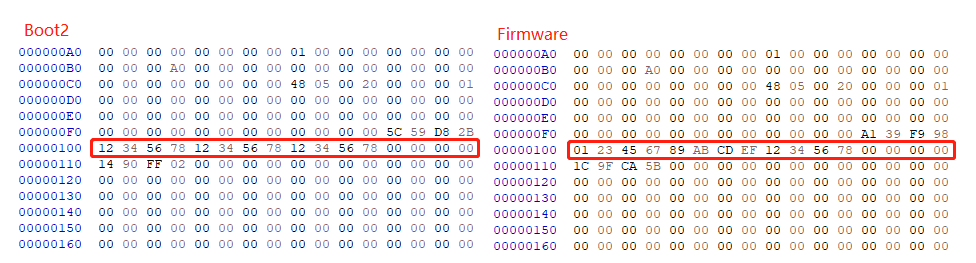

The AES key is stored in the chip's eFuse.
The bits [31:28] of 0xDC are '0010', indicating that the APP uses its own AES-128 encryption, which employs a different key than boot2.
As shown in the figure below, the 16-byte key for boot2 is stored at the 0x3C offset in the eFuse data.
The 16-byte key for APP firmware or mfg firmware is stored at the 0x4C offset in the eFuse data.
To prevent the key from being maliciously obtained, the eFuse region storing the key can be set with read and write protection.

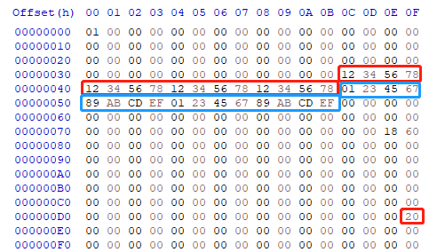

Sign
----

The boot2 and the firmware(APP or mfg) support the use of different keys.
Boot2 will use the app public key slot to verify APP firmware's signature.

1. Copy the boot2_bl616_isp_debug_<version>.bin( or boot2_bl616_isp_release_<version>.bin) and mfg files to the ../config directory, and delete the previous boot2 and mfg files in that directory to make sure only one boot2 and mfg image.

.. code-block:: bash

    $ cp boot2_bl616_isp_release_<version>.bin mfg_bl616_gu_<commit>_<version>.bin ../config

2. Enter the testcase directory, and execute 'make' in testcase directory.

.. code-block:: bash

    $ cd examples/wifi/sta/wifi_http
    $ make

3. update the boot2 and firmwares.

.. code-block:: bash

    $ bflb_fw_post_proc.exe --chipname=bl616 --imgfile=build/build_out/boot2*.bin --publickey=publickey_uecc.pem --privatekey=privatekey_uecc.pem
    $ bflb_fw_post_proc.exe --chipname=bl616 --imgfile=build/build_out/wifi*.bin,build/build_out/mfg*.bin --publickey=publickey_uecc_app.pem --privatekey=privatekey_uecc_app.pem --appkeys=true --edatafile_in=build/build_out/efusedata.bin

4. The updated bin files will be generated in the build/build_out directory

The content of the signed firmware itself has not changed, the main change is the addition of the public key and signature at the beginning of the firmware, as shown in the figure below.
The 64-byte public key is stored at the 0x100 offset address in the boot2(firmware) header, and the 64-byte signature value is stored at the 0x148 offset address.

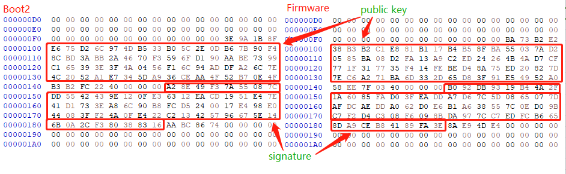

The public key hash is stored in the chip's eFuse. As shown in the figure,
The bits [27:26] of 0xDC are '10', indicating that the APP uses its own signing key, which employs a different key than boot2.
the 32-byte public key hash for boot2 is stored at the 0x1C offset address in the eFuse data,
the 32-byte public key hash for firmware is stored at the 0x1A0 offset address in the eFuse data.

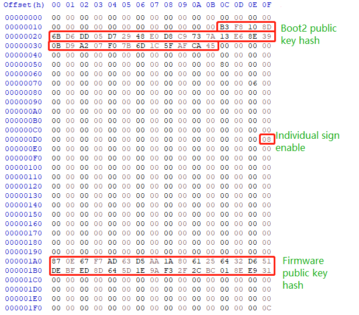

Encryption and Sign
-------------------

The boot2 and the firmware(APP or mfg) support the use of different AES key and public key.
Boot2 will set up the decryption setting with different key slot and use the app public key slot to verify APP firmware's signature.

1. Copy the boot2_bl616_isp_debug_<version>.bin( or boot2_bl616_isp_release_<version>.bin) and mfg files to the ../config directory, and delete the previous boot2 and mfg files in that directory to make sure only one boot2 and mfg image.

.. code-block:: bash

    $ cp boot2_bl616_isp_release_<version>.bin mfg_bl616_gu_<commit>_<version>.bin ../config

2. Enter the testcase directory, and execute 'make' in testcase directory.

.. code-block:: bash

    $ cd examples/wifi/sta/wifi_http
    $ make

3. update the boot2 and firmwares.

.. code-block:: bash

    $ bflb_fw_post_proc.exe --chipname=bl616 --imgfile=build/build_out/boot2*.bin --key=12345678123456781234567812345678 --iv=12345678123456781234567800000000 --publickey=publickey_uecc.pem --privatekey=privatekey_uecc.pem
    $ bflb_fw_post_proc.exe --chipname=bl616 --imgfile=build/build_out/wifi*.bin,build/build_out/mfg*.bin --key=0123456789ABCDEF0123456789ABCDEF --iv=0123456789ABCDEF1234567800000000 --publickey=publickey_uecc_app.pem --privatekey=privatekey_uecc_app.pem --appkeys=true --edatafile_in=build/build_out/efusedata.bin

4. The updated bin files will be generated in the build/build_out directory
The public key, signature and the encrypted AES IV are stored in the header of the firmware and will be programmed to the flash along with the firmware.
The 64-byte public key is stored at the 0x100 offset address in the boot2(firmware) header, and the 64-byte signature value is stored at the 0x148 offset address.
The 16-byte AES IV is stored at the 0x148 offset address.

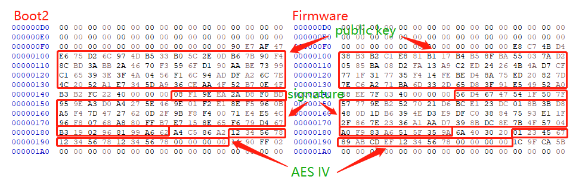

The public key hash and aes key are stored in the chip's eFuse. As shown in the figure,
The bits [31:28] of 0xDC are '0010', indicating that the APP uses its own AES-128 encryption, which employs a different key than boot2.
The bits [27:26] of 0xDC are '10', indicating that the APP uses its own signing key, which also employs a different key than boot2.
the 32-byte public key hash for boot2 is stored at the 0x1C offset,
the 16-byte aes key for boot2 is stored at the 0x3C offse.
The 32-byte public key hash for firmware is stored at the 0x1A0 offset address in the eFuse data,
the 16-byte aes key for firmware is stored at the 0x4C offse.

To prevent the key from being maliciously obtained, the eFuse region storing the key can be set with read and write protection.

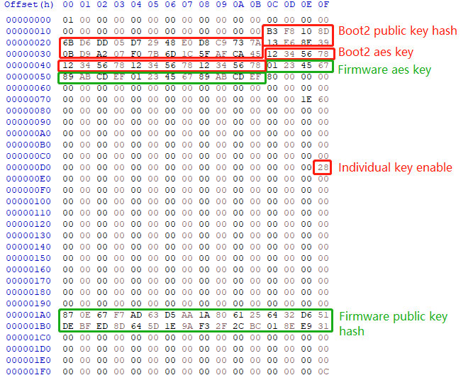

