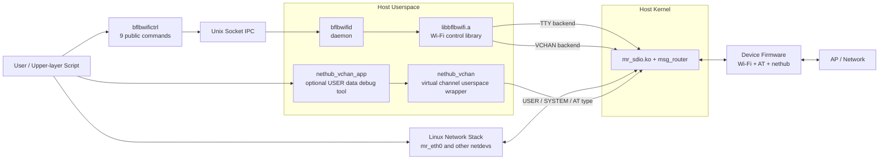
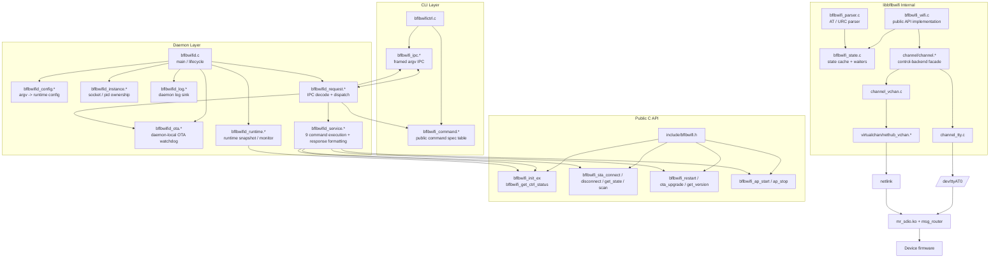

# NetHub Host Architecture Guide

This document only describes the host-side software architecture under
`bsp/common/msg_router/linux_host/userspace/nethub`.

It aims to clarify two things:

1. which modules end users actually see and what each one does
2. which interfaces programmers should use, plus the module boundaries and data
   flow

If you have not finished the basic bring-up yet, read these first:

- `examples/wifi/nethub/README.md`
- `bsp/common/msg_router/linux_host/userspace/nethub/README.md`

Online wiki:

- <https://docs.bouffalolab.com/index.php?title=NetHub>
- <https://docs.bouffalolab.com/index.php?title=NetHubArchitecture>

The current physical primary path is `SDIO`.
`tty / vchan` are runtime-selected control backends, but both are carried on the
same host link. `USER virtual channel` is also carried on this host link in
parallel with the control channel.

## 1. Design Goals

This host-side software solves three categories of problems:

- control plane
  - convert host-side Wi-Fi operations into AT / control messages for the
    device
- data plane
  - let the host use the device-side Wi-Fi connectivity through a netdev
- user extension channel
  - carry private user-space messages over virtual channel

Core principles:

- unified userspace build
- runtime control-backend selection
- fixed daemon / CLI command surface
- separation of data plane and control plane

## 2. User View Overview

### 2.1 Modules Users Actually Touch

| Module | Required | Purpose |
| --- | --- | --- |
| `build.sh` | Yes | build, load, and unload entry |
| `mr_sdio.ko` | Yes | host-kernel communication base |
| `bflbwifid` | Yes | unified control-plane entry |
| `bflbwifictrl` | Yes | manual operation or script entry |
| `nethub_vchan_app` | No | USER data-channel validation tool |

### 2.2 User-Facing Functions

- `connect_ap` / `disconnect` / `scan` / `status`
  - control device-side Wi-Fi through the daemon
- `version` / `reboot` / `ota`
  - device-management capabilities
- `start_ap` / `stop_ap`
  - SoftAP management
- host network access
  - uses the netdev data plane
- virtual-channel user data
  - uses `nethub_vchan`

### 2.3 Key Boundaries Users Should Understand

- `bflbwifid` only handles the control plane and does not forward IP data
- `tty` and `vchan` are control backends selected 2-of-1 at runtime
- both `tty` and `vchan` are always built in, and the real choice happens when
  the daemon starts
- `USER virtual channel`, like the control backends, is a logical channel on
  the current host link rather than an independent physical interface

## 3. Programmer View Overview

## 4. Module Boundaries and Interfaces

### 4.1 CLI Layer

Files:

- `bflbwifictrl/app/bflbwifictrl.c`
- `bflbwifictrl/app/bflbwifi_command.{c,h}`
- `bflbwifictrl/app/bflbwifi_ipc.{c,h}`

External responsibilities:

- expose the 9 public commands
- encode commands into framed argv IPC
- print daemon responses

It should not handle:

- backend selection
- Wi-Fi business logic
- TTY / VCHAN specific behavior

### 4.2 Daemon Layer

Files:

- `bflbwifictrl/app/bflbwifid.c`
- `bflbwifictrl/app/bflbwifid_config.{c,h}`
- `bflbwifictrl/app/bflbwifid_instance.{c,h}`
- `bflbwifictrl/app/bflbwifid_ota.{c,h}`
- `bflbwifictrl/app/bflbwifid_runtime.{c,h}`
- `bflbwifictrl/app/bflbwifid_request.{c,h}`
- `bflbwifictrl/app/bflbwifid_service.{c,h}`

External responsibilities:

- select the control backend
- manage socket / pid / log lifecycle
- monitor backend runtime state
- map IPC commands to the Wi-Fi control library
- isolate daemon-local OTA state through a single watchdog point

Internal interfaces:

- `bflbwifid_config_parse_argv()`
- `bflbwifid_instance_create_server()`
- `bflbwifid_refresh_runtime_state()`
- `bflbwifid_handle_client()`
- `bflbwifid_service_execute()`

### 4.3 libbflbwifi Public API

Header:

- `bflbwifictrl/include/bflbwifi.h`

The stable external capability surface is:

- initialization and backend status
  - `bflbwifi_ctrl_config_init()`
  - `bflbwifi_ctrl_config_use_tty()`
  - `bflbwifi_ctrl_config_use_vchan()`
  - `bflbwifi_init_ex()`
  - `bflbwifi_init()`, currently kept as a legacy TTY wrapper
  - `bflbwifi_get_ctrl_status()`
- STA
  - `bflbwifi_sta_connect()`
  - `bflbwifi_sta_disconnect()`
  - `bflbwifi_sta_get_state()`
  - `bflbwifi_scan()`
- device management
  - `bflbwifi_get_version()`
  - `bflbwifi_restart()`
  - `bflbwifi_ota_upgrade()`
- SoftAP
  - `bflbwifi_ap_start()`
  - `bflbwifi_ap_stop()`

### 4.4 Control Backend Layer

Internal interface file:

- `bflbwifictrl/src/channel/channel.h`

Current responsibilities:

- unify `tty` and `vchan` inside the library
- expose backend runtime state and capability
- provide a unified TX/RX interface to `bflbwifi_wifi.c`

Backend implementations:

- `channel_tty.c`
- `channel_vchan.c`

Supporting dependency:

- `virtualchan/nethub_vchan.{c,h}`

## 5. Key Data Flows

### 5.1 `connect_ap` Data Flow

1. The user runs `bflbwifictrl connect_ap <ssid> [password]`
2. The CLI validates arguments through `bflbwifi_command_*` and sends an IPC
   frame through `bflbwifi_ipc_send_request()`
3. The daemon unpacks the request in `bflbwifid_handle_client()`
4. `bflbwifid_request.c` checks whether the backend is available and whether OTA
   is holding exclusive ownership
5. `bflbwifid_service_execute()` directly calls the public API
   `bflbwifi_sta_connect()`
6. `libbflbwifi` sends AT commands through the `tty` or `vchan` backend
7. The device returns AT responses and URCs
8. `bflbwifi_parser.c` parses them and updates `bflbwifi_state.c`
9. The daemon assembles a text response and sends it back to the CLI

### 5.2 `status` Data Flow

1. The CLI sends `STATUS`
2. The daemon refreshes the runtime snapshot
3. `bflbwifi_get_ctrl_status()` returns backend type, link state, and OTA state
4. `bflbwifi_sta_get_state()` returns the Wi-Fi state
5. The daemon combines the output:
   - `DaemonState`
   - `Backend`
   - `BackendState`
   - `VchanHostState`, only shown for `vchan`
   - `OTA`
   - `State`
   - cached connection information

## 6. What Is Good About the Current Architecture

- userspace is now unified into a single build output instead of backend-split
  binaries
- backend choice is now runtime selection rather than a fake compile-time split
- responsibilities are mostly clear across CLI / daemon / library / vchan
- `status` can now observe daemon, backend, and Wi-Fi state together
- socket / pid / log paths are configurable, which helps system integration

## 7. Issues Still Worth Watching

- `bflbwifi_init()` still carries obvious TTY-oriented semantics
- the daemon no longer includes `src/bflbwifi_internal.h` directly; only the OTA
  watchdog still uses a small amount of non-public helper logic
- `channel.h` is still a full-feature backend abstraction; later it can be
  refined toward a model of base capabilities plus optional capabilities

These issues do not block current functionality, but they are the main
architectural debt to address in future iterations.
