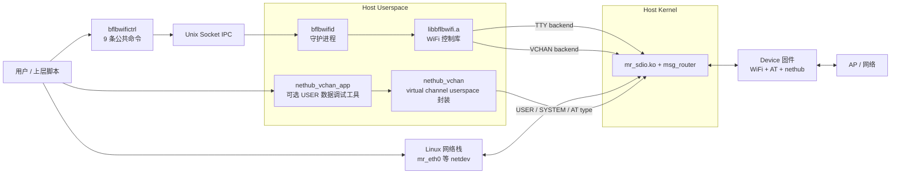
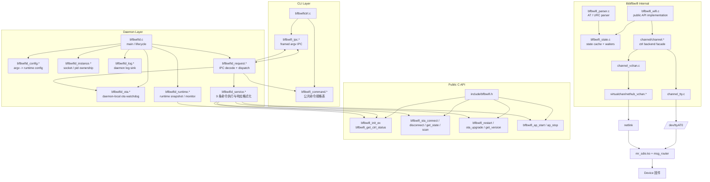

# NetHub Host 架构说明

本文只描述 `bsp/common/msg_router/linux_host/userspace/nethub` 的 host 侧软件架构。

目标是把两件事讲清楚：

1. 终端用户能看到哪些模块，分别有什么作用
2. 程序员应通过哪些接口使用这些模块，模块边界和数据流是什么

当前物理主路径是 `SDIO`。
`tty / vchan` 是运行时二选一的控制 backend，但它们都承载在同一条 host link 上；`USER virtual channel` 也承载在这条 host link 上，与控制通道并列。

## 1. 设计目标

这套 host 侧软件要解决三类问题：

- 控制面
  - 把 host 上层的 WiFi 操作转换成 device 侧 AT/控制消息
- 数据面
  - 让 host 通过 netdev 使用 device 侧 WiFi 联网能力
- 用户扩展通道
  - 通过 virtual channel 承载用户态私有消息

核心原则：

- userspace 统一构建
- control backend 运行时选择
- daemon / CLI 命令面固定
- 数据面与控制面分离

## 2. 用户视角总览

### 2.1 用户真正会接触到的模块

| 模块 | 是否必须 | 作用 |
|------|----------|------|
| `build.sh` | 是 | 编译、装载、卸载入口 |
| `mr_sdio.ko` | 是 | host kernel 通信底座 |
| `bflbwifid` | 是 | 统一控制面入口 |
| `bflbwifictrl` | 是 | 人工操作或脚本调用入口 |
| `nethub_vchan_app` | 否 | USER 数据通道验证工具 |

### 2.2 用户视角下的功能点

- `connect_ap` / `disconnect` / `scan` / `status`
  - 通过 daemon 控制 device 侧 WiFi
- `version` / `reboot` / `ota`
  - 设备管理类能力
- `start_ap` / `stop_ap`
  - SoftAP 管理
- host 网络访问
  - 走 netdev 数据面
- virtual channel 用户数据
  - 走 `nethub_vchan`

### 2.3 用户要理解的关键边界

- `bflbwifid` 只负责控制面，不转发 IP 数据
- `tty` 和 `vchan` 是 control backend，两者是运行时 2 选 1
- `tty` 和 `vchan` 都在构建阶段统一编入，真正的选择发生在 daemon 运行时
- `USER virtual channel` 和控制 backend 一样，都是当前 host link 上的逻辑通道，不是独立物理接口

## 3. 程序员视角总览

## 4. 模块边界与接口

### 4.1 CLI 层

文件：

- `bflbwifictrl/app/bflbwifictrl.c`
- `bflbwifictrl/app/bflbwifi_command.{c,h}`
- `bflbwifictrl/app/bflbwifi_ipc.{c,h}`

对外职责：

- 提供 9 条公共命令
- 将命令编码成 framed argv IPC
- 打印 daemon 返回结果

不应承担：

- backend 选择
- WiFi 业务逻辑
- TTY / VCHAN 差异处理

### 4.2 daemon 层

文件：

- `bflbwifictrl/app/bflbwifid.c`
- `bflbwifictrl/app/bflbwifid_config.{c,h}`
- `bflbwifictrl/app/bflbwifid_instance.{c,h}`
- `bflbwifictrl/app/bflbwifid_ota.{c,h}`
- `bflbwifictrl/app/bflbwifid_runtime.{c,h}`
- `bflbwifictrl/app/bflbwifid_request.{c,h}`
- `bflbwifictrl/app/bflbwifid_service.{c,h}`

对外职责：

- 选择 control backend
- 管理 socket / pid / log 生命周期
- 监控 backend 运行态
- 把 IPC 命令映射到 WiFi 控制库
- 用单点 OTA 看门狗隔离 daemon 与 OTA 私有状态

内部接口：

- `bflbwifid_config_parse_argv()`
- `bflbwifid_instance_create_server()`
- `bflbwifid_refresh_runtime_state()`
- `bflbwifid_handle_client()`
- `bflbwifid_service_execute()`

### 4.3 libbflbwifi 公共 API

头文件：

- `bflbwifictrl/include/bflbwifi.h`

当前面向外部客户的稳定能力：

- 初始化与 backend 状态
  - `bflbwifi_ctrl_config_init()`
  - `bflbwifi_ctrl_config_use_tty()`
  - `bflbwifi_ctrl_config_use_vchan()`
  - `bflbwifi_init_ex()`
  - `bflbwifi_init()`，当前仍保留为 legacy TTY 包装
  - `bflbwifi_get_ctrl_status()`
- STA
  - `bflbwifi_sta_connect()`
  - `bflbwifi_sta_disconnect()`
  - `bflbwifi_sta_get_state()`
  - `bflbwifi_scan()`
- 设备管理
  - `bflbwifi_get_version()`
  - `bflbwifi_restart()`
  - `bflbwifi_ota_upgrade()`
- SoftAP
  - `bflbwifi_ap_start()`
  - `bflbwifi_ap_stop()`

### 4.4 ctrl backend 层

内部接口文件：

- `bflbwifictrl/src/channel/channel.h`

当前职责：

- 在库内部统一 `tty` 与 `vchan`
- 暴露 backend 运行态与 capability
- 向 `bflbwifi_wifi.c` 提供统一收发接口

backend 实现：

- `channel_tty.c`
- `channel_vchan.c`

配套依赖：

- `virtualchan/nethub_vchan.{c,h}`

## 5. 关键数据流

### 5.1 `connect_ap` 数据流

1. 用户执行 `bflbwifictrl connect_ap <ssid> [password]`
2. CLI 使用 `bflbwifi_command_*` 校验参数，并用 `bflbwifi_ipc_send_request()` 发送 IPC 帧
3. daemon 在 `bflbwifid_handle_client()` 中解包请求
4. `bflbwifid_request.c` 检查 backend 是否可用、是否处于 OTA 独占期
5. `bflbwifid_service_execute()` 直接调用 public API `bflbwifi_sta_connect()`
6. `libbflbwifi` 通过 `tty` 或 `vchan` backend 下发 AT 指令
7. device 侧返回 AT 响应和 URC
8. `bflbwifi_parser.c` 解析响应并更新 `bflbwifi_state.c`
9. daemon 组装文本响应并回给 CLI

### 5.2 `status` 数据流

1. CLI 发起 `STATUS`
2. daemon 刷新 runtime snapshot
3. `bflbwifi_get_ctrl_status()` 返回 backend 类型、链路态、OTA 状态
4. `bflbwifi_sta_get_state()` 返回 WiFi 状态
5. daemon 组合输出：
   - `DaemonState`
   - `Backend`
   - `BackendState`
   - `VchanHostState`，仅 `vchan` 时显示
   - `OTA`
   - `State`
   - 已缓存连接信息

## 6. 当前架构的合理点

- userspace 已统一成单一产物，不再按 backend 分叉二进制名
- backend 已变成 runtime 选择，而不是编译期假选择
- CLI / daemon / lib / vchan 四层职责基本清晰
- `status` 已能同时观察 daemon、backend、WiFi 三个维度
- socket / pid / log 路径已配置化，便于不同系统集成

## 7. 当前仍需注意的点

- `bflbwifi_init()` 仍带有明显 TTY 语义
- daemon 已不再直接包含 `src/bflbwifi_internal.h`，当前只剩 OTA 看门狗单点使用少量非 public helper
- `channel.h` 当前仍是“全功能 backend 抽象”，后续可以继续朝“基础能力 + 可选能力”模型收敛

这些问题不影响当前功能使用，但属于后续继续演进时应优先处理的架构债务。
