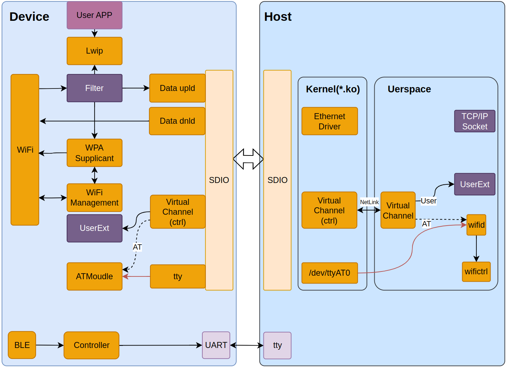
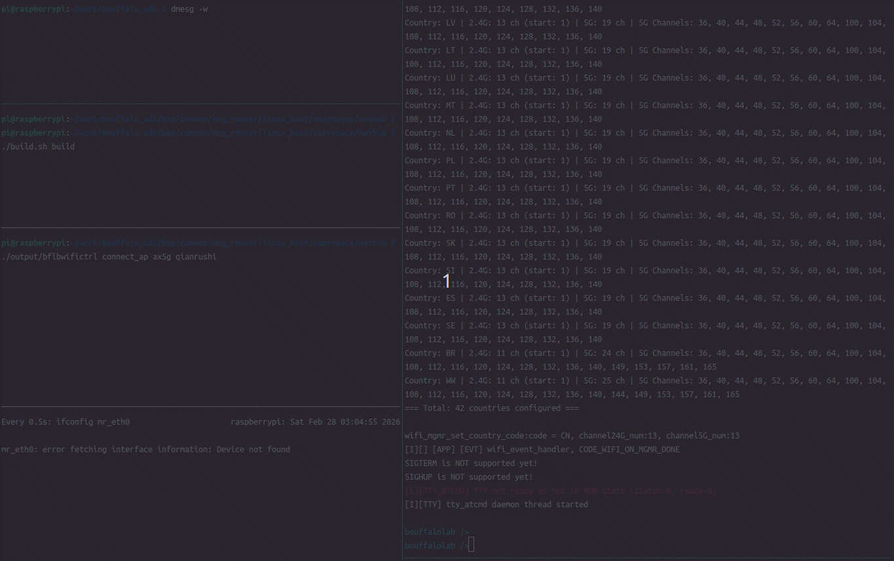

# NetHub Linux Host Solution

Linux host communication solution for Bouffalo Lab chips (BL616C/BL618M/BL618DG/BL616CL), providing kernel modules and userspace control tools.

## Table of Contents

- [1. System Architecture](#1-system-architecture)
- [2. Quick Start](#2-quick-start)
- [3. Development Guide](#3-development-guide)
- [4. FAQ](#4-faq)

## 1. System Architecture



**Note**: The control channel is currently transmitted via TTY. VirtualChannel support for AT command transmission will be added in the future.

### 1.1 Component Overview

| Component | Space | Description |
|-----------|-------|-------------|
| bflbwifictrl | Userspace | Command-line tool, communicates with daemon via Unix Socket |
| bflbwifid | Userspace | Daemon responsible for device communication and WiFi connection management |
| libbflbwifi | Userspace | Static library providing WiFi control APIs |
| nethub_vchan_app | Userspace | VirtualChannel communication program providing private data channel (message packet transmission, non-stream) |
| mr_sdio.ko | Kernelspace | Kernel driver module supporting SDIO interface |

### 1.2 Data Flow

```
User Command:
bflbwifictrl → bflbwifid → libbflbwifi → /dev/ttyAT → Kernel Driver → Device

URC Event:
Device → Kernel Driver → /dev/ttyAT → bflbwifid → Parse & Process → Network Interface Configuration

Workflow:
Load Kernel Module → Start Daemon → TTY Communication Established → Ready
```

## 2. Quick Start



This demo shows the complete workflow: Build → Load kernel module → Start daemon → WiFi connection → Network communication → Message exchange.

### 2.1 Build and Load Kernel Module

```bash
cd nethub/
./build.sh build
sudo ./build.sh load
```

### 2.2 Run WiFi Daemon

```bash
# Start daemon (default: /dev/ttyAT0)
sudo ./output/bflbwifid -p /dev/ttyAT0

# Or view help
sudo ./output/bflbwifid -h
```

### 2.3 Use WiFi Control Tool

```bash
# Scan APs
sudo ./output/bflbwifictrl scan

# Connect to AP (no password)
sudo ./output/bflbwifictrl connect_ap "SSID"

# Connect to AP (with password)
sudo ./output/bflbwifictrl connect_ap "SSID" "password"

# View status
sudo ./output/bflbwifictrl status

# Disconnect
sudo ./output/bflbwifictrl disconnect
```

## 3. Development Guide

### 3.1 System Requirements

- **Kernel Version**: Linux 3.7+ (required for kernel module)
- **Architecture**: x86_64, ARMv7 (Raspberry Pi), ARMv8 (Raspberry Pi 4/5)
- **Dependencies**: gcc, make, libc, pthread

**Compatibility Notes**:
- ✅ Userspace programs (bflbwifid/bflbwifictrl): No kernel version limitation
- ✅ Kernel module (mr_sdio.ko): Supports Linux 3.7+
- ✅ Tested: Linux raspberrypi 6.12.25+rpt-rpi-v8

### 3.2 Command Reference

#### build.sh Commands

| Command | Description |
|---------|-------------|
| `build` | Build kernel module, virtualchan, and bflbwifictrl |
| `clean` | Clean all build artifacts |
| `load` | Load kernel module `mr_sdio.ko` |
| `unload` | Unload kernel module |

#### bflbwifictrl Commands

| Command | Description |
|---------|-------------|
| `scan` | Scan nearby APs |
| `connect_ap <SSID> [password]` | Connect to AP |
| `disconnect` | Disconnect |
| `status` | View connection status |
| `version` | View firmware version |

### 3.3 Features

#### bflbwifid (Daemon)

- **TTY Communication**: Communicate with WiFi module via serial port
- **AT Protocol**: Parse and encapsulate AT commands
- **State Management**: Maintain WiFi connection state
- **Unix Socket**: Provide IPC communication interface
- **GOTIP Auto-Configuration** (Optional): Automatically configure Linux network interface when IP is obtained

#### bflbwifictrl (CLI Tool)

- **CLI Interface**: Communicate with daemon via Unix Socket
- **Easy to Use**: Provide common WiFi operation commands
- **Status Query**: Real-time connection information display

#### GOTIP Auto-Configuration Feature (Enabled by Default)

When WiFi module obtains IP, it will automatically:
1. Parse URC: `+CW:GOTIP,IP:xxx,gw:xxx,mask:xxx,dns:xxx`
2. Configure network interface: `ip addr add`, `ip route add default`
3. Configure DNS: Write to `/etc/resolv.conf`

**Notes**:
- Some hosts may need to disable NetworkManager: `sudo systemctl disable --now NetworkManager`
- Need to disable dhcpcd: `sudo systemctl disable --now dhcpcd`
- Default network interface name is `mr_eth0` (can be modified in code)

### 3.4 Code Modification and Compilation

#### Rebuild After Code Changes

```bash
# Build bflbwifictrl only
cd bflbwifictrl
make clean && make

# Or use build.sh to build all
cd ..
./build.sh build
```

#### Reload Kernel Module

```bash
sudo ./build.sh unload
sudo ./build.sh load
```

## 4. FAQ

### 4.1 Cannot Find Serial Device

```bash
# View available serial ports
ls /dev/ttyACM* /dev/ttyUSB*

# Add user to dialout group (avoid sudo every time)
sudo usermod -aG dialout $USER
# Then re-login
```

### 4.2 IP Configuration Disappears Automatically

**Cause**: NetworkManager or dhcpcd overwrites manual configuration.

**Solution**:
```bash
# Disable NetworkManager
sudo systemctl stop NetworkManager
sudo systemctl disable NetworkManager

# Disable dhcpcd
sudo systemctl stop dhcpcd
sudo systemctl disable dhcpcd
```

### 4.3 View Debug Logs

```bash
# View daemon logs
tail -f /var/log/bflbwifi.log

# View kernel logs
dmesg -w

# Run daemon in foreground (view real-time output)
sudo ./output/bflbwifid -p /dev/ttyAT0 --foreground
```

### 4.4 Build Errors

```bash
# Ensure necessary development packages are installed
sudo apt-get install build-essential libc-dev-i386

# Raspberry Pi needs 32-bit compatibility libraries
sudo apt-get install libc6:i386 libstdc++6:i386
```
