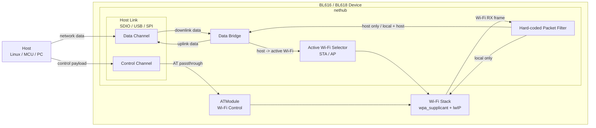
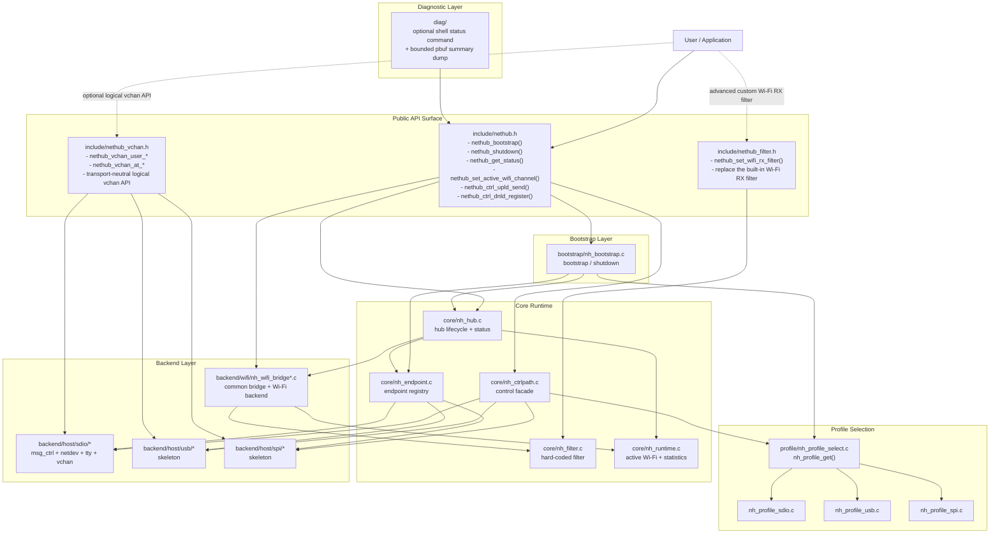

# NetHub Device Architecture Guide

This document describes the active device-side NetHub architecture.

If your goal is quick bring-up, start with:

- `examples/wifi/nethub/README.md`
- `examples/wifi/nethub/docs/NetHubQuickBringup.md`
- `components/net/nethub/README.md`

Online wiki:

- <https://docs.bouffalolab.com/index.php?title=NetHub>
- <https://docs.bouffalolab.com/index.php?title=NetHubArchitecture>

## 1. Goals

`nethub` targets device-side Wi-Fi bridging scenarios on Wi-Fi SoCs such as
`BL616 / BL618 / BL616CL / BL618DG`:

- the device runs `Wi-Fi backend (fhost / wl80211) + lwIP`
- the host communicates with the device over one interface chosen from
  `SDIO / USB / SPI`
- `nethub` only bridges Wi-Fi data onto the host link and does not implement
  the Wi-Fi protocol stack itself
- Wi-Fi control operations use a dedicated logical control channel carried on
  the current host link and forwarded to `ATModule`

The current primary path is `SDIO`. `USB / SPI` already have profile and backend
skeletons, but still need complete implementations.

## 2. Architecture Diagrams

### 2.1 Functional View

This diagram is for product users and customers. It answers what NetHub does on
the device side today.

From a functional perspective, `nethub` only does four things:

- maintain the `Wi-Fi <-> HostLink` data bridge
- use a hard-coded filter to decide whether a packet is `local`, `host`, or
  `both`
- maintain the currently active Wi-Fi selection, `STA / AP`
- provide a parallel logical control channel on the same host link and forward
  Wi-Fi control requests to `ATModule`

For customers, the current solution can be understood as:

- data plane primary path: `Wi-Fi <-> SDIO`
- control plane: the logical control channel on the host link
- private extension data: the `USER virtual channel` on the host link

### 2.2 Technical / API View

This diagram is for developers. It answers where the public APIs are, how the
internal modules are assembled, and how calls flow through the stack.

Developers usually depend directly on these three public headers:

- `include/nethub.h`
- `include/nethub_vchan.h` when host-link logical virtual channel support is
  needed
- `include/nethub_filter.h` when the built-in Wi-Fi RX filter must be fully
  replaced

`include/nethub_defs.h` should only be included directly when shared public
 types are needed. Most integrations do not need it.

Everything else in `core/ profile/ backend/ bootstrap/ diag/` should be treated
as internal implementation details and should not be referenced directly by
application code.

## 3. Current Architecture

### 3.1 Data Plane

The current data plane is a fixed topology, not a generic rule engine:

- `WiFi(STA/AP) -> Filter -> HostLink`
- `HostLink -> Active WiFi(STA or AP)`

Where:

- `HostLink` is selected by the active `CONFIG_NETHUB_PROFILE_*`; the default
  profile is currently `SDIO`
- `Active WiFi` is switched between `STA/AP` by
  `nethub_set_active_wifi_channel()`
- the hard-coded filter decides whether a packet is:
  - local only
  - host only
  - local + host
  - dropped directly
- `nethub_bootstrap()` does not branch directly on `SDIO/USB/SPI`; it uses
  `nh_profile_get()` to select the currently enabled `CONFIG_NETHUB_PROFILE_*`

### 3.2 Control Plane

The control plane does not go through the data routing core, but it is not a
separate physical interface. It is a parallel logical channel carried on the
current `SDIO / USB / SPI` host link:

- `Host Control Payload -> HostLink Control Channel -> nethub_ctrl_* -> ATModule`

This keeps data bridging and Wi-Fi control logically decoupled while still
reusing the same host link. If the host link changes later, the Wi-Fi control
semantics do not need to change.

## 4. Directory Responsibilities

- `include/`
  - external API surface, only stable public headers remain
  - `nethub.h`: bootstrap entry, control-plane API, and status query API
  - `nethub_vchan.h`: host-link logical virtual channel API
  - `nethub_filter.h`: entry for advanced users replacing the Wi-Fi RX filter
  - `nethub_defs.h`: public types
  - no legacy compatibility header shells are kept anymore
- `core/`
  - hub lifecycle
  - endpoint registration and lookup
  - fixed forwarding decisions
  - filter
  - runtime state aggregation such as active Wi-Fi channel and statistics
  - private packet-filter identification helpers
- `profile/`
  - hard-coded product topology
  - host link type selection
  - static Wi-Fi RX filter policy tables
  - host endpoint and ctrlpath assembly description
  - control-channel backend selection
  - currently provides `sdio_bridge / usb_bridge / spi_bridge`
- `backend/wifi/`
  - `nh_wifi_bridge.c`: shared bridge logic, filter integration, hub forwarding,
    statistics, and `STA/AP` selection
  - `nh_wifi_backend_wl80211.c`: `CONFIG_WL80211` platform integration
  - `nh_wifi_backend_fhost.c`: `fhost` platform integration
- `backend/host/sdio/`
  - SDIO `msg_ctrl / netdev / tty / virtualchan`
  - the current SDIO host backend is already fully internalized into `nethub`
- `backend/host/usb/`
  - USB host backend skeleton
  - currently an architectural placeholder; later it should expose the same
    `nethub_vchan_*` public API family
- `backend/host/spi/`
  - SPI host backend skeleton
  - currently an architectural placeholder; later it should expose the same
    `nethub_vchan_*` public API family
- `bootstrap/`
  - startup assembly entry
  - registers endpoints for the current profile and starts the hub lifecycle
- `diag/`
  - internal diagnostic helpers
  - currently includes an optional shell status command built on
    `nethub_get_status()`
  - also includes the internal `pbuf` summary dump helper used for Wi-Fi bridge
    debugging

## 5. Current Public Interfaces

Only the following facade APIs remain public:

- `nethub_bootstrap()` / `nethub_shutdown()`
- `nethub_get_status()`
- `nethub_ctrl_upld_send()` / `nethub_ctrl_dnld_register()`
  - semantically the logical control channel on the host link, not a separate
    physical channel
- `nethub_set_active_wifi_channel()`
- `nethub_set_wifi_rx_filter()`
  - `NULL` restores the built-in filter
  - non-`NULL` fully replaces the built-in Wi-Fi RX filter
  - must be called before `nethub_bootstrap()`
  - after replacement, the customer must handle traffic that used to be covered
    by the built-in filter
- `nethub_vchan_user_*()` / `nethub_vchan_at_*()`
  - semantically also logical channels on the host link, so the public API must
    not be tied to a single physical interface

The recommended public headers to include directly are:

- `nethub.h`
- `nethub_vchan.h`
- `nethub_filter.h` only for advanced custom filter scenarios

The shell diagnostic command and `pbuf` summary dump under `diag/` are internal
helpers only and are not part of the public API surface.

If your goal is customer integration or quick bring-up, start with:

- `examples/wifi/nethub/README.md`
- `components/net/nethub/README.md`

If your goal is customer sharing or online reference, see:

- `examples/wifi/nethub/docs/NetHub.md`
- `examples/wifi/nethub/docs/NetHubArchitecture.md`

## 6. Explicitly Out of Scope

This phase does not handle:

- product-level arbitration when `SDIO / USB / SPI` are enabled together
- a generic dynamic rule table
- topologies with multiple host links active at the same time

The current implementation only guarantees:

- clear architecture boundaries
- a working SDIO solution
- compile-safe USB/SPI skeletons that can be extended later

## 7. Current Repository Position

- `components/net/nethub` is the active implementation
- this module directly contains the public headers, forwarding core, profile,
  bootstrap, and host/Wi-Fi backends
- future evolution should continue in this directory rather than splitting into
  parallel old/new implementations

## 8. Recommended Refactoring Order

Continue in this order:

1. complete `USB/SPI` backend boundaries to match `SDIO`
2. continue refactoring `ctrlpath` from the current backend facade toward a
   unified host-link abstraction
3. refine Wi-Fi RX filter coverage for more packet classes if products need it
4. only then consider a product strategy where multiple interfaces are compiled
   together but selected 2-of-1 at runtime
