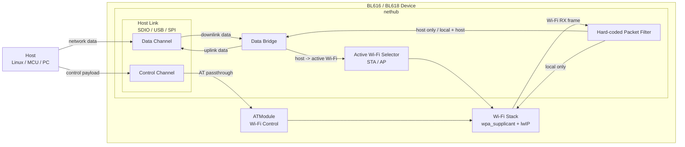
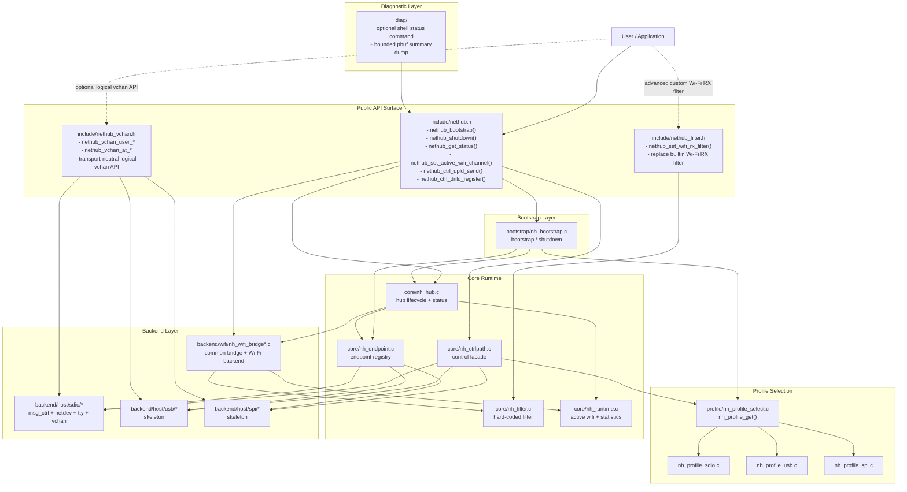

# NetHub Device 架构说明

本文档描述当前生效的 device 侧 NetHub 架构。

如果目标是快速 bringup，请优先阅读：

- `examples/wifi/nethub/README.md`
- `components/net/nethub/README.md`

## 1. 目标

`nethub` 面向 `BL616 / BL618 / BL616CL / BL618DG` 这类 Wi-Fi SoC 的 device 侧桥接场景：

- device 侧运行 `Wi-Fi backend（fhost / wl80211）+ lwIP`
- host 通过 `SDIO / USB / SPI` 中的一种 interface 与 device 通信
- `nethub` 只负责把 Wi-Fi 数据桥接到 host link，不承担 Wi-Fi 协议栈本身
- Wi-Fi 控制操作走承载在当前 host link 上的独立逻辑控制通道，透传给 `ATModule`

当前主路径是 `SDIO`。`USB / SPI` 已保留 profile 和 backend 骨架，但仍需后续补齐真实实现。

## 2. 架构图

### 2.1 功能视角架构图

这张图给产品或使用方看，重点回答当前 NetHub 在 device 侧到底做了什么。

从功能上看，`nethub` 只做 4 件事：

- 维护 `Wi-Fi <-> HostLink` 的数据桥接
- 用硬编码 filter 决定报文是 `local`、`host`、还是 `both`
- 维护当前生效的 Wi-Fi 通道选择 `STA/AP`
- 在同一 host-link 上提供并列的逻辑控制通道，把 Wi-Fi 控制请求透传给 `ATModule`

对客户来说，当前可以直接理解为：

- 数据面主路径：`Wi-Fi <-> SDIO`
- 控制面：host link 上的逻辑控制通道
- 私有扩展数据：host link 上的 `USER virtual channel`

### 2.2 技术/API 视角架构图

这张图给开发者看，重点回答公共 API 在哪里、内部模块怎么装配、调用链路怎么走。

开发侧通常直接依赖下面三组公共头：

- `include/nethub.h`
- `include/nethub_vchan.h`，当你需要 host-link 上的逻辑 virtual channel 能力时使用
- `include/nethub_filter.h`，当你需要完全替换内建 Wi-Fi RX filter 时使用

`include/nethub_defs.h` 只在你需要显式复用公共类型时再单独包含，普通集成代码通常不需要直接依赖它。

其余 `core/ profile/ backend/ bootstrap/ diag/` 都应视为内部实现，不建议由业务代码直接引用。

## 3. 当前架构

### 3.1 数据面

当前数据面是一个固定拓扑，而不是通用 rule-engine：

- `WiFi(STA/AP) -> Filter -> HostLink`
- `HostLink -> Active WiFi(STA 或 AP)`

其中：

- `HostLink` 由当前选中的 `CONFIG_NETHUB_PROFILE_*` 决定，当前默认 profile 为 `SDIO`
- `Active WiFi` 由 `nethub_set_active_wifi_channel()` 在 `STA/AP` 之间切换
- filter 使用硬编码策略决定包是：
  - 只给 local
  - 只给 host
  - local + host 都给
  - 直接丢弃
- `nethub_bootstrap()` 不直接区分 `SDIO/USB/SPI`，而是通过 `nh_profile_get()` 选择当前编译启用的 `CONFIG_NETHUB_PROFILE_*`

### 3.2 控制面

控制面不经过数据路由核心，但它不是独立物理接口，而是承载在当前 `SDIO / USB / SPI`
host link 上的并列逻辑通道：

- `Host Control Payload -> HostLink Control Channel -> nethub_ctrl_* -> ATModule`

这样数据桥接和 Wi-Fi 控制在逻辑上解耦，但在承载上仍复用同一条 host link，
后续替换 host link 时不需要改 Wi-Fi 控制语义。

## 4. 目录职责

- `include/`
  - 对外 API，只保留稳定公共头
  - `nethub.h`：公共启动入口、控制面与状态查询 API
  - `nethub_vchan.h`：host-link 逻辑 virtual channel 公共接口
  - `nethub_filter.h`：高级用户用的 Wi-Fi RX filter 替换入口
  - `nethub_defs.h`：公共类型
  - 不再保留旧头名兼容壳
- `core/`
  - hub 生命周期
  - endpoint 注册/查找
  - 固定转发决策
  - filter
  - runtime 状态收口，例如 active Wi-Fi channel 与统计信息
  - packet filter 基础识别工具（私有）
- `profile/`
  - 产品拓扑硬编码
  - host link 类型选择
  - WiFi RX filter 静态策略表
  - host endpoint 与 ctrlpath 装配描述
  - control channel backend 选择
  - 当前提供 `sdio_bridge / usb_bridge / spi_bridge`
- `backend/wifi/`
  - `nh_wifi_bridge.c`：共性 bridge 逻辑、filter 对接、hub 转发、统计与 `STA/AP` 选择
  - `nh_wifi_backend_wl80211.c`：`CONFIG_WL80211` 平台接入
  - `nh_wifi_backend_fhost.c`：`fhost` 平台接入
- `backend/host/sdio/`
  - SDIO msg_ctrl / netdev / tty / virtualchan
  - 当前 SDIO host backend 已完全内聚到 `nethub`
- `backend/host/usb/`
  - USB host backend skeleton
  - 当前只提供架构占位，后续应承接同一组 `nethub_vchan_*` 公共 API
- `backend/host/spi/`
  - SPI host backend skeleton
  - 当前只提供架构占位，后续应承接同一组 `nethub_vchan_*` 公共 API
- `bootstrap/`
  - 启动装配入口
  - 按当前 profile 注册 endpoint，并拉起 hub 生命周期
- `diag/`
  - 内部诊断辅助代码
  - 当前包含基于 `nethub_get_status()` 的可选 shell 状态命令
  - 以及供 WiFi bridge 调试使用的内部 `pbuf` 摘要 dump 工具

## 5. 当前公共接口

当前对外只保留下面这些门面接口：

- `nethub_bootstrap()` / `nethub_shutdown()`
- `nethub_get_status()`
- `nethub_ctrl_upld_send()` / `nethub_ctrl_dnld_register()`
  - 语义上是 host-link 上的逻辑控制通道，不是独立物理通道
- `nethub_set_active_wifi_channel()`
- `nethub_set_wifi_rx_filter()`
  - `NULL` 表示恢复内建 filter
  - 非 `NULL` 表示完全替换内建 Wi-Fi RX filter
  - 必须在 `nethub_bootstrap()` 之前调用
  - 替换后客户需要自己兜底原先由内建策略处理的报文
- `nethub_vchan_user_*()` / `nethub_vchan_at_*()`
  - 语义上也是 host link 上的逻辑虚拟通道，公共 API 不应绑定到某一种物理接口

当前推荐直接包含的新公共头为：

- `nethub.h`
- `nethub_vchan.h`
- `nethub_filter.h`，仅高级自定义 filter 场景需要

`diag/` 下的 shell 诊断命令和 `pbuf` 摘要 dump 都只是一层内部调试辅助，不属于公共 API 面。

如果目标是客户集成或快速 bringup，优先使用：

- `examples/wifi/nethub/README.md`
- `components/net/nethub/README.md`

## 6. 明确不做的事情

本阶段暂不处理：

- `SDIO / USB / SPI` 同时启用时的产品级仲裁
- 通用动态规则表
- 多 host link 并存拓扑

当前实现只保证：

- 架构边界清晰
- SDIO 方案可工作
- USB/SPI 已有 compile-safe 骨架，可继续往里填真实实现

## 7. 当前仓内定位

- `components/net/nethub` 是当前生效实现
- 本模块直接承载公共头、核心转发、profile、bootstrap 与 host/wifi backend
- 后续演进都应继续在这个目录上推进，不再保留并行的新旧实现目录

## 8. 后续建议的重构顺序

建议继续按下面顺序推进：

1. 为 `USB/SPI` 补齐与 `SDIO` 对齐的 backend 边界
2. 把 `ctrlpath` 从当前 backend facade 继续往统一 host-link 抽象推进
3. 视产品需要，把 WiFi RX filter 规则继续细化到更多报文类型
4. 最后再考虑多 interface 共编译但运行时 2 选 1 的整体产品策略
