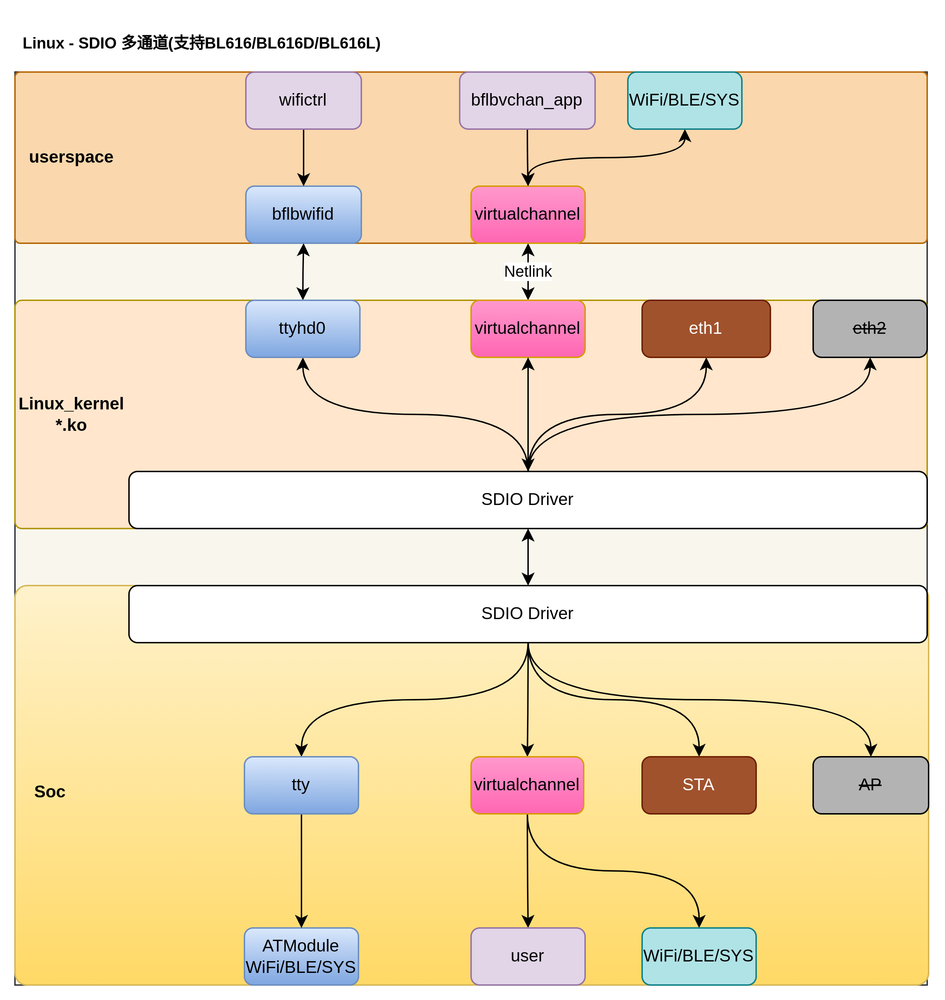
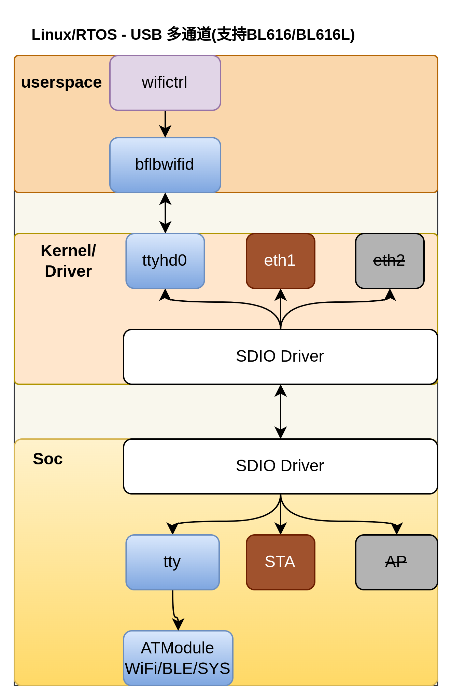

# nethub_host

本项目实现了 kernel 和 userspace 两部分：

- **kernel 部分**：编译生成 ko 文件，将 SDIO、USB、SPI 等多种接口虚拟成以太网、virtualchannel、tty 通道
- **userspace 部分**：
  - bflbwifictrl（当前载体是tty，后期载体会考虑从改成virtualchannel）
  - virtualchannel：支持用户私有数据的通信

## 目录

- [1. 软件架构和功能](#1-软件架构和功能)
- [2. 目录结构](#2-目录结构)
- [3. 快速开始](#3-快速开始)
- [4. 注意事项和常见问题](#4-注意事项和常见问题)
- [5. 待实现功能](#5-待实现功能)

## 1. 软件架构和功能




- **主机驱动**：将 SDIO、USB、SPI 等多种接口虚拟成以太网、tty 通道
- **设备控制**：连接到指定 WiFi 网络、查询 WiFi 状态、扫描可用 WiFi、OTA 固件升级

## 2. 目录结构

```
nethub_host/
├── build.sh                 # 主构建脚本
├── kernel/                  # 内核驱动代码
│   ├── sdio/               # SDIO 接口驱动
│   ├── eth_netdev/         # 以太网设备驱动
│   ├── tty/                # TTY 设备驱动
│   └── netlink/            # Netlink 通信驱动
├── userspace/              # 用户空间应用
│   ├── bflbwifictrl/      # BFLB WiFi 控制（守护进程+CLI）
│   └── bflbvirtualchannel/ # 虚拟通道管理
└── docs/                  # 文档资源
    └── images/            # 架构图片
```

**主要模块说明：**

- **kernel/**：内核驱动模块
  - **sdio/**：SDIO 接口驱动，实现 SDIO 通信协议
  - **eth_netdev/**：以太网设备驱动，虚拟网卡接口
  - **tty/**：TTY 设备驱动，提供 AT 命令控制通道
  - **netlink/**：Netlink 驱动，支持用户空间私有数据通信
- **userspace/**：用户空间应用
  - **bflbwifictrl/**：BFLB WiFi 控制模块（推荐使用）
    - 守护进程架构，支持多客户端
    - 完整的 WiFi 控制功能：连接、断开、扫描、状态查询
    - OTA 固件升级、版本查询、模块重启
    - 详见：`userspace/bflbwifictrl/README_CN.md`
  - **bflbvirtualchannel/**：虚拟通道管理

## 3. 快速开始

- 编译内核驱动和用户空间应用

  ```bash
  # 编译内核驱动
  cd kernel
  make

  # 编译用户空间应用
  cd ../userspace/bflbwifictrl
  make
  ```

- 加载内核驱动

  ```bash
  # 加载 SDIO 驱动
  sudo insmod kernel/sdio/hd_sdio.ko
  ```

  加载后，host 会多出至少 2 个 interface：
  - **hd_eth0** - 网卡接口（相当于 STA 转以太网功能）
  - **/dev/ttyUSB0** 或 **/dev/ttyACM0** - TTY 控制通道

- 使用 bflbwifictrl 控制 WiFi 模块

  ```bash
  # 1. 启动守护进程
  cd userspace/bflbwifictrl
  sudo ./app/bflbwifid -p /dev/ttyUSB0

  # 2. 另一个终端使用 CLI 工具
  # 连接 WiFi
  ./app/bflbwifictrl connect_ap MySSID password

  # 扫描 AP
  ./app/bflbwifictrl scan

  # 查询状态
  ./app/bflbwifictrl status

  # 断开连接
  ./app/bflbwifictrl disconnect

  # OTA 固件升级
  ./app/bflbwifictrl ota firmware.bin

  # 查询版本
  ./app/bflbwifictrl version

  # 重启模块
  ./app/bflbwifictrl reboot
  ```

  详细文档：`userspace/bflbwifictrl/README_CN.md`

## 4. 注意事项和常见问题

- 问题 1：硬件连接并加载 host 驱动后，host 会多出哪些 interface？

  加载后，host 会多出至少 2 个 interface：

  - **hd_eth0** [必须] - 网卡接口，相当于 STA 转以太网功能，不同平台名称可能会有差异
  - **/dev/ttyhd0** [必须] - TTY 控制通道，连接、断开等命令通过此通道进行发送和接收，协议为标准 AT 命令，不同平台名称可能会有差异
  - 提供 **bflbvirtualchannel** 驱动给用户层使用，方便用户进行私有的数据收发

- 问题 2：host 和 device 的 DHCP client 运行在哪一侧？

  运行在 **device** 侧。host 通过查询机制获取 IP 地址。连接 WiFi 后会收到 GOTIP 事件，然后 host 通过查询更新 IP 地址。

- 问题 3：device 侧的数据包 filter 用户可以自定义吗？默认规则是怎样的？

  **可以自定义**。用户在 device 侧重新实现 `eth_input_filter` 函数即可完成 filter 的自定义。

  **默认过滤规则：**

  - **ARP 包**：双向传输
  - **DHCPv4 和 ICMPv4 包**：默认交给 device 侧处理，不会交付到 host 侧
  - **端口过滤**：用户可通过定义 `CONFIG_NETHUB_FILTER_LOCAL_PORT_MIN` 和 `CONFIG_NETHUB_FILTER_LOCAL_PORT_MAX` 完成地址空间的过滤
  - **其他数据包**：默认都给 host 侧处理

- 问题 4：nethub、hd_sdio、bflbwifictrl 有什么关系和区别？

  - **nethub**：运行在设备端的固件软件，实现 WiFi Station 到以太网协议转换，支持数据包过滤和转发规则管理
  - **hd_sdio**：内核驱动模块（ko 文件），负责主机与设备间的 SDIO 通信
  - **bflbwifictrl**：WiFi 控制模块，包含守护进程和 CLI 工具，提供完整的设备管理功能（连接、断开、扫描、OTA、版本查询等）
  - **架构关系**：

    ```txt
    用户应用层
        ↓ bflbwifictrl (CLI 工具)
        ↓ bflbwifid (守护进程)
    控制通道层 (/dev/ttyUSBx 或 /dev/ttyACMx)
        ↓ hd_sdio (内核驱动)
    物理层 (SDIO 接口)
        ↓ nethub (设备固件)
    ```
  - **数据流向**：

    - `nethub` 是设备端固件，处理 WiFi 协议转换和数据转发
    - `hd_sdio` 是底层通信驱动，负责主机与设备的物理连接
    - `bflbwifictrl` 是用户空间控制模块，采用守护进程架构，支持多客户端访问

- 问题 5：host 开发有什么特别的注意事项？

  - **网络配置要求**：

    由于当前方案 DHCP client 设计在 device 侧，因此 host 侧需要遵循以下配置要求：

    - **必须关闭 hd_eth0 的 DHCP 服务**：采用静态 IP 配置方式
    - **静态 IP 配置步骤**：

      - 使用 bflbwifictrl 连接 WiFi 并查询状态
      - 根据查询结果配置 host 侧的静态 IP 地址（与 device 侧使用相同的 IP）
      - 确保 host 侧和 device 侧使用相同的 IP 地址
    - **配置示例**：

      ```txt
      # 1. 启动守护进程
      cd userspace/bflbwifictrl
      sudo ./app/bflbwifid -p /dev/ttyUSB0

      # 2. 连接 WiFi 并查询状态
      ./app/bflbwifictrl connect_ap MySSID password
      ./app/bflbwifictrl status

      # 3. 根据查询结果配置静态 IP（示例）
      sudo ip addr add 192.168.1.100/24 dev hd_eth0
      sudo ip link set hd_eth0 up
      ```

      ⚠️ **重要提醒**：如果 host 侧启用了 DHCP 服务，将会与 device 侧的 DHCP client 产生冲突，导致网络连接异常。

## 5. 待实现功能

- [ ] 热插拔、加载功能（理论已支持，待压测确认）
- [ ] 性能优化和稳定性提升、文档整理
- [ ] 【非必要】AP 控制通道也虚拟出 **hd_eth1** 到 host
- [ ] 增加 USB、SPI 相关 interface 支持
