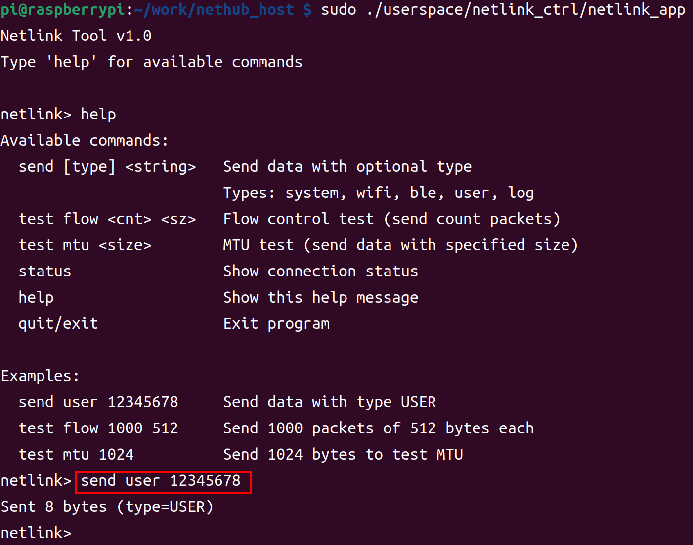

# nethub_host

本项目实现了 kernel 和 userspace 两部分：

- **kernel 部分**：编译生成 ko 文件，将 SDIO、USB、SPI 等多种接口虚拟成以太网、netlink、tty 通道
- **userspace 部分**：
  - 基于 tty 通道的 AT 命令应用程序，主要完成设备的连接、扫描、查询等功能
  - netlink_app 通过 netlink_client 演示用户私有数据的收发

## 1. 软件架构和功能


- **主机驱动**：将 SDIO、USB、SPI 等多种接口虚拟成以太网、tty 通道
- **设备控制**：连接到指定 WiFi 网络、查询 WiFi 状态、扫描可用 WiFi、OTA 固件升级

## 2. 快速开始

- 编译 hd_sdio.ko 和应用固件

  `./build.sh build`

- 加载 hd_sdio.ko

  `sudo ./build.sh load`

- 联网并配置静态 IP（该脚本仅供测试使用，详细请参考下文）

    `./userspace/connect_and_setip [password]`

- 通过 AT 通道支持的控制功能

  - WiFi 连接

    ```bash
    # 连接 WiFi
    ./userspace/easyat/src/easyat connect MyWiFi password123

    # 连接开放网络
    ./userspace/easyat/src/easyat connect OpenWiFi
    ```
  - WiFi 断开

    `./userspace/easyat/src/easyat disconnect_ap`

  - 查询状态

    `./userspace/easyat/src/easyat get_link_status`

  - 扫描网络

    `./userspace/easyat/src/easyat wifi_scan`

  - OTA 固件升级

    `./userspace/easyat/src/easyat ota firmware.bin.ota`

- 通过 netlink 通道发送数据给 device

    ```bash
    sudo ./userspace/netlink_ctrl/netlink_app
    help
    send user 12345678
    ```

    

## 3. 注意事项和常见问题

- 问题 1：硬件连接并加载 host 驱动后，host 会多出哪些 interface？

  加载后，host 会多出至少 2 个 interface：

  - **hd_eth0** [必须] - 网卡接口，相当于 STA 转以太网功能
  - **/dev/ttyhd0** [必须] - TTY 控制通道，连接、断开等命令通过此通道进行发送和接收，协议为标准 AT 命令
  - ~~**/dev/ttyhd1**~~ ~~[已废弃] - 原 TTY 数据通道（已被 netlink 方式取代）~~
  - 提供 **netlink** 驱动给用户层使用，方便用户进行私有的数据收发

- 问题 2：host 和 device 的 DHCP client 运行在哪一侧？

  运行在 **device** 侧。host 通过查询机制获取 IP 地址。连接 WiFi 后会收到 GOTIP 事件，然后 host 通过查询更新 IP 地址。可以参考 host 中的 `connect_and_setip` 脚本实现。

- 问题 3：device 侧的数据包 filter 用户可以自定义吗？默认规则是怎样的？

  **可以自定义**。用户在 device 侧重新实现 `eth_input_filter` 函数即可完成 filter 的自定义。

  **默认过滤规则：**

  - **ARP 包**：双向传输
  - **DHCPv4 和 ICMPv4 包**：默认交给 device 侧处理，不会交付到 host 侧
  - **端口过滤**：用户可通过定义 `CONFIG_NETHUB_FILTER_LOCAL_PORT_MIN` 和 `CONFIG_NETHUB_FILTER_LOCAL_PORT_MAX` 完成地址空间的过滤
  - **其他数据包**：默认都给 host 侧处理

- 问题 4：nethub、hd_sdio、easyat、connect_and_setip 有什么关系和区别？

  - **nethub**：运行在设备端的固件软件，实现 WiFi Station 到以太网协议转换，支持数据包过滤和转发规则管理
  - **hd_sdio**：内核驱动模块（ko 文件），负责主机与设备间的 SDIO 通信
  - **easyat**：用户控制设备的 AT 命令封装库，提供便捷的设备操作接口。开发者可直接收发 AT 协议绕过此库
  - **connect_and_setip**：网络配置示例工具，实现连接指定 AP、获取 IP 信息并设置静态 IP 的完整流程
  - **架构关系**：

    ```txt
    用户应用层
        ↓ connect_and_setip (示例工具)
        ↓ easyat (AT 命令库)
    控制通道层 (/dev/ttyhd0)
        ↓ hd_sdio (内核驱动)
    物理层 (SDIO 接口)
        ↓ nethub (设备固件)
    ```
  - **数据流向**：

    - `nethub` 是设备端固件，处理 WiFi 协议转换和数据转发
    - `hd_sdio` 是底层通信驱动，负责主机与设备的物理连接
    - `easyat` 是用户空间控制库，封装 AT 命令操作
    - `connect_and_setip` 是应用层示例，展示完整的使用流程

- 问题 5：host 开发有什么特别的注意事项？

  - **网络配置要求**：

    由于当前方案 DHCP client 设计在 device 侧，因此 host 侧需要遵循以下配置要求：

    - **必须关闭 hd_eth0 的 DHCP 服务**：采用静态 IP 配置方式
    - **静态 IP 配置步骤**：

      - 使用 easyat 命令查询链路状态：`./userspace/easyat/src/easyat get_link_status`
      - 根据查询结果配置 host 侧的静态 IP 地址（与 device 侧使用相同的 IP）
      - 确保 host 侧和 device 侧使用相同的 IP 地址
    - **配置示例**：

      ```txt
      # 1. 查询链路状态获取 IP 信息
      ./userspace/easyat/src/easyat get_link_status

      # 2. 根据查询结果配置静态 IP（示例）
      sudo ip addr add 192.168.1.100/24 dev hd_eth0
      sudo ip link set hd_eth0 up
      ```

      ⚠️ **重要提醒**：如果 host 侧启用了 DHCP 服务，将会与 device 侧的 DHCP client 产生冲突，导致网络连接异常。

## 4. 待实现功能

- [ ] 热插拔 SDIO 功能（理论已支持，待压测确认）
- [ ] hd_sdio.ko 动态加载/卸载功能（理论已支持，待压测确认）
- [ ] 性能优化和稳定性提升
- [ ] 【非必要】AT 控制通道可选择 disable（用户可以通过 userspace 的 netlink 模块实现控制）
- [ ] 【非必要】AP 控制通道也虚拟出 **hd_eth1** 到 host
- [ ] 增加 USB、SPI 相关 interface 支持
