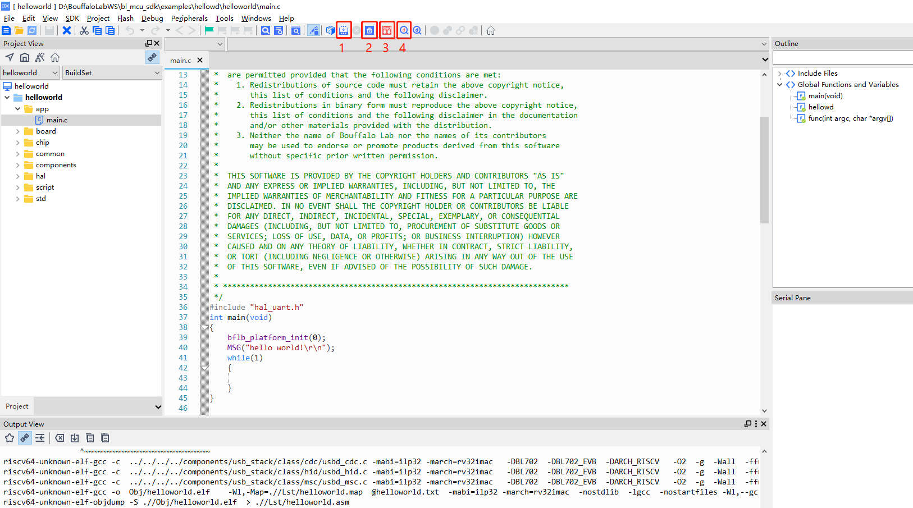

.. _windows_cdk_quick_start:

Windows 下使用 CDK (类 MDK Keil)开发指南
=============================================

本文档介绍了如何在 Windows 下使用 `平头哥半导体 <https://www.t-heah.cn/about>`_ 开发的 CDK 集成开发环境，
来完成博流 BL702 系列 MCU 的相关软件开发工作。

关于剑池 CDK ，这是一款由平头哥半导体开发打造的集成开发环境。它拥有和传统 MCU 开发环境十分近似的操作和设置，旨在不改变用户开发习惯的基础上，全面接入云端开发资源，结合图形化的 OSTracer、Profiling 等调试分析工具，加速用户产品开发

需要的软硬件环境
-----------------------------

-  剑池 CDK 软件
-  一根 USB Type-A 数据线、一根 Type-C 数据线
-  一个 CK-Link 仿真器 or 一个 Sipeed RV-Debugger Plus 调试器
-  一个 USB-TTL 串口模块
-  杜邦线若干

下载剑池 CDK 软件安装包
-----------------------------

- `剑池CDK <https://occ.t-head.cn/development/series/download?id=3864775351511420928&type=kind&softPlatformType=4#sticky>`_ 软件安装可以从平头哥半导体 OCC 官网获取到

- 下载完成后，解压缩，双击 ``setup.exe``，按照其提示，完成软件安装即可

下载 bl_mcu_sdk 软件开发包
----------------------------

-  从开源社区下载 bl_mcu_sdk 软件开发包。

   - 可以使用 ``git clone`` 或者直接 ``download`` 的方式下 SDK
   - 使用 ``git clone`` 前请确保已正确安装 ``git``，打开支持 ``git`` 的终端输入以下命令即可获取最新的 SDK

   .. code-block:: bash
      :linenos:
      :emphasize-lines: 1

      $ git clone https://gitee.com/bouffalolab/bl_mcu_sdk.git  --recursive

硬件连接
----------------------

-  具体开发板的连接, 请参考 :ref:`connect_hardware` 部分
-  请确保开发板被正确设置后再进行下面的步骤

测试 Hello World 工程
------------------------------

**使用 Sipeed RV-Debugger Plus 调试工程时请按照下面的步骤进行：**

打开 Hello World
^^^^^^^^^^^^^^^^^^^^^^^^^^^^^^

-  获取到 SDK 后，进入 sdk 中的 ``examples/hellowd/helloworld/cdk`` 目录下，双击 ``helloworld.cdkproj``，即可打开 ``Helloworld`` 工程

编译 Hello World
^^^^^^^^^^^^^^^^^^^^^^^^^^^^^^

   helloworld.cdkproj

-  在活动工程下拉菜单选择 ``OpenOCD_Debug`` 工程，由于 Sipeed RV-Debugger Plus 是使用 OpenOCD 调试的，所以本教程基于 ``OpenOCD_Debug`` 工程；
-  如 Sipeed RV-Debugger Plus 没有正确安装驱动，请参考 :ref:`sipeed_rv_debugger_plus` 部分，设置好驱动程序，在进行下面的步骤

-  在 CDK 工具栏中，点击编译图标即可编译工程

   -  点击 ``1`` 处 图标 ``Build Project`` 即可编译当前选中的工程
   -  点击 ``2`` 处 图标 ``Clean Project`` 即可清除上次编译的结果
   -  点击 ``3`` 处 图标 ``Flash Download`` 即可将编译好的代码下载到芯片中 （**使用 OpenOCD Debug 不能使用 Flash 下载功能**）
   -  点击 ``4`` 处 图标 ``Start/Stop Debug`` 即可进行 debug 的相关操作
   -  也可以在 ``Project`` 中，右击工程名称，通过右击菜单中的选项对项目进行编译等操作

烧写 Hello World
^^^^^^^^^^^^^^^^^^^^^^^^^^^^

-  在 CDK 中使用 OpenOCD 模式的调试方式时，暂不支持直接使用 CDK 相关 flash 工具下载代码，所以请使用 BL Dev Cube 工具进行程序烧写，烧写代码请参考 :ref:`bl_dev_cube` 部分进行
-  代码烧写完成后使用 CDK 进行 Debug

运行 Hello World
^^^^^^^^^^^^^^^^^^^^^^^^^^^^

-  从 CDK 的菜单栏 ``View->Serial Pane``，打开串口面板，在打开的 ``Serial Pane`` 中右击，进行串口设置，选择你对应的串口号和波特率

.. figure:: img/cdk4.png
.. figure:: img/cdk3.png
   :alt:

   CDK Serial Pane setting

-  按下板子上的 ``RST`` 按键，即可在串口中看到代码的运行结果

.. figure:: img/cdk6.png
   :alt:

   HelloWorld！

调试 Hello World
^^^^^^^^^^^^^^^^^^^^^^^^^^^^

-  点击工具栏上方的 ``Start/Stop Debugger`` 按钮，进入 debug 界面，如下图所示

.. figure:: img/cdk10.png
   :alt:

   Debug HelloWorld！

-  在 debug 界面下，左侧的 ``Register`` 窗口中，可以查看 ``CPU`` 内部寄存器数据；右侧的 ``Peripherals`` 外设面板中，
   可以查看相应外设寄存器数据，外设的选择可以在顶部菜单栏的 ``Peripherals->System Viewer`` 选择；
   点击上方工具栏中的相关调试按钮可以进行断点设置、单步调试、指令单步和全速运行等操作。
   当然这些操作都有相应的快捷键和快捷设置方法，详情请参考 ``CDK Help``，这里就不作过多介绍了。

-  我们点击单步运行按钮，运行代码，即可看到指示光标移动到下一句代码，同时可以看到串口面板中显示了我们输出的 ``Hello World！``

**使用 CK-Link 调试工程时请按照下面的步骤进行：**

打开 Hello World
^^^^^^^^^^^^^^^^^^^^^^^^^^^^^^

-  获取到 SDK 后，进入 sdk 中的 ``examples/hellowd/helloworld/cdk`` 目录下，双击 ``helloworld.cdkproj``，即可打开 ``Helloworld`` 工程

编译 Hello World
^^^^^^^^^^^^^^^^^^^^^^^^^^^^^^

   helloworld.cdkproj

-  在活动工程下拉菜单可以选择 ``CK_Link_Debug`` 或者 ``OpenOCD_Debug`` 工程，本教程基于 ``CK_Link_Debug`` 工程

-  在 CDK 工具栏中，点击编译图标即可编译工程

   -  点击 ``1`` 处 图标 ``Build Project`` 即可编译当前选中的工程
   -  点击 ``2`` 处 图标 ``Clean Project`` 即可清除上次编译的结果
   -  点击 ``3`` 处 图标 ``Flash Download`` 即可将编译好的代码下载到芯片中
   -  点击 ``4`` 处 图标 ``Start/Stop Debug`` 即可进行 debug 的相关操作
   -  也可以在 ``Project`` 中，右击工程名称，通过右击菜单中的选项对项目进行编译等操作

烧写 Hello World
^^^^^^^^^^^^^^^^^^^^^^^^^^^^

-  由于目前 CDK 软件中还没有包含我们的 flash 算法，所以需要我们手动将 flash 算法放到 CDK 安装目录，具体操作如下：

   -  进入 SDK 目录下 ``tools\cdk_flashloader`` 目录
   -  将目录下的 ``bl70x_flasher.elf`` 文件，拷贝到 CDK 工具的 ``C-Sky\CDK\CSKY\Flash`` 目录中

   .. figure:: img/cdk7.png
      :alt:

      CDK Flash Loader

.. figure:: img/cdk8.png
   :alt:

   CDK Project Setting

-  点击 ``Project View`` 中的项目设置按钮，打开 ``Project Setting`` 窗口，或者通过右击 ``Project`` 名称中右击菜单栏中打开

- 在打开的 ``Project Setting`` 窗口中，选择 ``Flash`` 标签，配置需要的 Flash 算法

.. figure:: img/cdk9.png
   :alt:

   CDK Project Flash setting

-  在 ``Flash`` 标签中，点击 ``Add`` 按纽，在打开的列表中选择 ``bl70x_flash`` 算法，点击 ``Add`` 添加到工程中，``Flash`` 标签下的其他设置，如图所示：

-  点击 OK 后，如配置正确，点击 ``Flash Download`` 即可将编译好的代码下载到芯片中

.. figure:: img/cdk5.png
   :alt:

   CDK Flashdownload Success

-  如下载失败请检查：

   -  1. 代码是否被正确编译，并生成 ``.elf`` ``.bin`` 等文件
   -  2. Flash 算法是否被正确设置
   -  3. CK-Link 与开发板是否正确连接
   -  4. 开发板是否正常供电，电源指示灯是否点亮

运行 Hello World
^^^^^^^^^^^^^^^^^^^^^^^^^^^^

-  从 CDK 的菜单栏 ``View->Serial Pane``，打开串口面板，在打开的 ``Serial Pane`` 中右击，进行串口设置，选择你对应的串口号和波特率

.. figure:: img/cdk4.png
.. figure:: img/cdk3.png
   :alt:

   CDK Serial Pane setting

-  按下板子上的 ``RST`` 按键，即可在串口中看到代码的运行结果

.. figure:: img/cdk6.png
   :alt:

   HelloWorld！

调试 Hello World
^^^^^^^^^^^^^^^^^^^^^^^^^^^^

-  点击工具栏上方的 ``Start/Stop Debugger`` 按钮，进入 debug 界面，如下图所示

.. figure:: img/cdk10.png
   :alt:

   Debug HelloWorld！

-  在 debug 界面下，左侧的 ``Register`` 窗口中，可以查看 ``CPU`` 内部寄存器数据；右侧的 ``Peripherals`` 外设面板中，
   可以查看相应外设寄存器数据，外设的选择可以在顶部菜单栏的 ``Peripherals->System Viewer`` 选择；
   点击上方工具栏中的相关调试按钮可以进行断点设置、单步调试、指令单步和全速运行等操作。
   当然这些操作都有相应的快捷键和快捷设置方法，详情请参考 ``CDK Help``，这里就不作过多介绍了。

-  我们点击单步运行按钮，运行代码，即可看到指示光标移动到下一句代码，同时可以看到串口面板中显示了我们输出的 ``Hello World！``

.. figure:: img/cdk11.png
   :alt:

   Debug HelloWorld！

