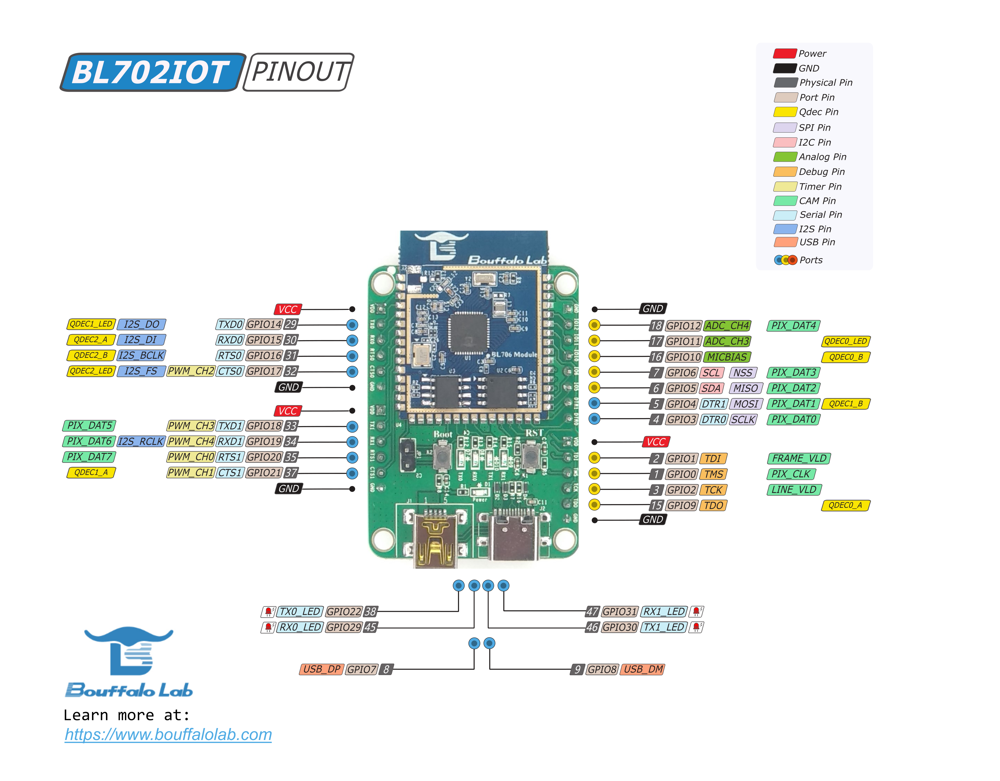

开发前的准备
=============================

硬件环境准备
-----------------------------

- 一块 BL702 系列 MCU 的开发板：

  - BL706_IOT 开发板， or
  - BL706_AVB 开发板

BL706_Iot 开发板如下图所示

   
   BL706_IoT

BL706_AVB 开发板如下图所示

.. figure:: img/bl706_avb.png
   :alt:
   
   BL706_AVB

-  一个支持标准 JTAG 功能的调试器，下面几款调试器中选择一款与开发环境适合即可：

  - CK-Link 仿真器
  - Jlink V11 仿真器
  - Sipeed USB-JTAG/TTL 调试器
  - Bouffalo Lab Debugger 调试器

-  一台 PC 主机（运行 Windows 或者 Linux 系统）

软件环境准备
--------------------------------

为了更好的进行 BL702 系列 MCU 的开发，建议您应当具备以下开发环境：

-  Windows 使用 `CDK <Windows_quick_start_cdk.html>`_ 环境开发 (建议 Windows 7 以上版本。) ，or
-  `Windows <Windows_quick_start_eclipse.html>`_ 使用 Eclipse 环境开发 (建议 Windows 7 以上版本。) ，or
-  `Linux <Linux_quick_start_ubuntu.html>`_ (建议使用 Ubuntu 18 以上的 LTS 版本)

