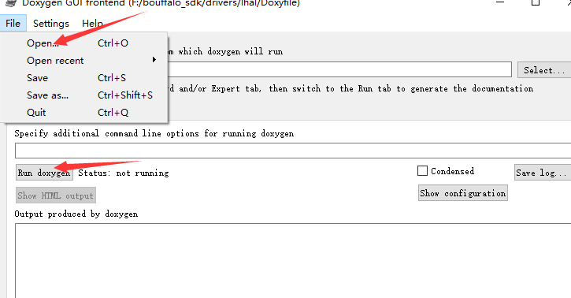

=======================
Peripherals
=======================

简介
---------

BouffaloSDK 中外设驱动分为两类： **LHAL** 和 **SOC** ，前者对通用外设进行了统一的封装，不同芯片使用同一套接口，方便用户使用和移植到其他平台。后者则是每个芯片独有且特殊的部分，比如 GLB、HBN、PDS、AON 等等。

下面主要列出 **LHAL** 相关 API 的使用。

**LHAL** 中各个外设 API 声明均在 `drivers/include` 目录下可以查看。在学习 API 使用之前，我们需要了解 `struct bflb_device_s` 结构体的含义和作用。

.. code-block:: C
    :linenos:

    struct bflb_device_s {
        const char *name;
        uint32_t reg_base;
        uint8_t irq_num;
        uint8_t idx;
        uint8_t sub_idx;
        uint8_t dev_type;
        void *user_data;
    };

.. list-table::
    :widths: 10 10
    :header-rows: 1

    * - parameter
      - description
    * - name
      - 外设名称
    * - reg_base
      - 外设寄存器基地址
    * - irq_num
      - 外设中断号
    * - idx
      - 外设 id
    * - idx
      - 外设 id,例如 UART0、UART1
    * - sub_idx
      - 外设子 id,例如 DMA0_CH0、DMA0_CH1
    * - dev_type
      - 外设类型
    * - user_data
      - 用户变量

从上我们可以知道  `struct bflb_device_s` 结构体成员的具体信息，其中比较重要的就是 **reg_base** 和 **irq_num** ，有了这两个，我们才能操作外设寄存器和外设中断。那么当我们进行外设配置之前，就需要先获取该结构体句柄，从中获取我们需要的信息，否则不能对外设进行操作。获取结构体句柄有以下两种方式：

- `bflb_device_get_by_name` 通过 **name** 获取
- `bflb_device_get_by_id` 通过 **dev_type** 和 **idx** 获取

**那么还有一个问题，结构体句柄保存在哪？**

对于每个系列芯片支持的外设，我们将结构体句柄保存在一个 table 表中。详见 **lhal/config/xxx/device_table.c** 文件。

API 支持情况
---------------

了解了上面的基本概念以后，接下来就可以查阅相关 **LHAL** API 并使用了。当前已经支持的 **LHAL** API 列表如下：

.. note::  **✔️** 表示已支持； **❌** 表示未支持； **❓** 表示已支持但未测试； **➖** 表示没有该外设。

.. list-table::
    :widths: 10 10 10 10 10
    :header-rows: 1

    * - peripheral
      - BL602/BL604
      - BL702/BL704/BL706
      - BL616/BL618
      - BL808
    * - ADC
      - ❓
      - ✔️
      - ✔️
      - ❓
    * - CAM
      - ➖
      - ❌
      - ❌
      - ❌
    * - CKS
      - ❓
      - ✔️
      - ✔️
      - ❓
    * - DAC
      - ❓
      - ✔️
      - ✔️
      - ❓
    * - DMA
      - ❓
      - ✔️
      - ✔️
      - ✔️
    * - EFUSE
      - ❓
      - ✔️
      - ✔️
      - ✔️
    * - EMAC
      - ➖
      - ✔️
      - ✔️
      - ✔️
    * - FLASH
      - ✔️
      - ✔️
      - ✔️
      - ✔️
    * - GPIO
      - ❓
      - ✔️
      - ✔️
      - ✔️
    * - I2C
      - ❓
      - ✔️
      - ✔️
      - ❓
    * - IR
      - ❓
      - ✔️
      - ✔️
      - ✔️
    * - MJPEG
      - ❌
      - ✔️
      - ✔️
      - ❌
    * - PWM_v1
      - ❓
      - ✔️
      - ➖
      - ➖
    * - PWM_v2
      - ➖
      - ➖
      - ✔️
      - ✔️
    * - RTC
      - ❓
      - ✔️
      - ✔️
      - ✔️
    * - SEC_AES
      - ❓
      - ✔️
      - ✔️
      - ✔️
    * - SEC_SHA
      - ❓
      - ✔️
      - ✔️
      - ✔️
    * - SEC_TRNG
      - ❓
      - ✔️
      - ✔️
      - ✔️
    * - SEC_PKA
      - ❓
      - ✔️
      - ✔️
      - ✔️
    * - SPI
      - ❓
      - ✔️
      - ✔️
      - ❓
    * - TIMER
      - ❓
      - ✔️
      - ✔️
      - ✔️
    * - UART
      - ❓
      - ✔️
      - ✔️
      - ✔️
    * - USB_v1
      - ➖
      - ✔️
      - ➖
      - ➖
    * - USB_v2
      - ➖
      - ➖
      - ✔️
      - ✔️
    * - WDG
      - ❓
      - ✔️
      - ✔️
      - ✔️

API 列表
---------------

除了使用网页版查看 API 以外， 还提供了 **LHAL Doxygen** 版本，离线生成文档。 Doxyfile 文件在 ``drivers/lhal`` 目录下。

使用 Doxywizard 导入并运行即可。

.. toctree::
    :maxdepth: 1

    ADC <adc>
    CKS <cks>
    CLOCK <clock>
    DAC <dac>
    DMA <dma>
    FLASH <flash>
    GPIO <gpio>
    I2C <i2c>
    IRQ <irq>
    L1C <l1c>
    MTIMER <mtimer>
    PWM_v1 <pwm_v1>
    PWM_v2 <pwm_v2>
    RTC <rtc>
    SEC_AES <sec_aes>
    SEC_SHA <sec_sha>
    SEC_PKA <sec_pka>
    SPI <spi>
    TIMER <timer>
    UART <uart>
    WDG <wdg>