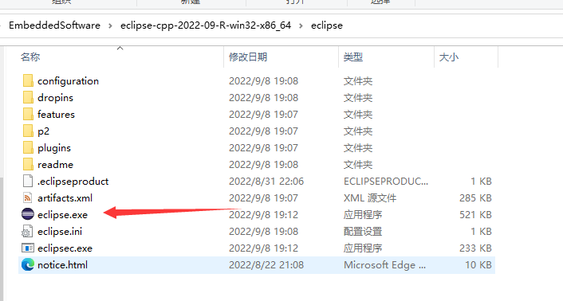
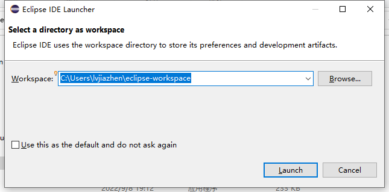
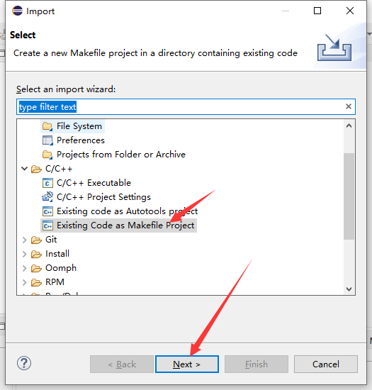
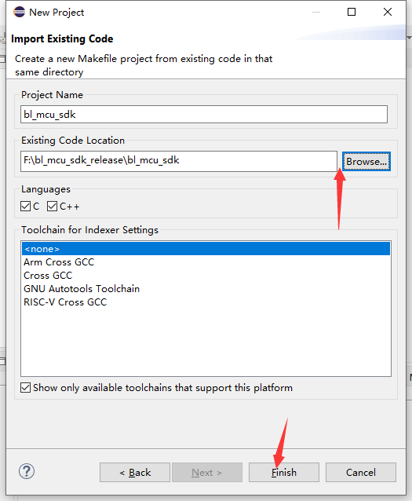
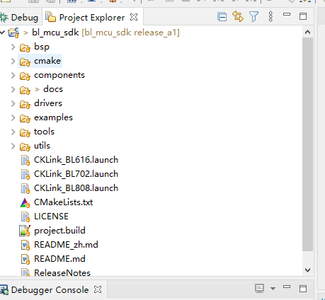
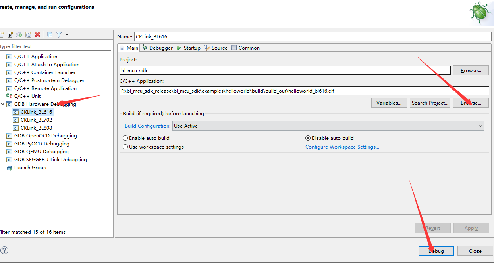
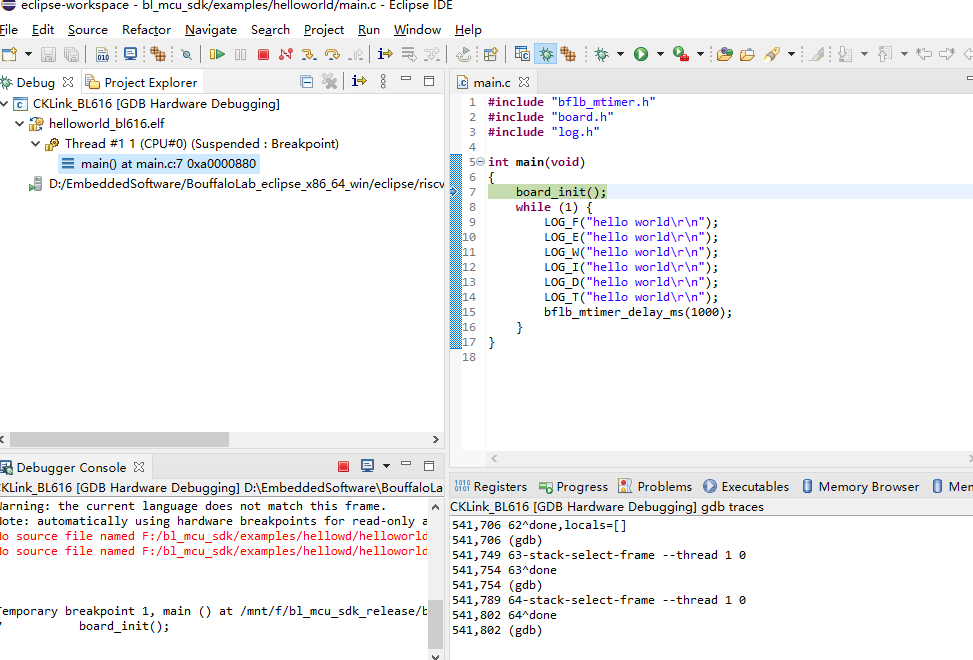

.. _debug:

使用调试器调试代码
====================

本节主要介绍如何使用调试器进行代码的调试。

使用 CKLink + Eclipse 调试代码
-------------------------------------------

- 从 Bouffalo Lab 开发者社区下载带有 RISC-V 工具链的 `Eclipse 安装包 <https://dev.bouffalolab.com/media/upload/download/BouffaloLab_eclipse_x86_64_win_v1.2.0.zip>`_ 。
- 从 T-HEAD 官网下载最新版本 `CKLink 驱动 <https://occ.t-head.cn/community/download?id=4103855596351066112>`_

安装和配置 Eclipse
^^^^^^^^^^^^^^^^^^^^

- 将获取到的 eclipse 压缩包拷贝到您的工作目录，解压 eclipse 压缩包
- 进入 eclipse 目录，双击 ``eclipse.exe`` 启动 eclipse
- 选择您的 ``Workspace`` 目录，点击 ``Launch`` 进入工作空间

.. figure:: img/eclipse1.png
    :alt:

-  点击菜单栏中 ``Window->preferences`` 打开环境配置相关页面，准备导入相关的配置环境

-  点击下图 1 处的图标，打开导入配置界面，按照如图所示步骤，选择 ``eclipse.exe`` 目录下的 ``bflb_mcu_preferences.epf`` 配置文件。

-  选择好对应的文件后，点击 ``Finish``，在弹出的对话框选中点击 ``cancel`` ，不用重新启动。

.. figure:: img/eclipse4.png
    :alt:

-  点击 菜单栏 ``File->Import`` ，打开导入项目的配置界面

.. figure:: img/eclipse5.png
    :alt:

-  在打开的 ``Import`` 窗口中选择 ``C/C++->Existing Code as Makefile Project`` ，然后点击 ``Next``

-  导入 bl_mcu_sdk 的工程路径后，点击 ``Finsh`` 完成

- 最终效果如下

安装和配置 CKLink
^^^^^^^^^^^^^^^^^^^^

- 将下载的 CKLink 安装包解压，并双击 `Setup` ,一路 next 即可，安装完成以后，桌面会有一个 `T-HeadDebugServer` 图标

.. figure:: img/cklink1.png
    :alt:

.. figure:: img/cklink2.png
    :alt:

- 将板子的 JTAG 引脚和 CKLink 调试器连接以后，点击 **三角** 按钮，如果变成 **圆圈**，则表示 JTAG 连接成功。如果失败，则需要检查 JTAG 线序是否正确。

.. figure:: img/cklink3.png
    :alt:

调试 ELF
^^^^^^^^^^^^^^^^^^^^

完成上述两步以后，如果是在 **flash 上调试，需要先将 bin 文件烧录到芯片中** ，最后才能够进行下面的调试环节。

- 在 Eclipse 中 点击 `debug` 图标，并点击 `Debug Configurations`

.. figure:: img/eclipse9.png
    :alt:

- 左侧打开 `GDB Hardware Debugging`，选择对应芯片的配置按钮，并导入编译生成的 **elf**,最后点击 `Debug`

- 最终进入调试界面

