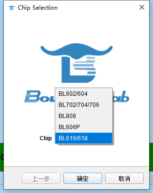
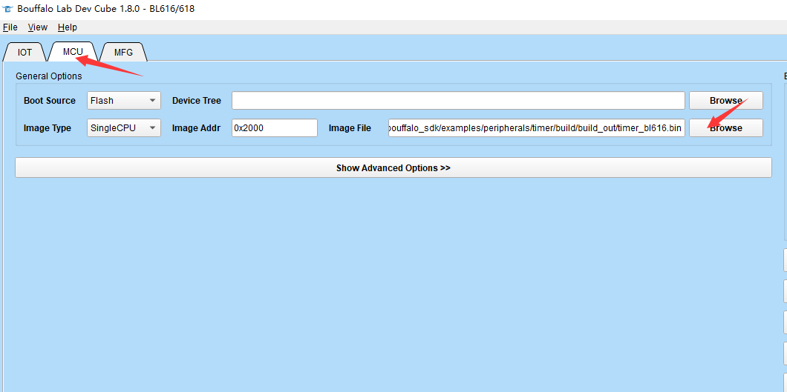
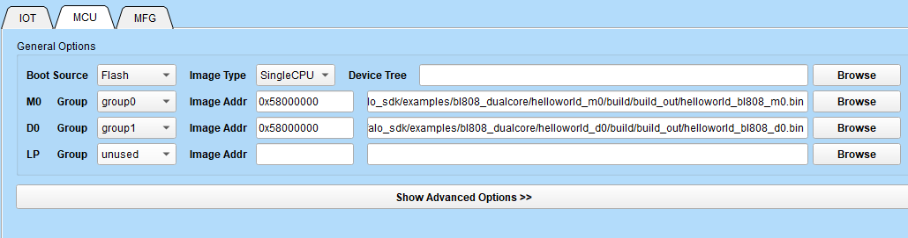
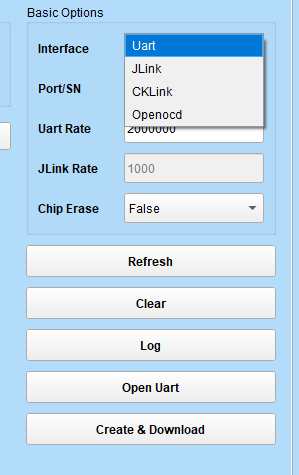

.. _bl_dev_cube:

Bouffalo Lab DevCube 的使用
=============================

.. caution:: BouffaloSDK 不再使用此工具，请使用 SDK 自带的命令行烧录工具

本文档将简要介绍一下如何使用 Bouffalo Lab DevCube 集成开发工具烧写代码。

Bouffalo Lab Dev Cube 工具可以从博流智能开发者社区下载适合您操作系统的版本，下载地址： `https://dev.bouffalolab.com/download <https://dev.bouffalolab.com/download>`_ 。没有注册开发者账号的用户，可以点击开发者入口，使用 ``guest`` 用户进入。

下载完成后，解压后即可使用。

下载代码流程
-------------------

-  双击解压后文件夹的 ``BLDevCube.exe``, 在 ``Chip Selection`` 对话框中，在 ``Chip Type`` 的下拉框中，选择您要开发的对应芯片的型号，点击 ``Finish`` 进入 ``Dev Cube`` 主界面

   select mcu

-  进入主界面后在上方的菜单栏 ``View`` 标签下选择 ``MCU`` 下载方式，进入 MCU 程序下载主界面
-  点击  ``Image file``  旁边的 ``Browse`` 导入编译生成的 bin 文件，（ ``Device Tree`` 没有任何用处，不需要使用）

- 如果使用的是 `BL808` 或者 `BL606P` ，则需要格外使能 `group`,默认是 unused。使用 `M0` 则 M0 group 为 `group0`，使用 `D0` 则 D0 group 为 `group1`

-  右侧 ``Interface`` 选择你想使用的下载方式

- 如果使用 `UART` 下载，首先选择 `Port/SN` , 其次选择波特率，推荐为 2M, 最后需要按照下面进入 boot 的方式以后，才能双击 ``Create&Program`` 下载

.. figure:: img/devcube5.png

- 如果使用的 CKLINK 或者其他调试器，则直接双击 ``Create&Program`` 即可，当前仅支持 `BL702`

如何进入 BOOT 模式
-------------------

按住开发板的 **BOOT** 引脚不松开，按一下 **RESET** 引脚并松开 **RESET**，最后松开 **BOOT**，即可进入 BOOT 模式。

Bouffalo Lab DevCube 常见错误汇总
-----------------------------------
