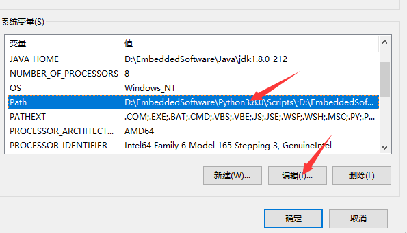

.. _windows_cmd:

Build with Windows CMD
============================

本节主要介绍如何在 Windows 下使用 **命令行** 进行开发。

环境搭建
-----------------

- 首先需要安装 git 工具，这里自行百度。
- 使用 git 下载 RISC-V 工具链, 这里比如安装到 D 盘

.. code-block:: bash
   :linenos:
   :emphasize-lines: 1

   $ cd D:/
   $ git clone https://gitee.com/bouffalolab/toolchain_gcc_t-head_windows.git

- 将 make、ninja、下载的 risc-v 工具链路径配置到系统环境变量中, 其中 make 和 ninja 工具位于 `bouffalo_sdk/tools` 目录下。
- windows 11 配置完以后需要重启电脑才生效。

- 完成上述步骤以后，需要检查是否真的安装成功。打开 powershell 或者 cmd，输入下列命令：

.. code-block:: bash
   :linenos:

   $ make -v

此时应该显示如下内容表示安装成功：

.. code-block:: bash
   :linenos:

    GNU Make 4.2.1
    Built for x86_64-w64-mingw32
    Copyright (C) 1988-2016 Free Software Foundation, Inc.
    License GPLv3+: GNU GPL version 3 or later <http://gnu.org/licenses/gpl.html>
    This is free software: you are free to change and redistribute it.
    There is NO WARRANTY, to the extent permitted by law.

.. code-block:: bash
   :linenos:

   $ riscv64-unknown-elf-gcc -v

此时应该显示如下内容表示安装成功：

.. code-block:: bash
   :linenos:

    Using built-in specs.
    COLLECT_GCC=riscv64-unknown-elf-gcc
    COLLECT_LTO_WRAPPER=/mnt/d/EmbeddedSoftware/Xuantie-900-gcc-elf-newlib-x86_64-V2.2.5/bin/../libexec/gcc/riscv64-unknown-elf/10.2.0/lto-wrapper
    Target: riscv64-unknown-elf
    Configured with: /lhome/software/toolsbuild/slave2/workspace/Toolchain/build-gnu-riscv_4/./source/riscv/riscv-gcc/configure --target=riscv64-unknown-elf --with-gmp=/lhome/software/toolsbuild/slave2/workspace/Toolchain/build-gnu-riscv_4/build-riscv-gcc-riscv64-unknown-elf/build-Xuantie-900-gcc-elf-newlib-x86_64-V2.2.5/lib-for-gcc-x86_64-linux --with-mpfr=/lhome/software/toolsbuild/slave2/workspace/Toolchain/build-gnu-riscv_4/build-riscv-gcc-riscv64-unknown-elf/build-Xuantie-900-gcc-elf-newlib-x86_64-V2.2.5/lib-for-gcc-x86_64-linux --with-mpc=/lhome/software/toolsbuild/slave2/workspace/Toolchain/build-gnu-riscv_4/build-riscv-gcc-riscv64-unknown-elf/build-Xuantie-900-gcc-elf-newlib-x86_64-V2.2.5/lib-for-gcc-x86_64-linux --with-libexpat-prefix=/lhome/software/toolsbuild/slave2/workspace/Toolchain/build-gnu-riscv_4/build-riscv-gcc-riscv64-unknown-elf/build-Xuantie-900-gcc-elf-newlib-x86_64-V2.2.5/lib-for-gcc-x86_64-linux --with-libmpfr-prefix=/lhome/software/toolsbuild/slave2/workspace/Toolchain/build-gnu-riscv_4/build-riscv-gcc-riscv64-unknown-elf/build-Xuantie-900-gcc-elf-newlib-x86_64-V2.2.5/lib-for-gcc-x86_64-linux --with-pkgversion='Xuantie-900 elf newlib gcc Toolchain V2.2.5 B-20220323' CXXFLAGS='-g -O2 -DTHEAD_VERSION_NUMBER=2.2.5' --enable-libgcctf --prefix=/lhome/software/toolsbuild/slave2/workspace/Toolchain/build-gnu-riscv_4/build-riscv-gcc-riscv64-unknown-elf/Xuantie-900-gcc-elf-newlib-x86_64-V2.2.5 --disable-shared --disable-threads --enable-languages=c,c++ --with-system-zlib --enable-tls --with-newlib --with-sysroot=/lhome/software/toolsbuild/slave2/workspace/Toolchain/build-gnu-riscv_4/build-riscv-gcc-riscv64-unknown-elf/Xuantie-900-gcc-elf-newlib-x86_64-V2.2.5/riscv64-unknown-elf --with-native-system-header-dir=/include --disable-libmudflap --disable-libssp --disable-libquadmath --disable-libgomp --disable-nls --disable-tm-clone-registry --src=/lhome/software/toolsbuild/slave2/workspace/Toolchain/build-gnu-riscv_4/./source/riscv/riscv-gcc --enable-multilib --with-abi=lp64d --with-arch=rv64gcxthead 'CFLAGS_FOR_TARGET=-Os   -mcmodel=medany' 'CXXFLAGS_FOR_TARGET=-Os   -mcmodel=medany'
    Thread model: single
    Supported LTO compression algorithms: zlib
    gcc version 10.2.0 (Xuantie-900 elf newlib gcc Toolchain V2.2.5 B-20220323)

编译
-------------

打开 powershell 或者 cmd，进入 **examples** ，选择你想要编译的 case，且该 case 下必须有 **Makefile** 文件。使用下面命令编译，生成的 bin 文件会输出到 `build/build_out` 目录下。

- 使用 make 编译

.. code-block:: bash
   :linenos:

    $ cd .\examples\helloworld\
    $ make CHIP=chip_name BOARD=board_name ## chip_name 为芯片型号，可以填写 bl702、bl616、bl808、bl606p, board_name 为开发板名称，详见 bsp/board 目录

- 使用 ninja 编译

.. code-block:: bash
   :linenos:

    $ cd .\examples\helloworld\
    $ make ninja CHIP=chip_name BOARD=board_name ## chip_name 为芯片型号，可以填写 bl702、bl616、bl808、bl606p, board_name 为开发板名称，详见 bsp/board 目录

.. note :: 如果使用 BL808 或者 BL606P，需要在上面基础上添加 CPU_ID=id ,id 可以为 m0 或者 d0

烧录
-------------

.. code-block:: bash
   :linenos:

    $ cd examples/helloworld
    $ make flash CHIP=chip_name COMX=port_name ## port_name 为串口号名称，比如 COM5

.. note :: 如果使用 BL808 或者 BL606P，需要在上面基础上添加 CPU_ID=id ,id 可以为 m0 或者 d0

调试
-------------

推荐使用 eclipse + cklink 调试，参考 :ref:`debug`，也可以使用命令行调试，这里不做介绍