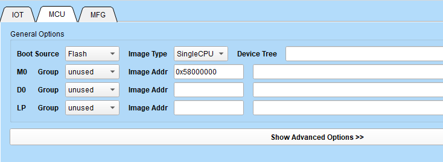

BL808 双核启动流程
=======================

本节主要介绍 BL808 M0 和 D0 两个核的启动流程。首先我们需要知道以下信息：

- M0 使用 t-head E907 ,D0 使用 t-head C906，为异构双核
- M0 和 D0 外设共享，但是中断不共享，M0 能触发的中断不一定能在 D0上触发，比如 UART0，中断只能在 M0 上使用
- 工具烧录时，MCU 界面有 group0 和 group1 选项

工具烧写的秘密
------------------

在工具上，烧录的时候会提示选择 group0 和 group1, 如果都不选的话，是没法烧录代码的。假如我们使用 M0 选择 group0，D0 unused，那么就是简单的
单核启动，D0 不会启动。如果 M0 选择 group0，D0 选择 group1，则两个核都会启动。那么问题来了，为什么工具选了之后会影响双核启动呢？原因就是工具选完后的配置，会在
烧录的时候传递给 bootrom，bootrom 会做处理。那么我们就知道了双核启动的第一步了。

SystemInit 干了什么
-------------------------

``SystemInit`` 函数位于 `soc/bl808/startup/m0` 和 `soc/bl808/startup/d0` 中的 `system_bl808.c` 中。

系统启动时，会根据 ld 文件中设置的 entry(__start) 去找 ``__start`` 函数, 这个便是我们芯片启动的入口，位于 `start.S` 中。看标题可以知道，我们主要是了解
``SystemInit`` 函数干了什么，而 `start.S` 中做了什么是不需要关心的，只需要知道，里面会调用 ``SystemInit`` 函数。

- D0 ``SystemInit``

首先我们先看 D0 ``SystemInit``，一上来就是一个 while 死循环，系统启动时，这个条件一定是不会满足的，所以 D0 一上来就会在这死循环，等待条件成立。

.. code-block:: c
   :linenos:

   while ((BL_RD_WORD(IPC_SYNC_ADDR1) != IPC_SYNC_FLAG) ||
   (BL_RD_WORD(IPC_SYNC_ADDR2) != IPC_SYNC_FLAG)) {
    // clang-format off
    __NOP(); __NOP(); __NOP(); __NOP();
    __NOP(); __NOP(); __NOP(); __NOP();
    __NOP(); __NOP(); __NOP(); __NOP();
    __NOP(); __NOP(); __NOP(); __NOP();
    // clang-format on
    /* if cache is off, comment this and this api need to start load itcm*/
    // L1C_DCache_Invalid_By_Addr(IPC_SYNC_ADDR1, 8);
    };
    /* clear this flags for system reboot */
    BL_WR_WORD(IPC_SYNC_ADDR1, 0x0);
    BL_WR_WORD(IPC_SYNC_ADDR2, 0x0);

- M0 ``SystemInit``

根据上述信息我们知道， M0 一定会在某个时刻，向这两个寄存器写入 ``IPC_SYNC_FLAG``, 从而让 D0 运行起来。