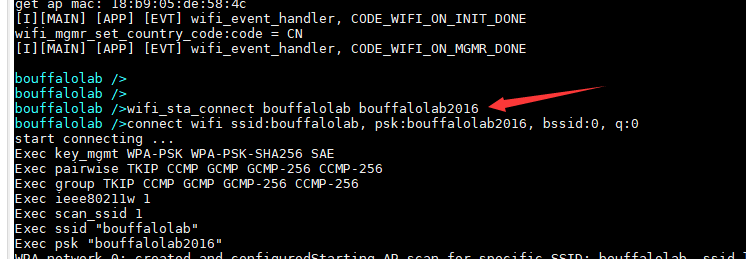
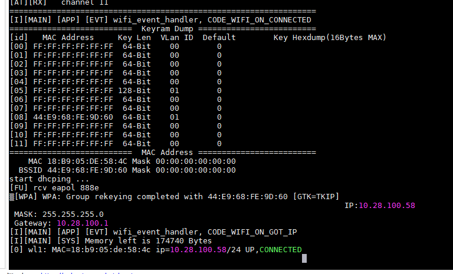
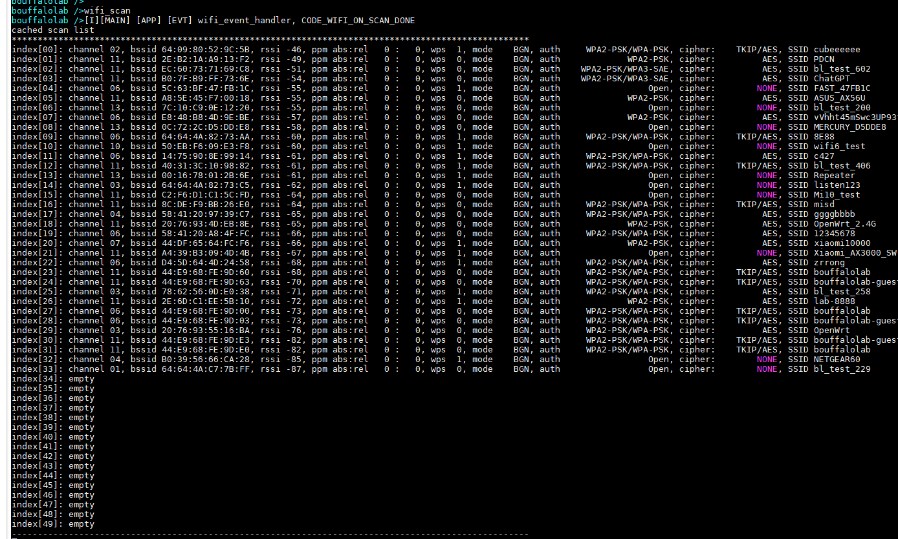
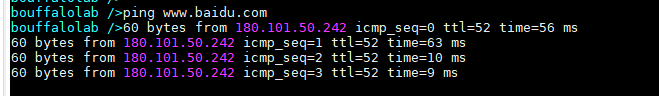

.. _wifi6_api:

WIFI6
=============

CLI 命令
-------------	 

wifi_sta_connect
^^^^^^^^^^^^^^^^^^^^

用于连接 AP,连接成功后，会打印出分配的 ip 地址

- 第一个参数表示 ssid
- 第二个参数表示 pwd

例如：

wifi_scan
^^^^^^^^^^^^^^^^^^^^

用于扫描 AP ，不需要跟参数

例如：

ping
^^^^^^^^^^^^^^^^^^^^

用于 ping 网络

- 第一个参数填写 ip 地址或者域名地址

例如：

Functions
----------------
