.. _eclipse_gcc:

Build and Debug with Eclipse
=================================

本节主要介绍如何使用 Eclipse 进行开发。

环境搭建
-------------

- 安装 GCC 工具链，cmake， make 和 ninja 流程参考 :ref:`get_started`

- 下载 `Eclipse <https://www.eclipse.org/downloads/packages>`_ , 选择  **Eclipse IDE for C/C++ Developers** , 并根据你的电脑版本进行下载。

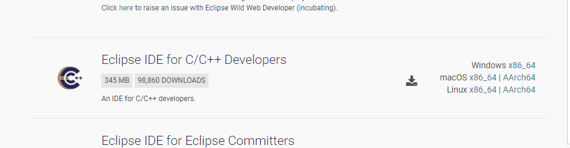

- 解压 Eclipse 并双击打开 `Eclipse.exe`

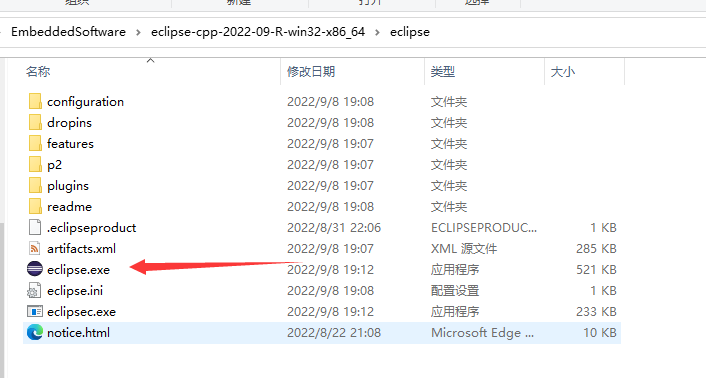

- 选择工作路径并点击 `Launch`

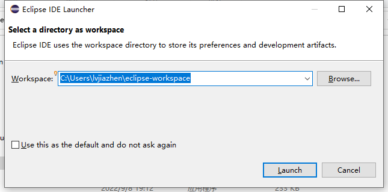

- 点击左上角 `File` 选择 `Import`，选择 `General > Existing project into workspace` 并点击 `Next`

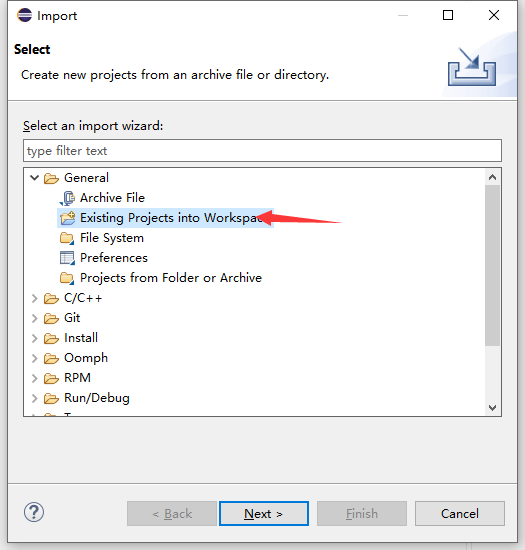

- 导入 bl_mcu_sdk

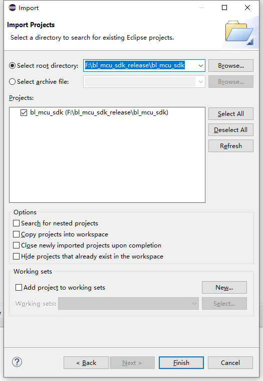

编译
-------------

- 双击 `Build Targets` 中的 `make` 即可编译 helloworld。双击 `clean` 即可清除 helloworld 下的缓存

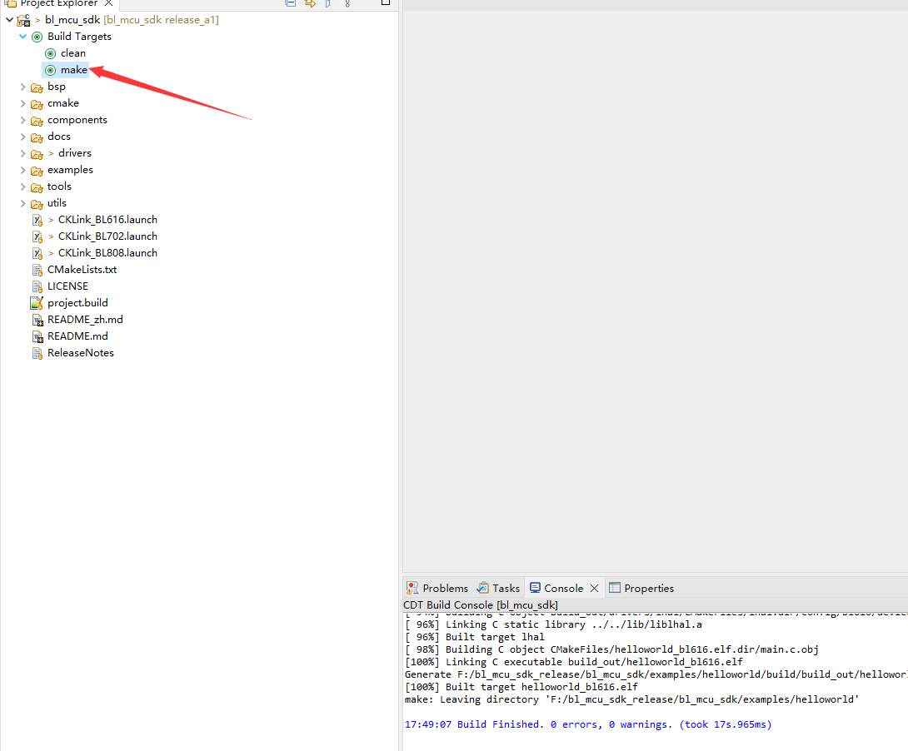

- 如果需要更换 demo ，右击 `Build Targets` 中的 `make`，修改中间方框里的内容即可，内容为指定 demo 下 Makefile 文件的路径

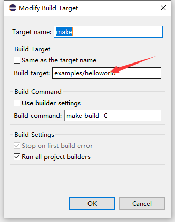

调试
-------------

- 从 T-HEAD 官网下载最新版本 `CKLink 驱动 <https://occ.t-head.cn/community/download?id=4103855596351066112>`_

- 将下载的 CKLink 安装包解压，并双击 `Setup` ,一路 next 即可，安装完成以后，桌面会有一个 `T-HeadDebugServer` 图标

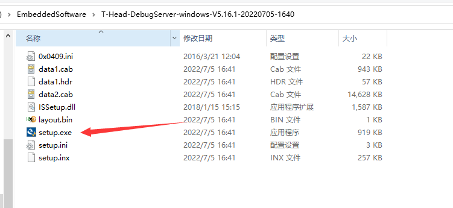

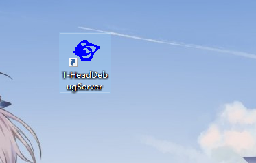

- 将板子的 JTAG 引脚和 CKLink 调试器连接以后，点击 **三角** 按钮，如果变成 **圆圈**，则表示 JTAG 连接成功。如果失败，则需要检查 JTAG 线序是否正确。

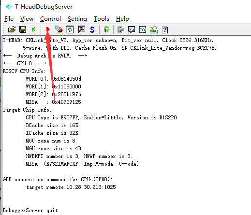

- 完成上述步骤以后，如果是在 **flash 上调试，需要先将编译的 bin 文件烧录到芯片中并复位** ，然后才能够进行下面的调试环节。

- 在 Eclipse 中 点击 `debug` 图标，并点击 `Debug Configurations`

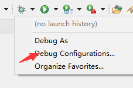

- 左侧打开 `GDB Hardware Debugging`，选择对应芯片的配置按钮，并导入编译生成的 **elf**, 最后点击 `Debug`

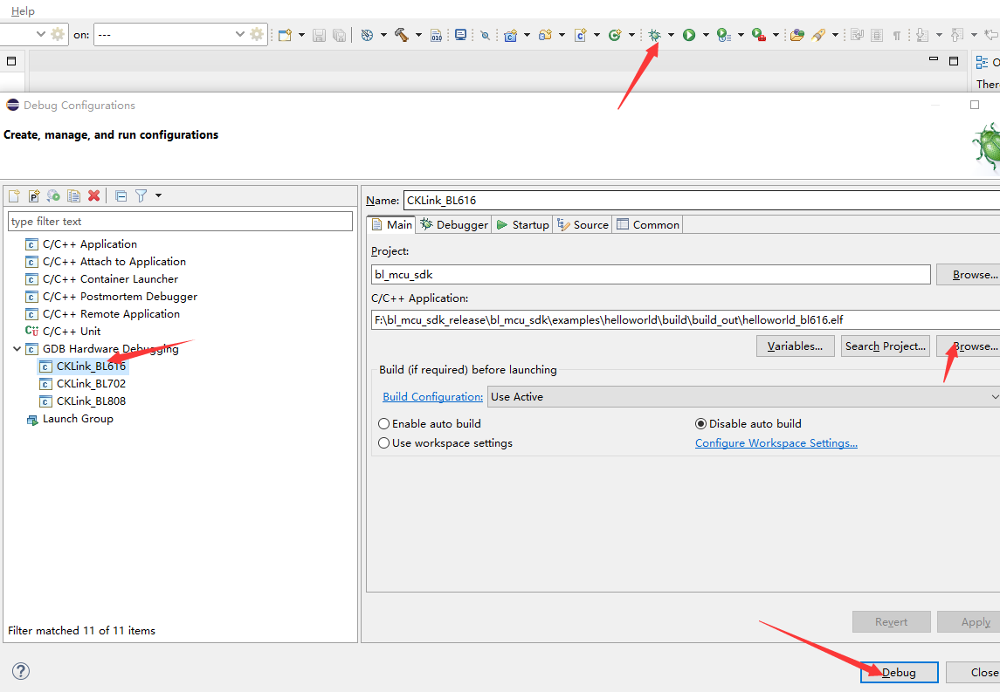

- 最终进入调试界面

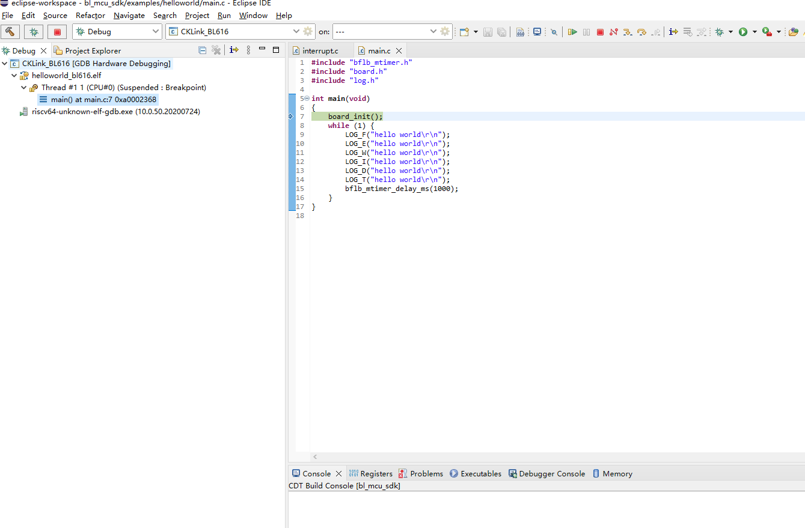
