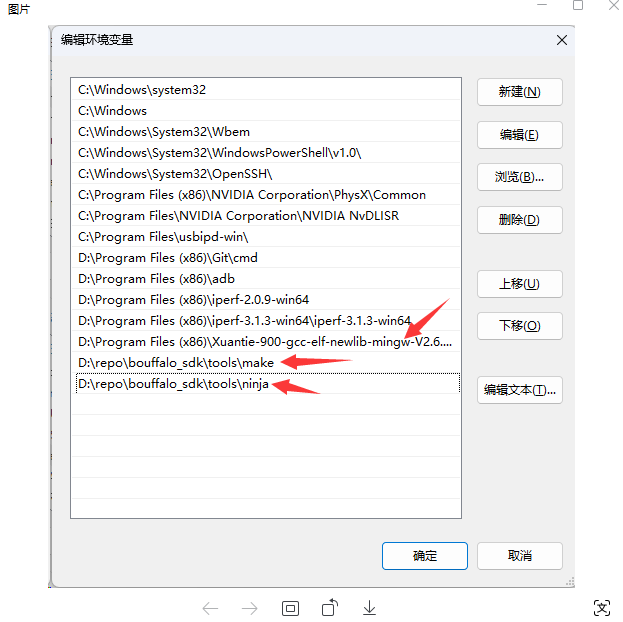

.. _get_started:

=======================
环境搭建
=======================

本节主要介绍 BouffaloSDK 的环境搭建，支持 windows 和 linux， macos 参考 linux。在阅读下面之前，需要保证你的电脑已经安装了 git 工具。

下载 SDK
==========

BouffaloSDK 下载可以从 github 或者 gitee 上获取

.. code-block:: bash
   :linenos:
   :emphasize-lines: 1

   $ cd ~
   $ git clone https://github.com/bouffalolab/bouffalo_sdk.git # 使用国内镜像请将 github 更换成 gitee

安装
========

BouffaloSDK 编译需要用到 gcc 工具链，cmake ， make，ninja（可选，用于加速代码编译）构建系统，下面讲述如何安装和配置。

Windows 环境
---------------

- 下载 GCC 工具链

.. code-block:: bash
   :linenos:
   :emphasize-lines: 1

   $ cd D:/
   $ git clone https://gitee.com/bouffalolab/toolchain_gcc_t-head_windows.git

- 安装 cmake

无需安装， `bouffalo_sdk/tools/cmake` 目录下已经提供 windows 版本 cmake 工具

- 安装 make

无需安装， `bouffalo_sdk/tools/make` 目录下已经提供 windows 版本 make 工具

- 安装 ninja

无需安装， `bouffalo_sdk/tools/ninja` 目录下已经提供 windows 版本 ninja 工具

- 配置环境变量

将 make、ninja、gcc 工具链路径配置到系统环境变量中

- 完成上述步骤以后，需要检查是否真的安装成功。打开 powershell 或者 cmd，输入下列命令：

.. code-block:: bash
   :linenos:

   $ make -v

此时应该显示如下内容表示安装成功：

.. code-block:: bash
   :linenos:

    GNU Make 4.2.1
    Built for x86_64-w64-mingw32
    Copyright (C) 1988-2016 Free Software Foundation, Inc.
    License GPLv3+: GNU GPL version 3 or later <http://gnu.org/licenses/gpl.html>
    This is free software: you are free to change and redistribute it.
    There is NO WARRANTY, to the extent permitted by law.

.. code-block:: bash
   :linenos:

   $ riscv64-unknown-elf-gcc -v

此时应该显示如下内容表示安装成功：

.. code-block:: bash
   :linenos:

    Using built-in specs.
    COLLECT_GCC=riscv64-unknown-elf-gcc
    COLLECT_LTO_WRAPPER=/mnt/d/EmbeddedSoftware/Xuantie-900-gcc-elf-newlib-x86_64-V2.2.5/bin/../libexec/gcc/riscv64-unknown-elf/10.2.0/lto-wrapper
    Target: riscv64-unknown-elf
    Configured with: /lhome/software/toolsbuild/slave2/workspace/Toolchain/build-gnu-riscv_4/./source/riscv/riscv-gcc/configure --target=riscv64-unknown-elf --with-gmp=/lhome/software/toolsbuild/slave2/workspace/Toolchain/build-gnu-riscv_4/build-riscv-gcc-riscv64-unknown-elf/build-Xuantie-900-gcc-elf-newlib-x86_64-V2.2.5/lib-for-gcc-x86_64-linux --with-mpfr=/lhome/software/toolsbuild/slave2/workspace/Toolchain/build-gnu-riscv_4/build-riscv-gcc-riscv64-unknown-elf/build-Xuantie-900-gcc-elf-newlib-x86_64-V2.2.5/lib-for-gcc-x86_64-linux --with-mpc=/lhome/software/toolsbuild/slave2/workspace/Toolchain/build-gnu-riscv_4/build-riscv-gcc-riscv64-unknown-elf/build-Xuantie-900-gcc-elf-newlib-x86_64-V2.2.5/lib-for-gcc-x86_64-linux --with-libexpat-prefix=/lhome/software/toolsbuild/slave2/workspace/Toolchain/build-gnu-riscv_4/build-riscv-gcc-riscv64-unknown-elf/build-Xuantie-900-gcc-elf-newlib-x86_64-V2.2.5/lib-for-gcc-x86_64-linux --with-libmpfr-prefix=/lhome/software/toolsbuild/slave2/workspace/Toolchain/build-gnu-riscv_4/build-riscv-gcc-riscv64-unknown-elf/build-Xuantie-900-gcc-elf-newlib-x86_64-V2.2.5/lib-for-gcc-x86_64-linux --with-pkgversion='Xuantie-900 elf newlib gcc Toolchain V2.2.5 B-20220323' CXXFLAGS='-g -O2 -DTHEAD_VERSION_NUMBER=2.2.5' --enable-libgcctf --prefix=/lhome/software/toolsbuild/slave2/workspace/Toolchain/build-gnu-riscv_4/build-riscv-gcc-riscv64-unknown-elf/Xuantie-900-gcc-elf-newlib-x86_64-V2.2.5 --disable-shared --disable-threads --enable-languages=c,c++ --with-system-zlib --enable-tls --with-newlib --with-sysroot=/lhome/software/toolsbuild/slave2/workspace/Toolchain/build-gnu-riscv_4/build-riscv-gcc-riscv64-unknown-elf/Xuantie-900-gcc-elf-newlib-x86_64-V2.2.5/riscv64-unknown-elf --with-native-system-header-dir=/include --disable-libmudflap --disable-libssp --disable-libquadmath --disable-libgomp --disable-nls --disable-tm-clone-registry --src=/lhome/software/toolsbuild/slave2/workspace/Toolchain/build-gnu-riscv_4/./source/riscv/riscv-gcc --enable-multilib --with-abi=lp64d --with-arch=rv64gcxthead 'CFLAGS_FOR_TARGET=-Os   -mcmodel=medany' 'CXXFLAGS_FOR_TARGET=-Os   -mcmodel=medany'
    Thread model: single
    Supported LTO compression algorithms: zlib
    gcc version 10.2.0 (Xuantie-900 elf newlib gcc Toolchain V2.2.5 B-20220323)

Linux 环境
---------------

- 下载 GCC 工具链

.. code-block:: bash
   :linenos:
   :emphasize-lines: 4-5

   $ cd ~
   $ git clone https://gitee.com/bouffalolab/toolchain_gcc_t-head_linux.git
   $ sudo cp -rf toolchain_gcc_t-head_linux/ /usr/bin
   $ echo "export PATH=\"$PATH:/usr/bin/toolchain_gcc_t-head_linux/bin\""  >> ~/.bashrc
   $ source ~/.bashrc

- 安装 cmake

    无需安装， `bouffalo_sdk/tools/cmake` 目录下已经提供 linux 版本 cmake 工具

- 安装 make

.. code-block:: bash
   :linenos:
   :emphasize-lines: 1

   $ cd ~
   $ sudo apt install make -y

- 安装 ninja

.. code-block:: bash
   :linenos:
   :emphasize-lines: 1

   $ cd ~
   $ sudo apt install ninja-build -y

- 配置环境变量

上述安装好以后就已经配置到系统环境变量了，无需手动配置

- 完成上述步骤以后，需要检查是否真的安装成功，在 linux 终端中输入下列命令：

.. code-block:: bash
   :linenos:

   $ make -v

此时应该显示如下内容表示安装成功：

.. code-block:: bash
   :linenos:

    GNU Make 4.1
    Built for x86_64-pc-linux-gnu
    Copyright (C) 1988-2014 Free Software Foundation, Inc.
    License GPLv3+: GNU GPL version 3 or later <http://gnu.org/licenses/gpl.html>
    This is free software: you are free to change and redistribute it.
    There is NO WARRANTY, to the extent permitted by law.

.. code-block:: bash
   :linenos:

   $ riscv64-unknown-elf-gcc -v

此时应该显示如下内容表示安装成功：

.. code-block:: bash
   :linenos:

    Using built-in specs.
    COLLECT_GCC=riscv64-unknown-elf-gcc
    COLLECT_LTO_WRAPPER=/mnt/d/EmbeddedSoftware/Xuantie-900-gcc-elf-newlib-x86_64-V2.2.5/bin/../libexec/gcc/riscv64-unknown-elf/10.2.0/lto-wrapper
    Target: riscv64-unknown-elf
    Configured with: /lhome/software/toolsbuild/slave2/workspace/Toolchain/build-gnu-riscv_4/./source/riscv/riscv-gcc/configure --target=riscv64-unknown-elf --with-gmp=/lhome/software/toolsbuild/slave2/workspace/Toolchain/build-gnu-riscv_4/build-riscv-gcc-riscv64-unknown-elf/build-Xuantie-900-gcc-elf-newlib-x86_64-V2.2.5/lib-for-gcc-x86_64-linux --with-mpfr=/lhome/software/toolsbuild/slave2/workspace/Toolchain/build-gnu-riscv_4/build-riscv-gcc-riscv64-unknown-elf/build-Xuantie-900-gcc-elf-newlib-x86_64-V2.2.5/lib-for-gcc-x86_64-linux --with-mpc=/lhome/software/toolsbuild/slave2/workspace/Toolchain/build-gnu-riscv_4/build-riscv-gcc-riscv64-unknown-elf/build-Xuantie-900-gcc-elf-newlib-x86_64-V2.2.5/lib-for-gcc-x86_64-linux --with-libexpat-prefix=/lhome/software/toolsbuild/slave2/workspace/Toolchain/build-gnu-riscv_4/build-riscv-gcc-riscv64-unknown-elf/build-Xuantie-900-gcc-elf-newlib-x86_64-V2.2.5/lib-for-gcc-x86_64-linux --with-libmpfr-prefix=/lhome/software/toolsbuild/slave2/workspace/Toolchain/build-gnu-riscv_4/build-riscv-gcc-riscv64-unknown-elf/build-Xuantie-900-gcc-elf-newlib-x86_64-V2.2.5/lib-for-gcc-x86_64-linux --with-pkgversion='Xuantie-900 elf newlib gcc Toolchain V2.2.5 B-20220323' CXXFLAGS='-g -O2 -DTHEAD_VERSION_NUMBER=2.2.5' --enable-libgcctf --prefix=/lhome/software/toolsbuild/slave2/workspace/Toolchain/build-gnu-riscv_4/build-riscv-gcc-riscv64-unknown-elf/Xuantie-900-gcc-elf-newlib-x86_64-V2.2.5 --disable-shared --disable-threads --enable-languages=c,c++ --with-system-zlib --enable-tls --with-newlib --with-sysroot=/lhome/software/toolsbuild/slave2/workspace/Toolchain/build-gnu-riscv_4/build-riscv-gcc-riscv64-unknown-elf/Xuantie-900-gcc-elf-newlib-x86_64-V2.2.5/riscv64-unknown-elf --with-native-system-header-dir=/include --disable-libmudflap --disable-libssp --disable-libquadmath --disable-libgomp --disable-nls --disable-tm-clone-registry --src=/lhome/software/toolsbuild/slave2/workspace/Toolchain/build-gnu-riscv_4/./source/riscv/riscv-gcc --enable-multilib --with-abi=lp64d --with-arch=rv64gcxthead 'CFLAGS_FOR_TARGET=-Os   -mcmodel=medany' 'CXXFLAGS_FOR_TARGET=-Os   -mcmodel=medany'
    Thread model: single
    Supported LTO compression algorithms: zlib
    gcc version 10.2.0 (Xuantie-900 elf newlib gcc Toolchain V2.2.5 B-20220323)

编译
========

BouffaloSDK 编译代码提供两种编译方式：make 和 ninja

- 使用 make 编译

.. code-block:: bash
   :linenos:

    $ cd examples/helloworld
    $ make CHIP=chip_name BOARD=board_name ## chip_name 为芯片型号，可以填写 bl702、bl616、bl808、bl606p, board_name 为开发板名称，详见 bsp/board 目录

- 使用 ninja 编译

.. code-block:: bash
   :linenos:

    $ cd examples/helloworld
    $ make ninja CHIP=chip_name BOARD=board_name ## chip_name 为芯片型号，可以填写 bl702、bl616、bl808、bl606p, board_name 为开发板名称，详见 bsp/board 目录

.. caution :: 如果使用 BL808 或者 BL606P，需要在上面基础上添加 CPU_ID=id ,id 可以为 m0 或者 d0

.. caution :: chip_name 相同系列只需要填 pin 脚最少的芯片名称，比如使用 bl618 则填写 bl616，使用 bl706 则填写 bl702

烧录
========

BouffaloSDK 烧录代码提供两种：命令行和界面。需要注意，如果使用第三方 usb转串口模块，部分不支持 2M 波特率烧录，例如 CH340，请降低波特率使用（小于500K）

.. note :: 在烧录之前需要保证芯片进入烧录模式：按住 boot 键，按下 reset 键，松开 reset 键，松开 boot，即可进入烧录模式

- 命令行烧录

.. code-block:: bash
   :linenos:

    $ cd examples/helloworld
    $ make flash CHIP=chip_name COMX=port_name ## port_name 为串口号名称

.. caution :: 如果使用 BL808 或者 BL606P，需要在上面基础上添加 CPU_ID=id ,id 可以为 m0 或者 d0

.. caution :: 如果使用 WSL ，烧录请使用界面 windows 版本

- 界面烧录

windows 环境请用后缀带 .exe 文件，其余同理

- 双击打开
- 点击 Broswe，导入烧录文件（位于每个 demo 下，名称为 flash_prog_cfg.ini）
- 选择芯片型号
- 选择烧录的串口号
- 选择波特率
- 点击 download
- 界面提示绿色的 100% 表示烧录完成
- 如果烧录失败，请检查烧录口是否正确，芯片是否进入烧录模式，供电是否正常，usb转串口模块是否支持设置的波特率

运行
========

烧录完成以后，按下 reset 键，程序就运行了，并且可以使用串口工具查看 log，默认波特率 2M。推荐使用微软商店串口调试助手或者 mobaxterm

调试
========

BouffaloSDK 当前仅支持使用 eclipse + cklink 调试。参考 :ref:`eclipse_gcc`

芯片默认 JTAG PIN 列表
-----------------------

.. list-table::
    :widths: 10 10 10 10 10
    :header-rows: 1

    * - CHIP/Pin
      - BL602/BL604
      - BL702/BL704/BL706
      - BL616/BL618
      - BL808
    * - TMS
      - GPIO12
      - GPIO0
      - GPIO0
      - GPIO6
    * - TCK
      - GPIO14
      - GPIO2
      - GPIO1
      - GPIO12
    * - TDO
      - GPIO11
      - GPIO9
      - GPIO2
      - GPIO7
    * - TDI
      - GPIO17
      - GPIO1
      - GPIO3
      - GPIO13
