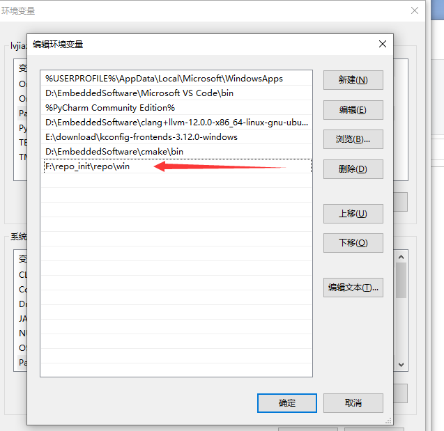

Repo 的使用
=======================

Repo 是谷歌用 Python 脚本写的调用 git 的一个脚本，可以实现管理多个 git 库，简单的几行命令便可以拉取很多仓库的代码。

安装
--------

- 下载 `repo <https://github.com/bouffalolab/repo>`_ 。

- windows 下将 `repo.exe` 文件（在 win 目录中）所在的路径配置到系统环境变量。

- Linux 下执行以下命令。

.. code-block:: bash
   :linenos:

    cd repo/linux
    chmod +x repo
    mv repo /usr/bin/repo

下载代码
----------

请联系商务申请账号。

同步代码
----------

后续只需要使用 ``repo sync`` 即可同步代码。