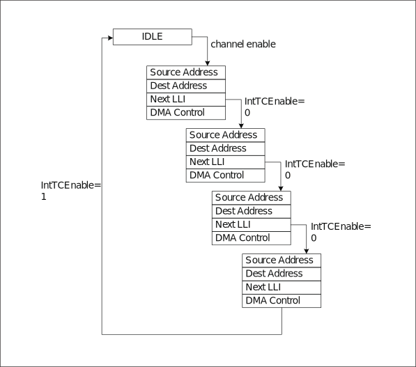
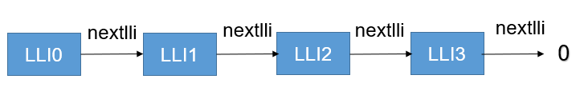
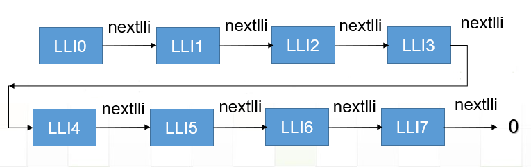

DMA 链表模式（LLI）深度解析
===============================

博流系列芯片的 DMA 都支持链表模式（LLI）。

在进行一次 DMA 读或者写的时候，可以配置多个链表，从而当一个链表的数据传输完成时，会跳到下一个链表的起始地址，并继续传输数据，直到链表的下一个地址为 0。如果 DMA 使能了完成中断，则当 DMA 发送或者接收完成时，会进入完成中断。

那么有了这种 DMA 链表模式，我们就可以实现以下功能：

- DMA 发送或者接收长度不限制
- DMA 发送接收地址可以不连续
- DMA 实现多种中断模式，半中断、3中断、4中断等等
- DMA 实现循环功能

OK，那么当我们开始研究链表配置之前，我们需要了解一些前提：
- 每个链表最多传输 4095 ,单位根据位宽决定
- 每个链表都可以触发中断

支持长度不限制
--------------------

由于每个 dma 链表最多支持 4095，假设位宽用的是字节，那么一个链表最多传输 4095 字节，很显然这个不能满足我们需求，性能太低。那么如何提高传输长度呢？

我们可以使用多个链表，串接起来，这样就能够支持更大的传输长度了，并且传输的地址是连续的，dma 链表连接如图所示：

这个时候还有一个问题，当一个链表使用了 4095 字节，下一个链表是从 4095 的偏移开始，这个时候，就会产生非对齐的问题，如果是在 cache 场景下，是会有问题的。
因此，我们将 4095 减少到 4064，这样保证每个链表的首地址都是 32 字节对齐的。到这就实现了长度不限制的功能，具体实现参考 ``bflb_dma_lli_config`` 函数。

.. code-block:: c
   :linenos:

   void bflb_dma_lli_config(struct bflb_device_s *dev, struct bflb_dma_channel_lli_pool_s *lli_pool, uint32_t lli_count, uint32_t src_addr, uint32_t dst_addr, uint32_t transfer_offset, uint32_t last_transfer_len)
   {
       uint32_t channel_base;
       union bflb_dma_lli_control_s dma_ctrl_cfg;

       channel_base = dev->reg_base;

       dma_ctrl_cfg = (union bflb_dma_lli_control_s)getreg32(channel_base + DMA_CxCONTROL_OFFSET);

       dma_ctrl_cfg.bits.TransferSize = 4064;
       dma_ctrl_cfg.bits.I = 0;

       /* nbytes will be integer multiple of 4064*n or 4064*2*n or 4064*4*n,(n>0) */
       for (uint32_t i = 0; i < lli_count; i++) {
           lli_pool[i].src_addr = src_addr;
           lli_pool[i].dst_addr = dst_addr;
           lli_pool[i].nextlli = 0;

           if (dma_ctrl_cfg.bits.SI) {
               src_addr += transfer_offset;
           }

           if (dma_ctrl_cfg.bits.DI) {
               dst_addr += transfer_offset;
           }

           if (i == lli_count - 1) {
               dma_ctrl_cfg.bits.TransferSize = last_transfer_len;
               dma_ctrl_cfg.bits.I = 1;
           }

           if (i) {
               lli_pool[i - 1].nextlli = (uint32_t)(uintptr_t)&lli_pool[i];
           }

           lli_pool[i].control = dma_ctrl_cfg;
       }
   }

支持地址不连续
--------------------

刚刚我们解决了长度限制问题，那么本身 dma 链表是支持地址不连续的，我们只需要把上面使用的多个链表当成一个大链表，然后两个大链表拼接，并且两个链表传输的首地址不连续，就可以实现地址不连续了。
具体实现参考 ``bflb_dma_channel_lli_reload`` 函数中的 ``bflb_dma_channel_lli_transfer_s``。dma 链表连接如图所示：

支持多中断
--------------------

完成了上述两步以后，多中断也就完成了。
当我们支持完长度不限制后，最后一个链表会开启中断，当传输完成最后一个链表时，就会触发中断。
当我们支持完地址不连续后，多个大链表（也就是长度不限制的链表的最后一个链表）完成都会触发中断，假设设定了三个传输 ``bflb_dma_channel_lli_transfer_s``, 那么会触发三次 DMA 完成中断。

支持循环模式
--------------------
