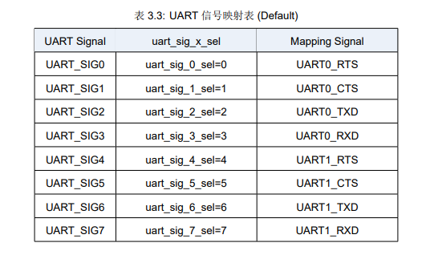

UART 引脚映射详解
===============================

博流系列芯片每个 pin 都可以配置成 UART 任意一个功能，这种灵活的配置就会出现一些坑，比如多个 pin 配成了一个 uart 功能。
下面介绍下如何正确的理解 `每个 pin 都可以配置成 UART 任意一个功能` 并防止踩坑。最后讲下 ``bflb_gpio_uart_init`` 函数的实现。

UART SIG
-------------------

在博流系列芯片中，有个 `UART SIG` 的概念, 每个 SIG 对应到 UART 所有功能，功能类似于 8选1 选择器或者 12 选1 选择器。并且每个 SIG 都有一个默认的 UART 功能，如图所示：

2 个 pin 选了一个 SIG
^^^^^^^^^^^^^^^^^^^^^^^

每个 GPIO 对应一个 SIG, 对应关系跟芯片相关，比如 BL602/BL702 是 mod 8 的关系，而 BL616/BL808 是 mod 12 的关系，这个时候就会产生一个问题， **存在重复的可能性**，
**假设现在是 mod 8 的关系，则 GPIO0 跟 GPIO8 都对应 SIG0，如果 GPIO0 配置了 UART 一个功能，则不能再使用 GPIO8，否则会出现两个 GPIO 共用一个功能的情况**。

2 个 SIG 选了一个 UART 功能
^^^^^^^^^^^^^^^^^^^^^^^^^^^^^^^^

为了方便软件，代码中将默认功能全部改成了 `0xF`，所有 SIG 都指向一个没有作用的功能。为什么这么做？

假设 GPIO2 默认使用 UART0 TX，这个时候我想使用 GPIO6 作为 UART0 TX，当我软件中配置 GPIO6 为 UART0 TX 以后，请问，GPIO2 是什么功能？没错，还是 UART0 TX，这个时候就是有问题的。

bflb_gpio_uart_init
------------------------

针对以上两个问题，出现了 ``bflb_gpio_uart_init``。该函数的作用是避免了 `2 个 SIG 选了一个 UART 功能` ，如果出现了，则后配置的覆盖前面的。
而对于 `2 个 pin 选了一个 SIG` 则是无法靠软件避免的，只能人为的避免。

