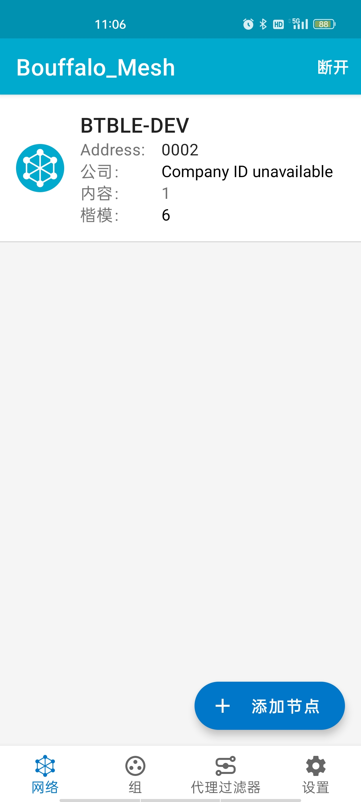

BLE MESH
====================

本节主要介绍 BLE mesh的使用，使用 ble mesh 组网并控制 led 开关。

硬件准备
-----------------------------

- 手机app 安装 Bouffalo_Mesh_v1.0_20211118.apk
- pc 终端工具：xshell 或者 mobaxterm

硬件连接
-----------------------------

无

软件实现
-----------------------------

更详细的代码请参考 **examples/btble/blemesh_cli**

编译和烧录
-----------------------------

参考 :ref:`get_started`

实验现象
-----------------------------

- 打开终端工具，选择好串口以后复位芯片，并敲回车，可以显示 shell 功能正常
- 输入 ``blemesh_init`` 和 ``blemesh_pb 2 1``

- 如果提示 Failed to enable PB-GATT (err -120)，输入 ``blemesh_reset`` 命令复位

- 到此芯片端初始化完成

- 打开 Bouffalo_Mesh app, 点击 **添加节点**

- 扫描出芯片的 BLE 名称和 mac 地址, 单击名称进行连接

- 连接完成，点击 **鉴定**

- 鉴定完成，点击 **规定**，会弹出一个选项，点击 **好**

.. figure:: img/blemesh7.jpg
    :alt:

- 规定完成，会弹出一个选项，点击 **好**

- 配置完成后，网络菜单项会显示连接的 BLE 设备，此时点击 BLE 设备

- 点击分子菜单的下拉框，点击 **Generic On Off Server**

- 点击 **绑定密钥**，点击 **Application Key 1**

- 下拉到最底下，点击 **上** 或者 **关闭** 发送开关命令给 BLE 设备，BLE 设备的串口会打印出开关命令的值

- 在 APP 当前界面点击 **订阅**，如果当前没有组，则创建一个组，并点击 **好**，如果组已经存在，则使用存在的组，这样设备就在一个组网中

- 点击 **组** 的界面，并点击创建的组，会显示 LED 开关的界面，点击 **上** 或者 **关闭** 发送开关命令给 BLE 设备，如果存在多个 BLE 设备，则会发给所有的 BLE 设备

- 如果需要添加多个 BLE 设备进行组网，只需要按照上述步骤重复即可，并加入到一个 group 中