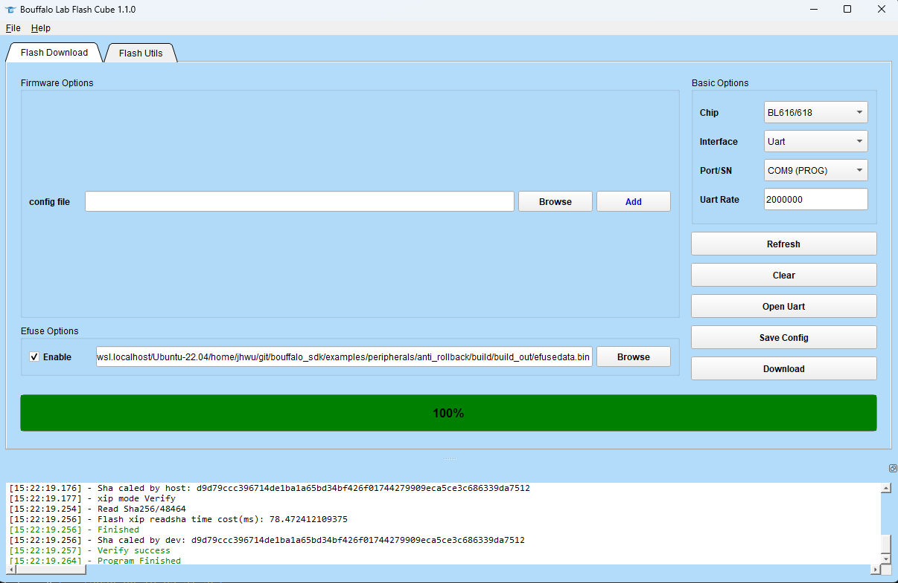

==================
anti-rollback介绍
==================

anti-rollback（反回滚）是指在设备或系统中使用的一种安全功能，它的目的是防止设备或系统的软件版本被回滚（降级）到早期版本，
从而避免由此带来的安全风险和不稳定性。具体来说，当设备或系统的软件版本被更新到一个新版本后，anti-rollback功能将会记录下当前的软件版本信息。
如果在之后的操作中，有人试图将软件版本回滚到较早的版本， Anti-rollback 功能就会阻止启动。

============
efuse烧写
============

1. 要使用anti-rollback功能，首先需要将efuse中的anti-rollback enable位烧写为1，而要烧写efuse，需要有对应的包含anti-rollback enable位配置的efusedata.bin文件。

2. 用于生成上述efusedata.bin文件的工具位于bouffalo_sdk/tools/bflb_tools/bflb_fw_post_proc/路径下，使用命令如下图所示：

其中，--imgfile指定任意一个编译好的固件，如图中指定的是examples/peripherals/下anti_rollback编译生成的anti_rollback_bl616.bin。

3. 运行之后会在anti_rollback_bl616.bin的同一目录下生成efusedata.bin。

4. 打开烧录工具Bouffalo Lab Flash Cube，在Efuse Options下勾选Enable选项，在右边选择刚才生成的efusedata.bin，如下图所示：

5. 点击Download按钮，等待efuse烧录完成。

==========================
anti-rollback相关API介绍
==========================

1. 代码示例在bouffalo_sdk/examples/peripherals/anti_rollback路径下。

2. 通过bflb_get_app_version_from_efuse()可以读取efuse中记录的anti-rollback版本号。默认情况下，efuse中记录的anti-rollback版本号为0，此时任意版本的应用固件都可以启动。

3. 通过bflb_set_app_version_to_efuse()可以配置efuse记录的anti-rollback版本号，当该版本号被设置为非0值时，
任何版本号小于该值的应用固件都将无法启动。anti-rollback版本号最大支持到128，即取值范围是0~128。

4. anti-rollback配置结构体如下图所示：

其中:
    anti_rollback：当前固件的版本号，当该值小于efuse中记录的anti-rollback版本号时，该固件将无法启动。

    x/y/z：用户自定义版本号，与anti-rollback功能无关。

    name：指向固件名称的字符串指针。

    build_time：指向固件编译时间的字符串指针。

    commit_id：指向固件代码commit id的字符串指针

    rsvd0/rsvd1：保留字段，未使用。

上述结构体配置会由链接脚本链接到特定地址上，用于标识当前固件的版本信息，启动固件时anti-rollback功能将会查询该信息进行比对，如下图所示：

==============
代码示例运行
==============

1. 代码示例在bouffalo_sdk/examples/peripherals/anti_rollback路径下。

2. 由于默认情况下efuse中记录的anti-rollback版本号为0，所以烧录完固件之后第一次可以正常启动，运行结果如下图所示：

3. 按下复位按钮，固件第二次将无法启动，因为在第一次运行过程中，efuse中记录的anti-rollback版本号被改为了1，而当前固件的版本号仍是0，小于efuse中记录的anti-rollback版本号，
所以第二次启动过程会被anti-rollback功能阻止，无法正常启动。

4. 将代码中的配置结构体app_ver的成员.anti_rollback的值改为1，重新烧录运行，固件将正常启动，代码修改如下图所示：

运行结果如下图所示：

