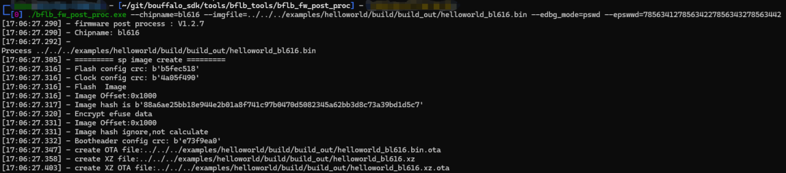
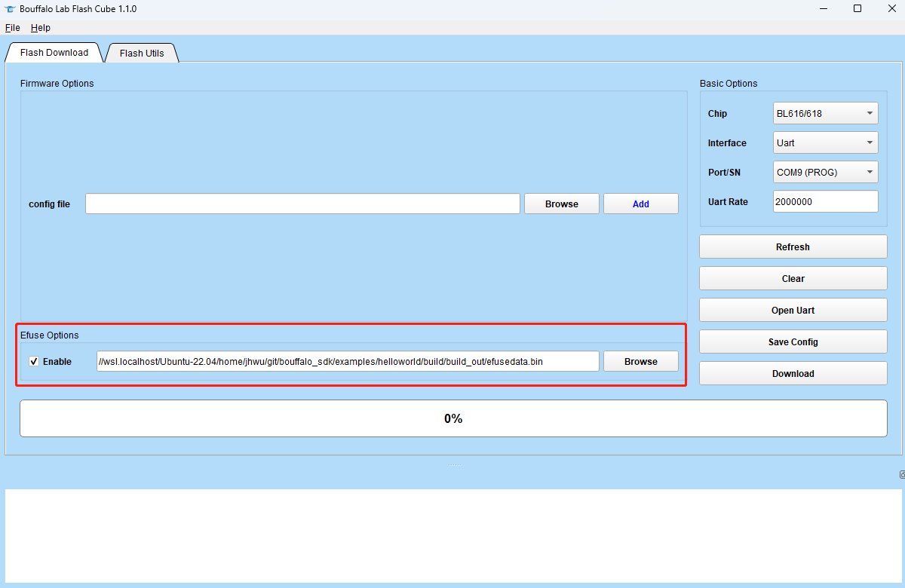
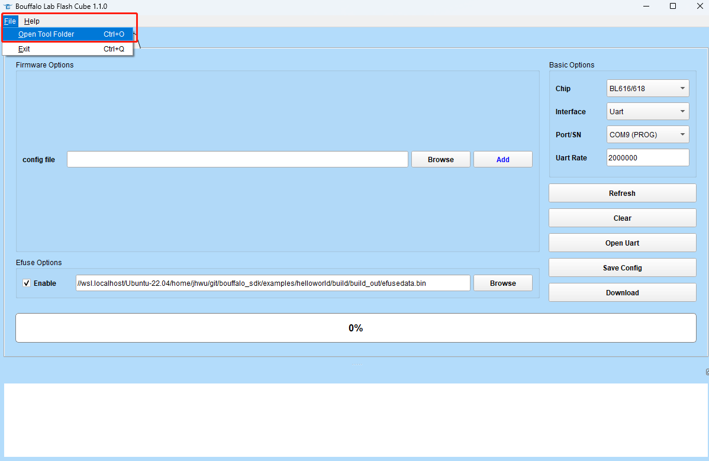
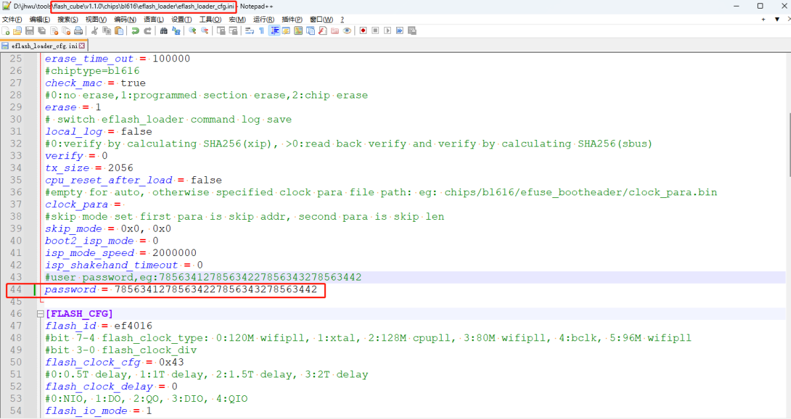
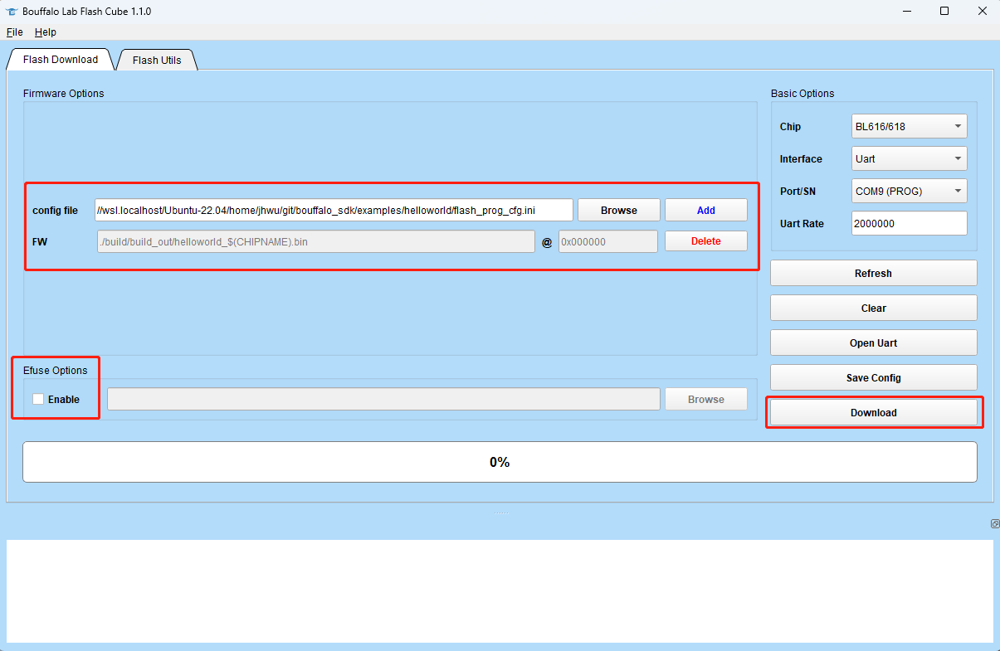
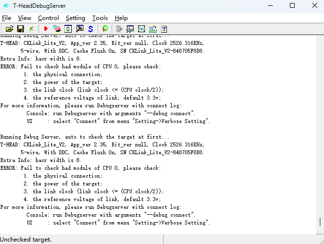
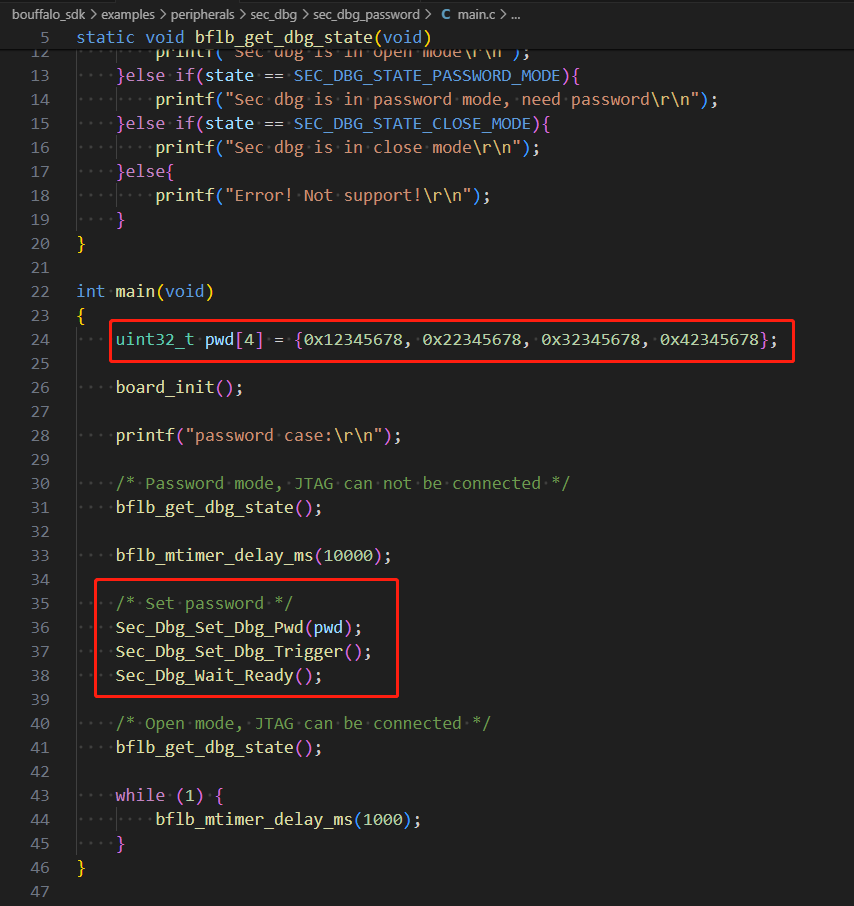
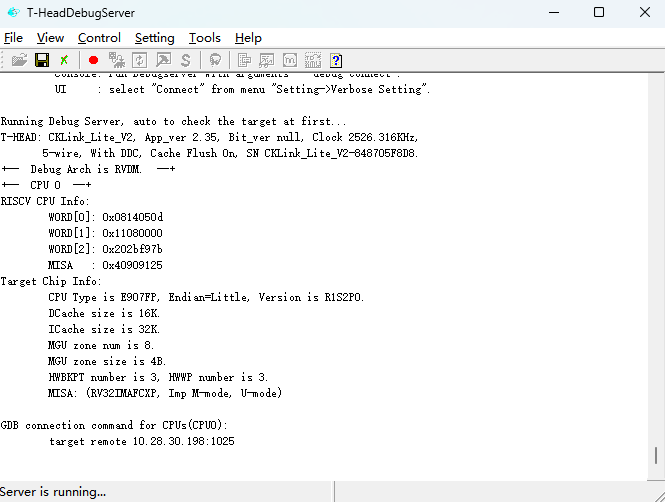

===============
password介绍
===============

password功能可以对烧录和JTAG连接进行保护，通过设置password，烧录过程中如果没有使用正确的password将无法正常烧写，程序运行过程中如果没有使用正确的password将无法连接JTAG。

==============
password烧写
==============

1. 要使用password功能，首先需要将password烧写到efuse中的指定位置，而要烧写efuse，需要有对应的包含password的efusedata.bin文件。

2. 用于生成上述efusedata.bin文件的工具位于bouffalo_sdk/tools/bflb_tools/bflb_fw_post_proc/路径下，使用命令如下图所示：

其中，--imgfile指定任意一个编译好的固件，如图中指定的是examples下helloworld编译生成的helloworld_bl616.bin。--epswwd指定烧录到efuse中的password十六进制值，
假设password[4] = {0x12345678, 0x22345678, 0x32345678, 0x42345678}，则 --epswwd = 78563412785634227856343278563442。

3. 运行之后会在helloworld_bl616.bin的同一目录下生成efusedata.bin。

.. raw:: latex

   \newpage

4. 打开烧录工具Bouffalo Lab Flash Cube，在Efuse Options下勾选Enable选项，在右边选择刚才生成的efusedata.bin，如下图所示：

5. 点击Download按钮，等待efuse烧录完成。

======================
使用password烧录固件
======================

1. 对于已经烧录了上述efusedata.bin的芯片，用烧录工具Bouffalo Lab Flash Cube烧录固件时，需要按以下步骤填入正确的password，否则烧录将会失败。

2. 首先，点击File选项卡下的Open Tool Folder，如下图所示：

.. raw:: latex

   \newpage

3. 然后在出现的文件夹中选择chips/bl616/eflash_loader_cfg.ini打开，找到password项，填入正确的password值，如下图所示：

4. 保存后回到烧录主界面，取消之前勾选的Efuse Options 下的Enable选项，选择固件对应的烧录文件，点击Download完成烧录。如下图所示：

====================================
应用程序中使用password打开JTAG连接
====================================

1. 代码示例在bouffalo_sdk/examples/peripherals/sec_dbg/ sec_dbg_password路径下。

2. 对于已经烧录了password的芯片，在运行代码时，如果没有调用Sec_Dbg相关接口填入password，JTAG将无法连接，如下图所示：

.. raw:: latex

   \newpage

3. 填入password的API如下图所示：

.. raw:: latex

   \newpage

4. 当Sec_Dbg_Wait_Ready()执行完后，JTAG将恢复连接功能，此时再进行连接可以正常调试，如下图所示：

