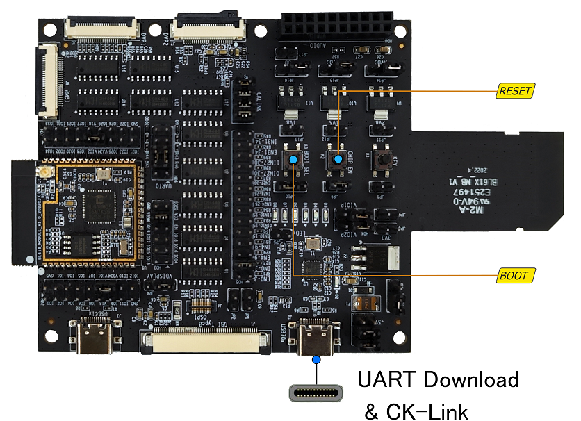
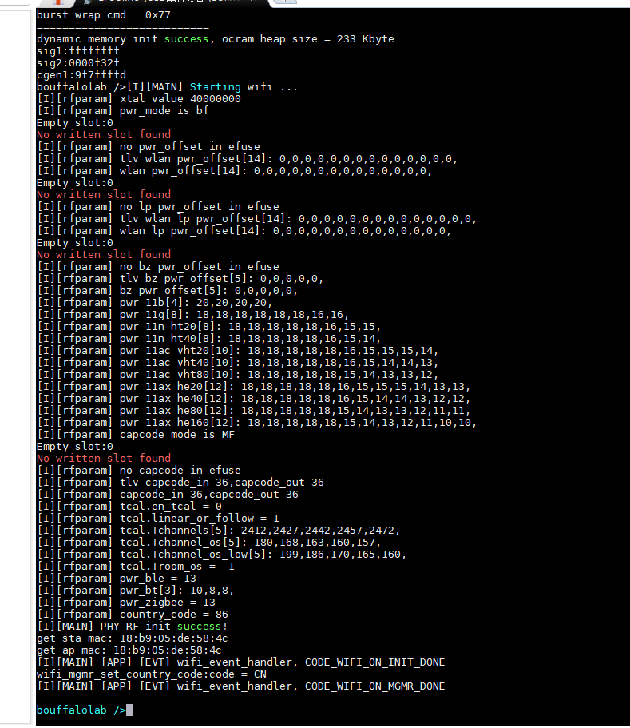
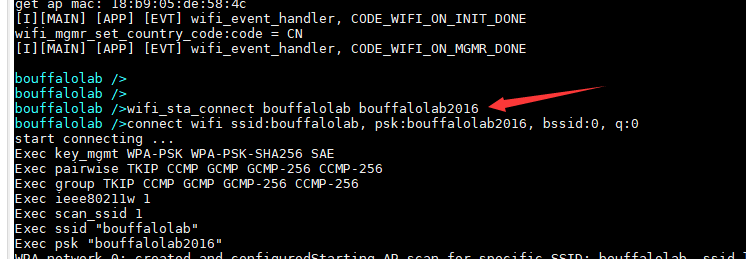
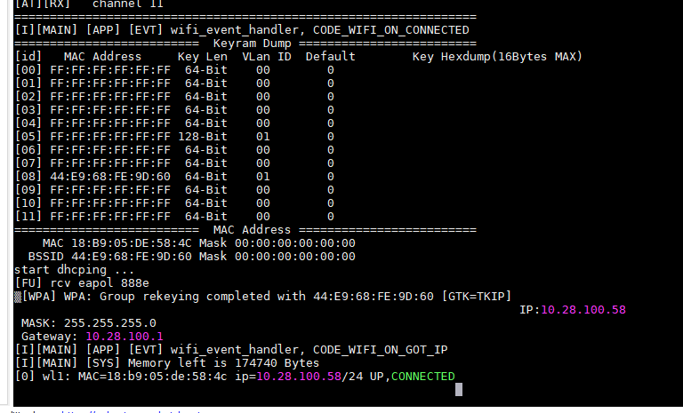
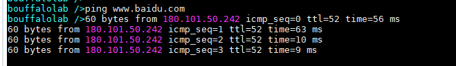
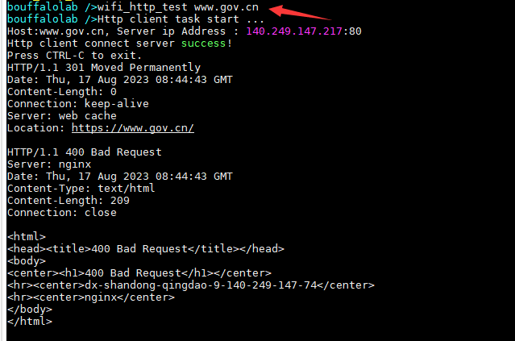

WIFI HTTP
====================

本节主要介绍 BL616/BL618 wifi 的使用，如何进行 http 请求。

开发前准备
-----------------------------

硬件准备
^^^^^^^^^^^

准备一块BL616/BL618开发板，本文使用的是BL618 DVK开发板，如下图：

开发板带有一个USB接口，使用一根 Type-C 线连接到电脑后，USB在给开发板供电的同时可以枚举出一个串口和CK-Link调试器设备。
串口用于将程序烧录到芯片的flash，CK-Link用于JTAG调试。如果没有安装 ck-link 驱动，可能不能枚举出ck-link设备，在本评估过程中不需要使用 ck-link，只要串口成功枚举即可。

开发板同时带有一个Boot按键，用于选择芯片复位后运行模式，配合Reset按键可以实现芯片的Flash启动和下载模式的进入。

- 运行模式

直接按下RESET按键并松开，按键松开后芯片从Flash启动，进入运行模式。

- 下载模式

先按下BOOT按键，再按下RESET按键，然后松开RESET按键，最后松开BOOT按键，此时芯片进入烧录模式。

PC 准备
^^^^^^^^^^^

准备 pc 终端工具：xshell 或者 mobaxterm，linux 下可以选择 picocom 或者 putty

硬件连接
-----------------------------

无

软件实现
-----------------------------

更详细的代码请参考 **examples/wifi/sta/wifi_http**

编译和烧录
-----------------------------

- 编译，Makefile 文件已经配置好了其他参数（ **CHIP** 和 **BOARD** ）,不需要用户再填写

.. code-block:: bash
   :linenos:

   $ cd examples/wifi/sta/wifi_http
   $ make

- 烧录

参考 :ref:`get_started` 烧录章节

实验现象
-----------------------------

- 打开串口终端软件，按下复位键，输出以下log，按回车键可以显示 **bouffalolab />** 字样，类似于 linux 的终端

- 输入 `wifi_sta_connect ssid pwd` 连接网络，其中 ssid 为连接的 ap 名称，pwd 为连接的 ap 密码

- wifi 连接成功后，会打印出分配的 ip 地址，并提示 CONNECTED

- 输入 `ping url` 可以 ping 一个网站，url 为网站 ip 地址或者域名

- 输入 `wifi_http_test url` 从网站中获取 html数据，url 为网站 ip 地址或者域名

- 其他命令的使用参考 :ref:`wifi6_api`