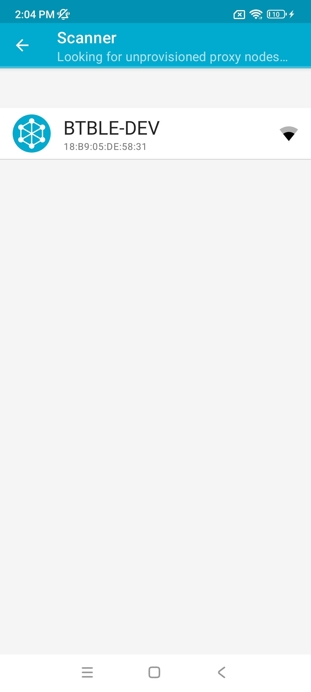
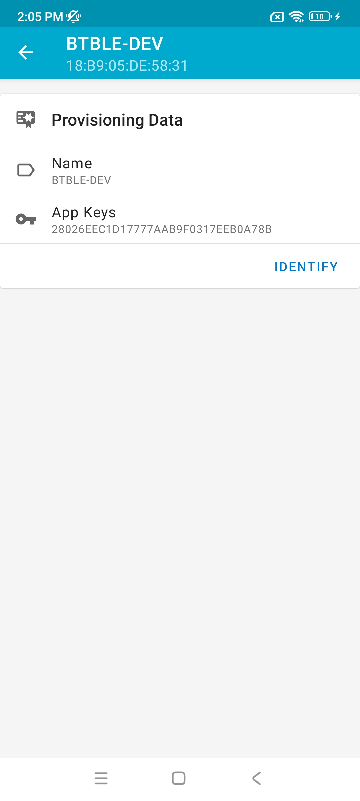
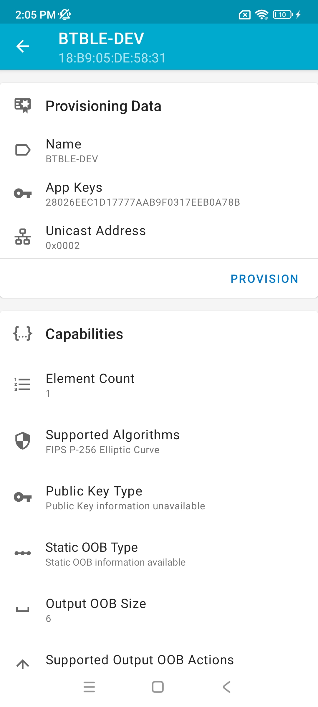
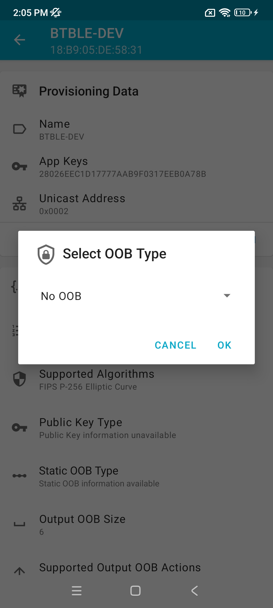
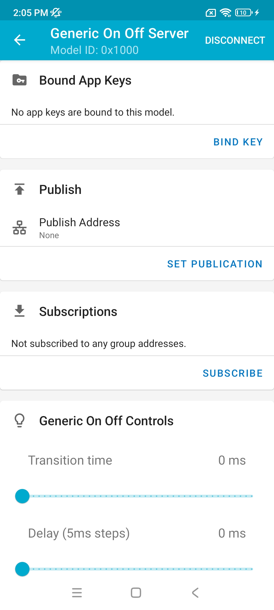
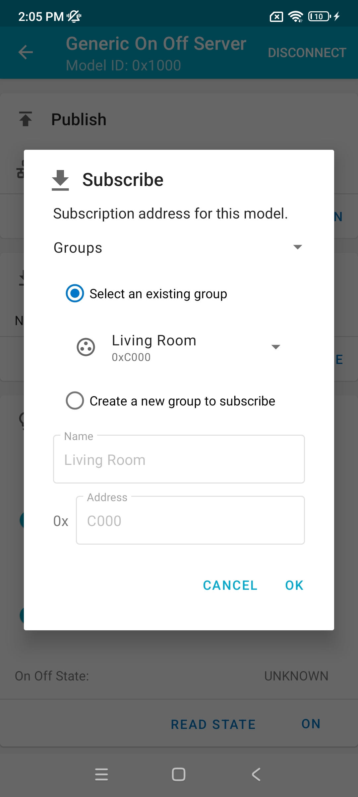
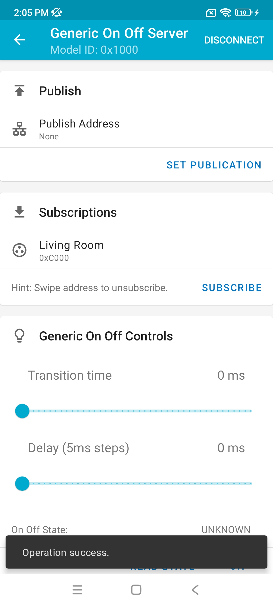
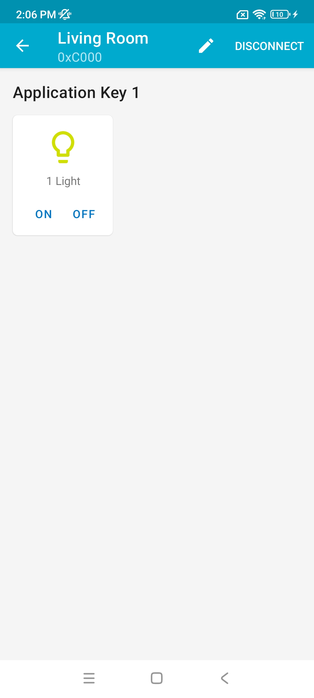

# ble_mesh_cli

This example shows how to use ble mesh.

## Support CHIP

|      CHIP        | Remark |
|:----------------:|:------:|
|BL616/BL618       |        |

## Compile

- BL616/BL618

```
make CHIP=bl616 BOARD=bl616dk
```

## Flash

```
make flash CHIP=chip_name COMX=xxx # xxx is your com name
```

## How to use

- Run the following mesh commands in the serial terminal

```bash
bouffalolab />blemesh_init
......

bouffalolab />blemesh_pb 2 1 
......

```

- Open the app and select ADD NODE in the Network column


- Select your device



- Click the IDENTIFY button



- Click the PROVISION button



- Select No OOB in the pop-up window and click ok



- Click ok


- Your node is automatically added to the Network column, click on your connected device
- Locate Elements option and click it’s drop-down button, Select the Generic On Off Server option


- Click the BIND KEY button



- Click Application key 1


- Click on the ON and OFF buttons to control the LED switch


- The following information can be seen in the serial monitor, indicating that the LED is successfully controlled



- Click the SUBSCRIBE button



- Select “Create a new group to subscribe” option

- In the group, clicking on ON and OFF buttons prints the LED information in the serial monitor, indicating that the mesh is working


