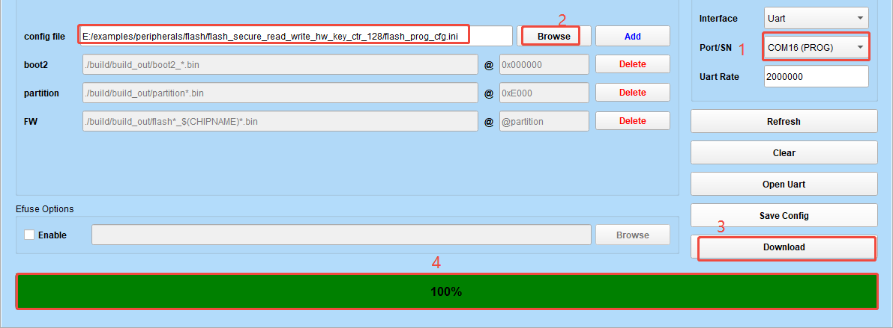

# flash_secure_read_write_hw_key_ctr_128

## Overview

The function implemented in this case is to encrypt the data in the application using the key in efuse and store it in flash, then read the data from flash and decrypt it.
The storage address comes from the "DATA" area of ​​the partition table.

## Key location

For the efuse function arrangement, please refer to ``eFuse Function Allocation``
For the sec eng AES module key location, please refer to ``BL616/BL618 Secure Boot Application Note``

For this case, the application is non-encrypted. According to ``BL616/BL618 Secure Boot Application Note``, the optional keys for sec eng are as follows:

| key_sel_1                | key_sel_0          | APP data Not Encrypt  |
|:------------------------:|:------------------:|:---------------------:|
| 0                        |  0                 | {Slot3,Slot2}         |
| 0                        |  1                 | {Slot4,Slot3}         |
| 0                        |  2                 | {Slot2,Slot4}         |
| 0                        |  3                 | {Slot2,Slot4}         |

If the sec eng encryption and decryption key is 128-bit and is written in Slot2, then key_sel_0 should be set to 2, and key_sel_1 set to 0.

If the sec eng encryption and decryption key is 256-bit and is written in Slot4 and Slot3 (the first byte of the byte stream is written in the lower 8 bits of Slot4), then key_sel_0 should be set to 1, and key_sel_1 set to 0.

This case uses 128-bit and the key is stored in Slot2 (offset address in efuse is 0x3c), so key_sel_0 should be set to 2, and key_sel_1 set to 0. The code is as follows:

```
    bflb_aes_select_hwkey(aes,2,0);
```

The value of key is:

```
    uint8_t aes_ctr_128bit_key[16] = {
        0x2b, 0x7e, 0x15, 0x16, 0x28, 0xae, 0xd2, 0xa6,
        0xab, 0xf7, 0x15, 0x88, 0x09, 0xcf, 0x4f, 0x3c
    };
```

The corresponding arrangement of efusedata.bin is as follows:


## Support CHIP

|      CHIP        | Remark |
|:----------------:|:------:|
|BL616/BL618       |        |

## Compile

- BL616/BL618

```
make CHIP=bl616 BOARD=bl616dk
```

## Efuse program

1. Use flash tool to program

Open the ``Flash Download`` interface of ``flash tool``, check the ``Enable`` box in ``Efuse Options``, click the ``Browse`` button, select the efusedata.bin to be programed, and click the ``Download`` button to complete the programming.


2. Use command tool to program

```
./BLFlashCommand.exe --interface=uart --chipname=bl616 --port=COM16 --baudrate=500000 --efusefile=E:/examples/peripherals/flash/flash_secure_read_write_hw_key_ctr_128/efusedata.bin
```
## Flash

1. Use flash tool to program

Open the ``Flash Download`` interface of ``flash tool``, click the ``Browse`` button, select the flash_prog_cfg.ini to be programed, and click the ``Download`` button to complete the programming.



2. Use command to program

```
make flash CHIP=chip_name COMX=xxx # xxx is your com name
```

## Example Output

```
data address: 003f3000
aes ctr128 encrypt success
flash write & read success
aes ctr128 decrypt success
```