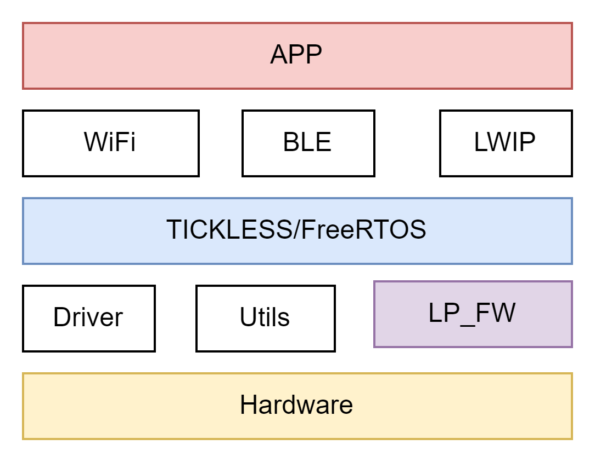
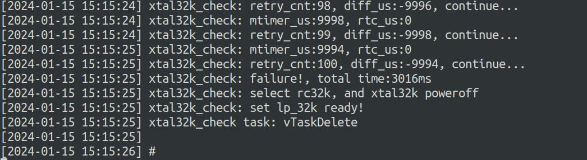
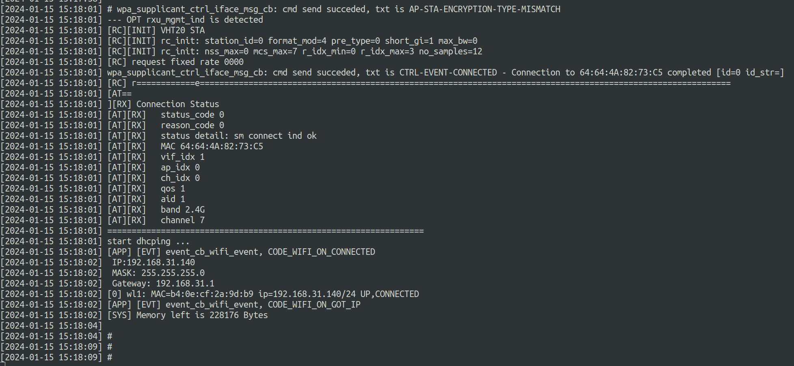
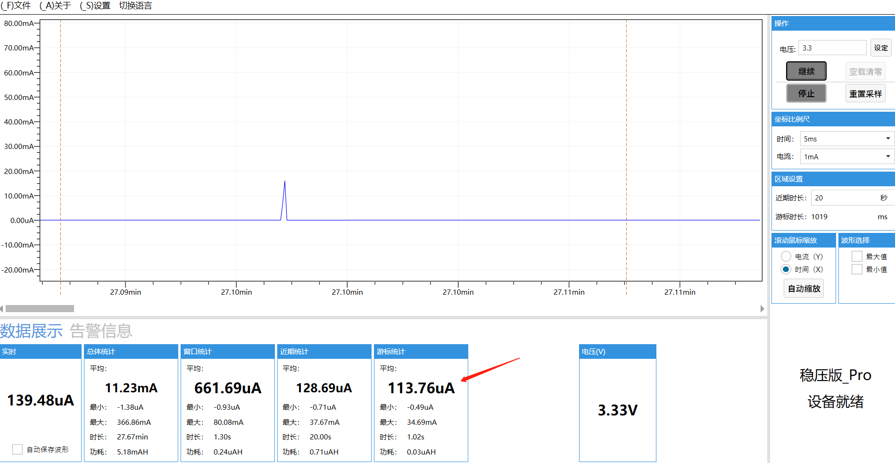

# 616低功耗简介文档

## BL616：PSRAM 保活配置

在本示例 `defconfig` 中配置：

```make
CONFIG_PSRAM_RETENTION =y
```

此选项替代原来的 `CONFIG_TICKLESS_PDS1`，表示 tickless 休眠时保持 PSRAM 供电，仅 BL616 生效。当前工作配置保留开启状态；设为 `n` 或删除该配置即可使用默认 PDS15 路径。其他芯片忽略此选项，保持默认休眠路径。该选项不负责启用或初始化 PSRAM，应用仍需按板级配置使用 PSRAM。

BL616 APP 将 PDS1/PDS15 级别通过 `iot2lp_para.pds_level` 传给 LPFW；两种模式共用同一份 LPFW，无需分别编译。先在 `examples/pmu/bl616_lp_fw` 中运行 `bash auto_release`，再编译 APP。详细构建及镜像选择见 [BL616 LPFW 说明](../bl616_lp_fw/README.md)。切换保活配置只需重新编译 APP，不需切换 LPFW 镜像；首次迁移必须同时更新 APP 和统一 LPFW。

PDS1 返回 APP 改为实验性的 CPU-only reset 路径，不再经过最终 PDS15 短睡眠跳板；复用 LPFW 的 XIP 和 APP 上下文恢复入口。需重新构建并打包新版 LPFW，单独重编 APP 不会更新已有 LPFW 二进制。默认 PDS15 模式不变。本次修改不替代上板验证：除定时、GPIO、Wi-Fi 唤醒和 PSRAM 内容外，还要验证唤醒后的实际 Wi-Fi 收发及连续多轮休眠，不能直接套用下文 PDS15 的功耗数据。

烧录并连接 Wi-Fi 后，串口执行 `tickless 10 0` 进入低功耗，或执行 `wakeup_timer 5000 0` 进行约 5 秒的定时唤醒测试。

## BL616 PSRAM 数据保持测试

本示例在 BL616 的 `defconfig` 分支中开启 `CONFIG_PSRAM=y`，启动时初始化 PSRAM 并注册堆；`CONFIG_PSRAM_RETENTION=y` 则选择 PDS1。需要板上实际有匹配的 PSRAM，链接脚本默认容量为 4 MiB。

初始化链路为 `board_init()` → `ram_heap_init()` → `board_psram_x8_init()`（`bsp/board/bl616dk/board.c` / `board_flash_psram.c`）。Winbond PSRAM 使用芯片内部刷新，而不是 CPU 周期性发 DRAM refresh；板级配置中 PASR 为全阵列刷新、禁止 deep power-down，但当前初始化明确写的是 CR0，不能仅凭配置结构断言 CR1 已被写入，实际模式应结合器件手册/寄存器读回确认。

不要为了测试在唤醒后直接调用完整 `board_psram_x8_init()`：未烧录 DQS trim 时，初始化扫描会写 PSRAM，破坏待校验数据。控制器/时钟恢复与存储芯片重新初始化应分开判断。

新增两个命令（仅 BL616 且开启 PSRAM 时编译）：

- `psram_write [seed]`：从 PSRAM 堆申请尽可能大的连续空闲块，目标留下 64 KiB 供其他用途；写入由字索引和种子生成的确定性数据。默认种子 `0x61612345`，可指定其他十进制/十六进制种子。打印实际测试地址和字节数；不覆盖已分配对象、堆元数据及静态段。碎片化时实际范围会小于总空闲容量。
- `psram_verify`：完整读回并比较，输出正确/错误字节数、错误字数、错误位数和字节正确率（四位小数），最多打印前 8 个错误位置。不会初始化、复位 PSRAM，也不会重写测试数据。

写入结束 clean+invalidate D-cache，校验前只 invalidate 测试块，避免缓存造成假通过。测试块在检查后仍保持分配，可以重复休眠/检查；再次写入复用同一块，重启释放。指针、长度和种子放在片内 SRAM。两个命令均关闭 tickless，避免读写中途再次入睡；再次休眠需显式运行休眠命令。

推荐先连接 Wi-Fi，再执行：

```text
psram_write
psram_verify
wakeup_timer 10000 0
# 等待约 10 秒唤醒、串口恢复后：
psram_verify
```

第一次校验建立不经过 PDS 的基线，应为 `PASS` 和 `100.0000%`。随后可重复 `wakeup_timer 60000 0` → `psram_verify`，以及更换种子后重新测试。检查低功耗日志/统计，确认实际进入 PDS，而不只是等待定时器。

唤醒后通过表示当前完整恢复路径下数据可读且无需在命令中额外初始化；不等同于底层从未恢复控制器。失败不能单独区分 DRAM 内容丢失、PSRAM 控制器/时钟未恢复或板级时序问题。若读取卡死/异常，也需要调试器检查控制器状态，命令无法将总线挂死统计为错误率。PSRAM 堆元数据也可能受休眠影响，失败后应重启，不要继续分配/释放内存。

### PSRAM 寄存器访问时钟

`CONFIG_LPAPP` 使用 `bl616dk/board.c` 的 `peripheral_clock_init_lp()`，其精简时钟配置从零重写 `GLB_CGEN_CFG2`。原实现没有保留 bit18（PSRAM 控制器总线时钟），这与普通 `pds_rtc` 初始化路径不同。现在在 `CONFIG_PSRAM` 下通过 SDK `GLB_PER_Clock_UnGate(GLB_AHB_CLOCK_PSRAM1_CTRL)` 恢复该时钟；此函数同时用于启动和 `board_recovery()`，避免唤醒后再次门控。SDK 中 PSRAM1_CTRL 对应 bit18，PSRAM0_CTRL 的 ungate 分支为空，不要仅凭名称换成后者。

刷新命令也通过同一 SDK API 幂等开启总线时钟，并打印 `CGEN_CFG2` 和 `gate18` 前后值。只修改时钟门控，不修改 PSRAM 时钟源/分频、不重置或重新初始化器件。`status` 不写器件 CR1，但会开启访问所需总线时钟。该修复针对源码中确定的门控遗漏；仍需上板确认 CR1 不再固定为 ID，并在 PDS 后重复读取。启用必要时钟可能影响活跃功耗，应使用同一固件比较刷新 ON/OFF。

### 内部刷新开关（破坏性测试）

`psram_refresh off` 向 Winbond CR1 写入 `PASR=NONE`，`psram_refresh on` 写入 `PASR=FULL`；`psram_refresh status` 只读状态，不写配置（也会关闭 tickless）。破坏性控制限于当前 WB_4MB（ID `0x005f`），按 SDK 定义 FULL=0、NONE=4；保留其他控制器时序/突发字段，不做 reset 或 DQS 初始化。

器件寄存器读写统一调用 BL616 SDK 的 `PSram_Ctrl_Winbond_Read_Reg()` / `PSram_Ctrl_Winbond_Write_Reg()`，不再使用应用自定义 REQ/GNT、pulse、DONE 轮询或 10 us 延时。是否使用 ROM 由 SDK 实现/构建决定，不直接调用 ROM 地址。写配置从当前控制器写影子提取，保留其他字段、仅修改 PASR 并禁止复位；写前 clean 全部 D-cache。应用只读控制器影子/状态用于配置保留和诊断，不直接写控制器寄存器。

ID 不匹配或写前读取失败时停止操作，但写前 CR1 等于 ID0/0xffff 只警告、不阻止写入。写后强制读取 CR1 → ID0 → CR1，即使写事务超时也尝试回读；逐项打印 SDK 返回码、CR1 原始结果、WB_CONFIG 写影子和 WB_STATUS 只读状态。写影子变化或 SDK 返回 SUCCESS 均不能单独作为成功依据。SDK 超时路径的请求释放行为由底层驱动负责；当前 BL616 C 实现存在超时提前返回而未释放请求的路径，遇到超时应重启，不继续破坏性实验。

两次回读一致、PASR 符合目标且原始值没有明显异常才报告 `VERIFIED readback`，否则报告 `WRITE ATTEMPTED, EFFECT UNCONFIRMED`。`Transition observed=yes` 表示本次写入前后同时观察到 PASR 和原始 CR1 变化。先执行 `on → off → on` 验证可重复的 `0 → 4 → 0`；单次已等于目标不能证明切换有效。命令不会自动切换到相反模式。SDK 读取通路与刷新行为仍需上板验证。

```text
psram_write
psram_verify
psram_refresh on
psram_refresh status
psram_refresh off
psram_refresh status
# 确认 OFF VERIFIED 和 PASR=4，再等待；先不进入 PDS
psram_refresh on
psram_refresh status
# 确认 ON VERIFIED 和 PASR=0
psram_verify
```

关闭前要求先执行 `psram_write`。整个颗粒都会受到影响，不限于测试块：堆元数据和其他对象可能损坏，系统可能崩溃；开启刷新不能恢复已丢失数据。应在专用测试板上执行，结束后重启，不继续使用该 PSRAM 堆。短时间仍正确不代表关闭无效，数据衰减与温度、等待时长有关。刷新命令关闭 tickless；若另做 PDS 对比，需显式执行休眠命令。不要在刷新关闭期间反复读取测试区，以免访问干扰保持时间实验。

## 概述

### 1. 低功耗设计简述

BL616的低功耗方案使用了FreeRTOS的tickless机制来实现低功耗。系统在没有其他任务需要运行时，进入IDLE任务并进入硬件的PDS15低功耗模式，从而实现系统的低功耗。系统可以通过深睡唤醒源（如GPIO、RTC等）进行唤醒。休眠时间的确定采用了tickless机制，避免了每个系统tick都被唤醒。模组作为STA时，系统在空闲时会自动进入休眠，休眠时间取决于系统空闲状态、关联AP的DTIM和Beacon周期。

BL616的低功耗方案包含两个固件：应用固件(APP_FW)和低功耗固件(LP_FW)。应用固件基于FreeRTOS的tickless机制实现低功耗，即系统在没有其他任务就绪需要运行时，进入IDLE任务并进入硬件的PDS15低功耗模式，从而实现系统的低功耗。


在实际应用中，系统可以通过多种方式被唤醒，包括FreeRTOS定时任务、WiFi数据包和外部GPIO中断等。这些唤醒源由低功耗固件处理。应用固件和低功耗固件的主要分工如下：
- BL616作主控，单协议栈。
- 其他CPU做主控（如T31），BL616作为一个低功耗网卡，双协议栈。

| 固件类型                | 功能                                    |
|-----------------------|---------------------------------------|
| **低功耗固件(LP_FW)**   | GPIO唤醒判断                             |
|                       | RTC唤醒的判断                             |
|                       | DTIM接收和唤醒的判断                        |
|                       |                                         |
| **应用固件(APP_FW)**    | 外设GPIO的初始化                           |
|                       | 应用业务逻辑                               |
|                       | 低功耗模式设置及唤醒(RTC,GPIO,DTIM)设置      |
|                       | 低功耗唤醒后的外设GPIO的重新初始化          |
|                       | 运行客户应用和业务的固件                      |


### 2. BL616低功耗模式的特点

- 超低功耗模式
  - CPU下电，RAM保持下电，大部分外设下电。（GPIO16-20保持）
  - 支持WIFI协议规定的节能模式
  - 支持GPIO，WIFI，RTC唤醒
  - 保持AP连接（Station 关联Ap后）。
- 退出低功耗后，SDIO等外设需要重新初始化才可以再次工作


### 3. BL616低功耗模式应用场景

完成烧录后，打开一个串口工具，例如putty。设定好串口号(下载口使用的串口号)，波特率为115200。然后按下开发板的 CHIP_EN/Reset 复位键。此时可在串口工具上看到启动 Log 如下：



在串口工具上输入命令“wifi_sta_connect <ssid> <psk>/r/n”，进行连接路由器。
例如：
- 待连接的路由器 ssid 是 MERCURY_D5DDE8，没有加密，则通过串口发送命令“wifi_sta_connect MERCURY_D5DDE8/r/n”。
- 待连接的路由器 ssid 是 Xiaomi_0A16，密码是12345678，则通过串口发送命令“wifi_sta_connect Xiaomi_0A16 12345678/r/n”

联网过程需要大概 5 秒左右，完成的 log 如下：


联网成功后，在串口工具上输入命令“tickless 10/r/n”，进入 dtim10 状态。每 10 个 Beacon 醒来一次，完成 Beacon 的接收后再次进入睡眠。此时通过 Power Monitor 可以看到芯片电流情况如下。



## BL616低功耗开发流程

**Freertos的tickless模式：**
Tickless模式下，FreeRTOS会根据任务的调度需求和时间限制来决定是否进入低功耗模式。如果没有即将到期的定时器、延时或其他事件，系统将进入睡眠状态。当有任务需要运行时，系统会立即唤醒并处理任务。

**616的省电状态：**
616可以根据应用场景设置为省电状态，具体方式如下所示。BL616的省电模式分为以下两种：
- 在系统正常启动后，将全局变量 enable_tickless设置为1，则可以进入低功耗模式。将enable_tickless置为0，则可以退出低功耗模式。
- 在未连接状态下，芯片和系统仅会被系统task或者gpio唤醒。在唤醒后，执行完相应的task后，如果没有即将到期的定时器、延时或其他事件，则会自动再次进入睡眠。


### 配置io唤醒
- BL618 IO:0-34，其中16-20为AON模式IO，即在常电和低功耗模式下均保持。AON IO支持的低电平，和双边沿唤醒。其余IO，如需要在低功耗模式下配置为唤醒源，则需要配置。
- 进入PDS（低功耗）后，支持IO唤醒，唤醒模式可以配置成以下模式：

| 接口名称                             | 描述             |
|-------------------------------------|------------------|
| `BL_LP_PDS_IO_TRIG_SYNC_FALLING_EDGE` | 同步下降沿       |
| `BL_LP_PDS_IO_TRIG_SYNC_RISING_EDGE`  | 同步上升沿       |
| `BL_LP_PDS_IO_TRIG_SYNC_HIGH_LEVEL`   | 同步高电平       |
| `BL_LP_PDS_IO_TRIG_ASYNC_FALLING_EDGE`| 异步下降沿       |
| `BL_LP_PDS_IO_TRIG_ASYNC_RISING_EDGE` | 异步上升沿       |
| `BL_LP_PDS_IO_TRIG_ASYNC_HIGH_LEVEL`  | 异步高电平       |

示例代码
```c
static void cmd_io_test(char *buf, int len, int argc, char **argv)
{
    static bl_lp_io_cfg_t lp_wake_io_cfg = {
        /* input enable, use @ref BL_LP_IO_INPUT_EN */
        .io_0_15_ie = BL_LP_IO_INPUT_ENABLE,
        .io_16_ie = BL_LP_IO_INPUT_ENABLE,
        .io_17_ie = BL_LP_IO_INPUT_ENABLE,
        .io_18_ie = BL_LP_IO_INPUT_ENABLE,
        .io_19_ie = BL_LP_IO_INPUT_ENABLE,
        .io_20_34_ie = BL_LP_IO_INPUT_ENABLE,
        /* trigger mode */
        .io_0_7_pds_trig_mode = BL_LP_PDS_IO_TRIG_SYNC_FALLING_EDGE,          /* use @ref BL_LP_PDS_IO_TRIG */
        .io_8_15_pds_trig_mode = BL_LP_PDS_IO_TRIG_SYNC_HIGH_LEVEL,           /* use @ref BL_LP_PDS_IO_TRIG */
        .io_16_19_aon_trig_mode = BL_LP_AON_IO_TRIG_SYNC_RISING_FALLING_EDGE, /* aon io, use @ref BL_LP_AON_IO_TRIG, full mode support */
        .io_20_27_pds_trig_mode = BL_LP_PDS_IO_TRIG_SYNC_FALLING_EDGE,        /* use @ref BL_LP_PDS_IO_TRIG */
        .io_28_34_pds_trig_mode = BL_LP_PDS_IO_TRIG_SYNC_FALLING_EDGE,        /* use @ref BL_LP_PDS_IO_TRIG */
        /* resistors */
        .io_0_15_res = BL_LP_IO_RES_PULL_UP,
        .io_16_res = BL_LP_IO_RES_NONE,
        .io_17_res = BL_LP_IO_RES_NONE,
        .io_18_res = BL_LP_IO_RES_PULL_UP,
        .io_19_res = BL_LP_IO_RES_PULL_UP,
        .io_20_34_res = BL_LP_IO_RES_PULL_DOWN,
        /* wake up unmask */
        .io_wakeup_unmask = 0,
    };

    /* wake up unmask */
    lp_wake_io_cfg.io_wakeup_unmask |= ((uint64_t)1 << 0);  /* gpio 0 */
    lp_wake_io_cfg.io_wakeup_unmask |= ((uint64_t)1 << 10); /* gpio 10 */
    lp_wake_io_cfg.io_wakeup_unmask |= ((uint64_t)1 << 18); /* gpio 18 */
    lp_wake_io_cfg.io_wakeup_unmask |= ((uint64_t)1 << 19); /* gpio 19 */
    lp_wake_io_cfg.io_wakeup_unmask |= ((uint64_t)1 << 20); /* gpio 20 */

    lp_wake_io_cfg.io_wakeup_unmask |= ((uint64_t)1 << 31); /* gpio 31 */
    lp_wake_io_cfg.io_wakeup_unmask |= ((uint64_t)1 << 32); /* gpio 32 */
    // lp_wake_io_cfg.io_wakeup_unmask |= ((uint64_t)1 << 33);     /* gpio 33 */
    // lp_wake_io_cfg.io_wakeup_unmask |= ((uint64_t)1 << 34);     /* gpio 34 */

    bl_lp_io_wakeup_cfg(&lp_wake_io_cfg);

    /* register io wakeup callback */
    bl_lp_wakeup_io_int_register(test_wakeup_io_callback);
}
```


#### 唤醒后IO功能配置
进入低功耗后，外设会断电，所以退出低功耗后，若需要使用相关的外设，需要重新初始化。


#### 进入低功耗

调用 pm_enable_tickless 接口，则开启进入freertos的tickless模式。若处于未联网状态，则可以直接进入低功耗。

```c
static void cmd_tickless(char *buf, int len, int argc, char **argv)
{
  pm_enable_tickless();
}
```


### WiFi连接状态

简介：

BL616在连上AP后，可以和ap交互，进入power save模式。

在power save模式下，BL616会定期唤醒接收beacon帧。当beacon 帧中表明当前连接的BL616有缓存的数据包时，BL616会唤醒，并接收数据。在接收完数据后，会继续睡眠。

BL616可以配置唤醒的DTIM间隔。beacon的间隔越长，则唤醒频率越低。假设每个beacon的间隔是102.4ms， 当配置DTIM3时，则BL616 在102.4ms * 3收一次beacon。DTIM10，则1.024s收一次beacon。
接口功能：
| 接口名称                | 描述                                   |
|-----------------------|--------------------------------------|
| `wifi_sta_connect`    | 连接AP                               |
| `wifi_mgmr_sta_ps_enter` | 和ap交互，进入wifi power save模式       |
| `wifi_mgmr_sta_ps_exit`  | 退出wifi power save模式               |
| `enable_tickless`     | 设置进入和退出低功耗模式                |
| `lpfw_cfg.dtim_origin` | 设置DTIM                             |


#### 低功耗模式的使用流程：

1. **步骤1** - 调用 `wifi_sta_connect` 连接wifi。
2. **步骤2** - 当产生连接成功，并且拿到IP的事件后，调用 `wifi_mgmr_sta_ps_enter`。
3. **步骤3** - 设置DITM，并且调用 `pm_enable_tickless`。

```c
case CODE_WIFI_ON_GOT_IP:
{
    printf("[APP] [EVT] %s, CODE_WIFI_ON_GOT_IP\r\n", __func__);
    printf("[SYS] Memory left is %d Bytes\r\n", xPortGetFreeHeapSize());

    wifi_sta_ps_enter();
    lpfw_cfg.dtim_origin = 10;
    pm_enable_tickless();
}
```
此时BL616则进入了wifi 低功耗模式。


### 若要退出wifi低功耗模式：

1. **步骤1** - 调用 `wifi_mgmr_sta_ps_exit`。
2. **步骤2** - 调用 `pm_disable_tickless`。

此时BL616是常电wifi模式。

```c
static void proc_hellow_entry(void *pvParameters)
{
    vTaskDelay(50000);

    //exit wifi power save and tickless
    wifi_mgmr_sta_ps_exit();
    pm_disable_tickless();

    while (1) {
        vTaskDelay(40000);
    }
    vTaskDelete(NULL);
}
```


### 3. 不能进入休眠模式可能是什么原因？

1. **定时器使用错误**
   - 举例：启动10ms周期定时器。
   - 分析：系统在入睡前会检查是否有定时器即将到期，如果定时器即将到期，系统不允许进入系统低功耗模式。
   - 建议：根据实际业务启动定时器，在业务空闲时关闭对应定时器，特别是周期性定时器。

2. **任务使用错误**
   - 举例：任务体中循环操作，无主动释放动作，如调用阻塞接口。
   - 分析：某一任务无主动释放动作，则其他低优先级任务得不到执行，严重时会引起看门狗复位。系统在入睡前会检查是否有任务即将被调度，如果存在任务主动释放过少，则系统不允许进入系统低功耗模式。
   - 建议：业务设计上尽量调用阻塞接口，超时时间设置为无穷大或合理超时时间。

3. **vTaskDelay使用错误**
   - 举例：调用`vTaskDelay`接口，传参为10ms。
   - 分析：该行为效果类似于启动10ms周期定时器，该任务会以10ms周期被调度，入睡前检查有任务即将到期，不允许进入系统低功耗模式。
   - 建议：尽量采用阻塞接口，阻塞时间设置为无穷大或合理超时时间；或者采用定时器实现，并在业务认为空闲时关闭定时器。

4. **在连上ap状态下未调用wifi_sta_ps_enter，wifi子系统未进入power save模式**
   - 举例：连上ap的状态下，未调用`wifi_sta_ps_enter`接口, wifi子系统未进入power save模式。
   - 分析：打开Wi-Fi子系统低功耗是系统可进入休眠模式的前提，否则即使设置了低功耗模式系统也不会进入休眠模式。
   - 建议：连上ap的状态下，采用低功耗策略，必须打开Wi-Fi子系统低功耗。


### 4. 为什么从睡眠唤醒后系统执行异常？

1. **外设未重新初始化**
   - 举例：增加I2C接口的调用后，上电后系统运行正常，深睡模式唤醒后I2C工作异常。
   - 分析：深睡模式后外设模块掉电，唤醒后需要进行重新初始化。
   - 建议：在`hi_lpc_register_wakeup_entry`注册的接口中增加I2C的初始化，同时注意初始化位置，须在UART和Flash初始化之后调用对应初始化函数。

2. **外设对应业务概率性收发报文异常**
   - 举例：SPI设备通信发现偶尔接收不到数据，或发送数据与预期不符。
   - 分析：睡眠后外设均掉电，会导致接收不到对端的发送数据，或者调用完异步发送接口后，数据实际并未发送出去，但系统认为没有业务即将或正在执行，从而进入休眠模式导致数据发送异常。
   - 建议：在完成数据发送完前，不要enable tickless 进入睡眠。


### 5. 为什么功耗比预期偏高

可以从硬件和软件两方面排查：

   - 检查底电流是否符合预期
   - 确认是否有task频繁唤醒。打开`tickless.c`中的debug log。
   - 确认是否一直存在频繁的流量交互。
   - 打开`tickless.c`的debug log，确认是否有其他事件或者原因阻止睡眠。
