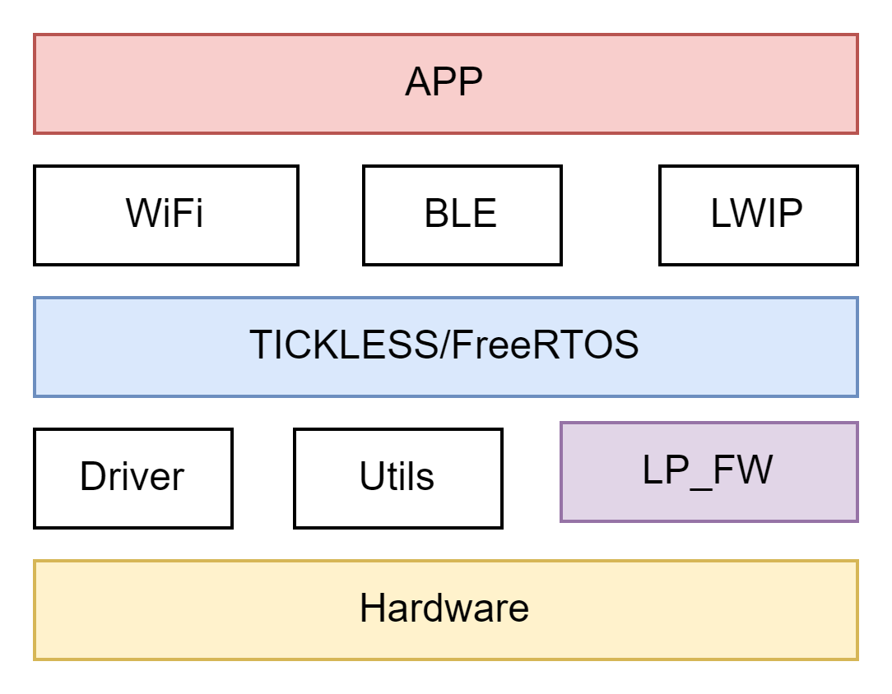

# 616低功耗简介文档

## 概述

### 1. 低功耗设计简述

BL616的低功耗方案使用了FreeRTOS的tickless机制来实现低功耗。系统在没有其他任务需要运行时，进入IDLE任务并进入硬件的PDS15低功耗模式，从而实现系统的低功耗。系统可以通过深睡唤醒源（如GPIO、RTC等）进行唤醒。休眠时间的确定采用了tickless机制，避免了每个系统tick都被唤醒。模组作为STA时，系统在空闲时会自动进入休眠，休眠时间取决于系统空闲状态、关联AP的DTIM和Beacon周期。

BL616的低功耗方案包含两个固件：应用固件(APP_FW)和低功耗固件(LP_FW)。应用固件基于FreeRTOS的tickless机制实现低功耗，即系统在没有其他任务就绪需要运行时，进入IDLE任务并进入硬件的PDS15低功耗模式，从而实现系统的低功耗。


在实际应用中，系统可以通过多种方式被唤醒，包括FreeRTOS定时任务、WiFi数据包和外部GPIO中断等。这些唤醒源由低功耗固件处理。应用固件和低功耗固件的主要分工如下：
- BL616作主控，单协议栈。
- 其他CPU做主控（如T31），BL616作为一个低功耗网卡，双协议栈。

| 固件类型                | 功能                                    |
|-----------------------|---------------------------------------|
| **低功耗固件(LP_FW)**   | GPIO唤醒判断                             |
|                       | RTC唤醒的判断                             |
|                       | DTIM接收和唤醒的判断                        |
|                       |                                         |
| **应用固件(APP_FW)**    | 外设GPIO的初始化                           |
|                       | 应用业务逻辑                               |
|                       | 低功耗模式设置及唤醒(RTC,GPIO,DTIM)设置      |
|                       | 低功耗唤醒后的外设GPIO的重新初始化          |
|                       | 运行客户应用和业务的固件                      |


### 2. BL616低功耗模式的特点

- 超低功耗模式
  - CPU下电，RAM保持下电，大部分外设下电。（GPIO16-20保持）
  - 支持WIFI协议规定的节能模式
  - 支持GPIO，WIFI，RTC唤醒
  - 保持AP连接（Station 关联Ap后）。
- 退出低功耗后，SDIO等外设需要重新初始化才可以再次工作


### 3. BL616低功耗模式应用场景

完成烧录后，打开一个串口工具，例如putty。设定好串口号(下载口使用的串口号)，波特率为115200。然后按下开发板的 CHIP_EN/Reset 复位键。此时可在串口工具上看到启动 Log 如下：


在串口工具上输入命令“wifi_sta_connect <ssid> <psk>/r/n”，进行连接路由器。
例如：
- 待连接的路由器 ssid 是 MERCURY_D5DDE8，没有加密，则通过串口发送命令“wifi_sta_connect MERCURY_D5DDE8/r/n”。
- 待连接的路由器 ssid 是 Xiaomi_0A16，密码是12345678，则通过串口发送命令“wifi_sta_connect Xiaomi_0A16 12345678/r/n”

联网过程需要大概 5 秒左右，完成的 log 如下：


联网成功后，在串口工具上输入命令“tickless 10/r/n”，进入 dtim10 状态。每 10 个 Beacon 醒来一次，完成 Beacon 的接收后再次进入睡眠。此时通过 Power Monitor 可以看到芯片电流情况如下。


## BL616低功耗开发流程

**Freertos的tickless模式：**
Tickless模式下，FreeRTOS会根据任务的调度需求和时间限制来决定是否进入低功耗模式。如果没有即将到期的定时器、延时或其他事件，系统将进入睡眠状态。当有任务需要运行时，系统会立即唤醒并处理任务。

**616的省电状态：**
616可以根据应用场景设置为省电状态，具体方式如下所示。BL616的省电模式分为以下两种：
- 在系统正常启动后，将全局变量 enable_tickless设置为1，则可以进入低功耗模式。将enable_tickless置为0，则可以退出低功耗模式。
- 在未连接状态下，芯片和系统仅会被系统task或者gpio唤醒。在唤醒后，执行完相应的task后，如果没有即将到期的定时器、延时或其他事件，则会自动再次进入睡眠。


### 配置io唤醒
- BL618 IO:0-34，其中16-20为AON模式IO，即在常电和低功耗模式下均保持。AON IO支持的低电平，和双边沿唤醒。其余IO，如需要在低功耗模式下配置为唤醒源，则需要配置。
- 进入PDS（低功耗）后，支持IO唤醒，唤醒模式可以配置成以下模式：

| 接口名称                             | 描述             |
|-------------------------------------|------------------|
| `BL_LP_PDS_IO_TRIG_SYNC_FALLING_EDGE` | 同步下降沿       |
| `BL_LP_PDS_IO_TRIG_SYNC_RISING_EDGE`  | 同步上升沿       |
| `BL_LP_PDS_IO_TRIG_SYNC_HIGH_LEVEL`   | 同步高电平       |
| `BL_LP_PDS_IO_TRIG_ASYNC_FALLING_EDGE`| 异步下降沿       |
| `BL_LP_PDS_IO_TRIG_ASYNC_RISING_EDGE` | 异步上升沿       |
| `BL_LP_PDS_IO_TRIG_ASYNC_HIGH_LEVEL`  | 异步高电平       |

示例代码
```c
static void cmd_io_test(char *buf, int len, int argc, char **argv)
{
    static bl_lp_io_cfg_t lp_wake_io_cfg = {
        /* input enable, use @ref BL_LP_IO_INPUT_EN */
        .io_0_15_ie = BL_LP_IO_INPUT_ENABLE,
        .io_16_ie = BL_LP_IO_INPUT_ENABLE,
        .io_17_ie = BL_LP_IO_INPUT_ENABLE,
        .io_18_ie = BL_LP_IO_INPUT_ENABLE,
        .io_19_ie = BL_LP_IO_INPUT_ENABLE,
        .io_20_34_ie = BL_LP_IO_INPUT_ENABLE,
        /* trigger mode */
        .io_0_7_pds_trig_mode = BL_LP_PDS_IO_TRIG_SYNC_FALLING_EDGE,          /* use @ref BL_LP_PDS_IO_TRIG */
        .io_8_15_pds_trig_mode = BL_LP_PDS_IO_TRIG_SYNC_HIGH_LEVEL,           /* use @ref BL_LP_PDS_IO_TRIG */
        .io_16_19_aon_trig_mode = BL_LP_AON_IO_TRIG_SYNC_RISING_FALLING_EDGE, /* aon io, use @ref BL_LP_AON_IO_TRIG, full mode support */
        .io_20_27_pds_trig_mode = BL_LP_PDS_IO_TRIG_SYNC_FALLING_EDGE,        /* use @ref BL_LP_PDS_IO_TRIG */
        .io_28_34_pds_trig_mode = BL_LP_PDS_IO_TRIG_SYNC_FALLING_EDGE,        /* use @ref BL_LP_PDS_IO_TRIG */
        /* resistors */
        .io_0_15_res = BL_LP_IO_RES_PULL_UP,
        .io_16_res = BL_LP_IO_RES_NONE,
        .io_17_res = BL_LP_IO_RES_NONE,
        .io_18_res = BL_LP_IO_RES_PULL_UP,
        .io_19_res = BL_LP_IO_RES_PULL_UP,
        .io_20_34_res = BL_LP_IO_RES_PULL_DOWN,
        /* wake up unmask */
        .io_wakeup_unmask = 0,
    };

    /* wake up unmask */
    lp_wake_io_cfg.io_wakeup_unmask |= ((uint64_t)1 << 0);  /* gpio 0 */
    lp_wake_io_cfg.io_wakeup_unmask |= ((uint64_t)1 << 10); /* gpio 10 */
    lp_wake_io_cfg.io_wakeup_unmask |= ((uint64_t)1 << 18); /* gpio 18 */
    lp_wake_io_cfg.io_wakeup_unmask |= ((uint64_t)1 << 19); /* gpio 19 */
    lp_wake_io_cfg.io_wakeup_unmask |= ((uint64_t)1 << 20); /* gpio 20 */

    lp_wake_io_cfg.io_wakeup_unmask |= ((uint64_t)1 << 31); /* gpio 31 */
    lp_wake_io_cfg.io_wakeup_unmask |= ((uint64_t)1 << 32); /* gpio 32 */
    // lp_wake_io_cfg.io_wakeup_unmask |= ((uint64_t)1 << 33);     /* gpio 33 */
    // lp_wake_io_cfg.io_wakeup_unmask |= ((uint64_t)1 << 34);     /* gpio 34 */

    bl_lp_io_wakeup_cfg(&lp_wake_io_cfg);

    /* register io wakeup callback */
    bl_lp_wakeup_io_int_register(test_wakeup_io_callback);
}
```


#### 唤醒后IO功能配置
进入低功耗后，外设会断电，所以退出低功耗后，若需要使用相关的外设，需要重新初始化。


#### 进入低功耗
设置全局变量enable_tickless为1，则开启进入freertos的tickless模式。若处于未联网状态，则可以直接进入低功耗。
```c
static void cmd_exit_tickless(char *buf, int len, int argc, char **argv)
{
  enable_tickless = 0;
}
```


### WiFi连接状态

简介：

BL616在连上AP后，可以和ap交互，进入power save模式。

在power save模式下，BL616会定期唤醒接收beacon帧。当beacon 帧中表明当前连接的BL616有缓存的数据包时，BL616会唤醒，并接收数据。在接收完数据后，会继续睡眠。

BL616可以配置唤醒的DTIM间隔。beacon的间隔越长，则唤醒频率越低。假设每个beacon的间隔是102.4ms， 当配置DTIM3时，则BL616 在102.4ms * 3收一次beacon。DTIM10，则1.024s收一次beacon。
接口功能：
| 接口名称                | 描述                                   |
|-----------------------|--------------------------------------|
| `wifi_sta_connect`    | 连接AP                               |
| `wifi_mgmr_sta_ps_enter` | 和ap交互，进入wifi power save模式       |
| `wifi_mgmr_sta_ps_exit`  | 退出wifi power save模式               |
| `enable_tickless`     | 设置进入和退出低功耗模式                |
| `lpfw_cfg.dtim_origin` | 设置DTIM                             |


#### 低功耗模式的使用流程：

1. **步骤1** - 调用 `wifi_sta_connect` 连接wifi。
2. **步骤2** - 当产生连接成功，并且拿到IP的事件后，调用 `wifi_mgmr_sta_ps_enter`。
3. **步骤3** - 设置DITM，并且设置 `enable_tickless` 为1。

```c
case CODE_WIFI_ON_GOT_IP:
{
    printf("[APP] [EVT] %s, CODE_WIFI_ON_GOT_IP\r\n", __func__);
    printf("[SYS] Memory left is %d Bytes\r\n", xPortGetFreeHeapSize());

    wifi_sta_ps_enter();
    lpfw_cfg.dtim_origin = 10;
    enable_tickless = 1;
}
```
此时BL616则进入了wifi 低功耗模式。


### 若要退出wifi低功耗模式：

1. **步骤1** - 调用 `wifi_mgmr_sta_ps_exit`。
2. **步骤2** - 设置 `enable_tickless` 为0。

此时BL616是常电wifi模式。

```c
static void proc_hellow_entry(void *pvParameters)
{
    vTaskDelay(50000);

    //exit wifi power save and tickless
    wifi_mgmr_sta_ps_exit();
    enable_tickless = 0;

    while (1) {
        vTaskDelay(40000);
    }
    vTaskDelete(NULL);
}
```


### 3. 不能进入休眠模式可能是什么原因？

1. **定时器使用错误**
   - 举例：启动10ms周期定时器。
   - 分析：系统在入睡前会检查是否有定时器即将到期，如果定时器即将到期，系统不允许进入系统低功耗模式。
   - 建议：根据实际业务启动定时器，在业务空闲时关闭对应定时器，特别是周期性定时器。

2. **任务使用错误**
   - 举例：任务体中循环操作，无主动释放动作，如调用阻塞接口。
   - 分析：某一任务无主动释放动作，则其他低优先级任务得不到执行，严重时会引起看门狗复位。系统在入睡前会检查是否有任务即将被调度，如果存在任务主动释放过少，则系统不允许进入系统低功耗模式。
   - 建议：业务设计上尽量调用阻塞接口，超时时间设置为无穷大或合理超时时间。

3. **vTaskDelay使用错误**
   - 举例：调用`vTaskDelay`接口，传参为10ms。
   - 分析：该行为效果类似于启动10ms周期定时器，该任务会以10ms周期被调度，入睡前检查有任务即将到期，不允许进入系统低功耗模式。
   - 建议：尽量采用阻塞接口，阻塞时间设置为无穷大或合理超时时间；或者采用定时器实现，并在业务认为空闲时关闭定时器。

4. **在连上ap状态下未调用wifi_sta_ps_enter，wifi子系统未进入power save模式**
   - 举例：连上ap的状态下，未调用`wifi_sta_ps_enter`接口, wifi子系统未进入power save模式。
   - 分析：打开Wi-Fi子系统低功耗是系统可进入休眠模式的前提，否则即使设置了低功耗模式系统也不会进入休眠模式。
   - 建议：连上ap的状态下，采用低功耗策略，必须打开Wi-Fi子系统低功耗。


### 4. 为什么从睡眠唤醒后系统执行异常？

1. **外设未重新初始化**
   - 举例：增加I2C接口的调用后，上电后系统运行正常，深睡模式唤醒后I2C工作异常。
   - 分析：深睡模式后外设模块掉电，唤醒后需要进行重新初始化。
   - 建议：在`hi_lpc_register_wakeup_entry`注册的接口中增加I2C的初始化，同时注意初始化位置，须在UART和Flash初始化之后调用对应初始化函数。

2. **外设对应业务概率性收发报文异常**
   - 举例：SPI设备通信发现偶尔接收不到数据，或发送数据与预期不符。
   - 分析：睡眠后外设均掉电，会导致接收不到对端的发送数据，或者调用完异步发送接口后，数据实际并未发送出去，但系统认为没有业务即将或正在执行，从而进入休眠模式导致数据发送异常。
   - 建议：在完成数据发送完前，不要enable tickless 进入睡眠。


### 5. 为什么功耗比预期偏高

可以从硬件和软件两方面排查：

   - 检查底电流是否符合预期
   - 确认是否有task频繁唤醒。打开`tickless.c`中的debug log。
   - 确认是否一直存在频繁的流量交互。
   - 打开`tickless.c`的debug log，确认是否有其他事件或者原因阻止睡眠。
