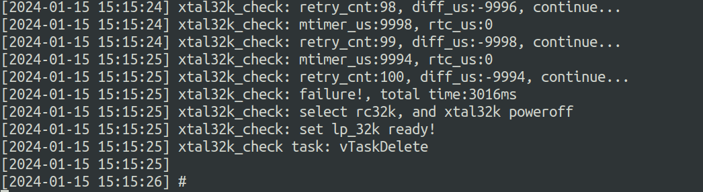
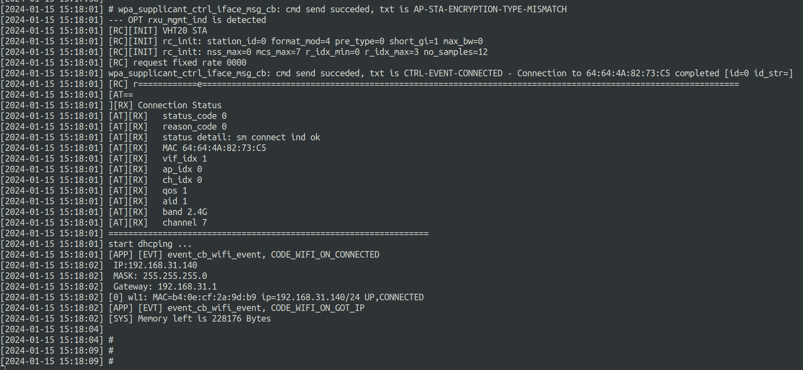

# BL616 Low-Power Brief Documentation

## Overview

### 1. Brief Description of Low-Power Design

The low-power solution of BL616 implements low power consumption using FreeRTOS's tickless mechanism. 
When there are no other tasks to run, the system enters the IDLE task and the hardware's PDS15 low-power mode, thereby achieving low power consumption of the system. 
The system can be woken up by deep sleep wake-up sources (such as GPIO, RTC, etc.). The determination of the sleep time adopts the tickless mechanism to avoid being woken up at each system tick. 
When the module works as a STA, the system will automatically enter sleep mode when idle. The sleep time depends on the system's idle state, the DTIM of the associated AP, and the Beacon interval.

The low-power solution of BL616 includes two firmwares: Application Firmware (APP_FW) and Low-Power Firmware (LP_FW). 
The application firmware implements low power consumption based on FreeRTOS's tickless mechanism. 
That is, when no other tasks are ready to run, the system enters the IDLE task and the hardware's PDS15 low-power mode, thus realizing the low power consumption of the system.


In practical applications, the system can be woken up in various ways, including FreeRTOS timing tasks, WiFi data packets, and external GPIO interrupts. 
These wake-up sources are handled by the low-power firmware. The main division of labor between the application firmware and the low-power firmware is as follows:
- BL616 acts as the main controller with a single protocol stack.
- Other CPUs act as the main controller (such as T31), and BL616 serves as a low-power network card with dual protocol stacks.

| Firmware Type                | Function                                    |
|-----------------------|---------------------------------------|
| **Low-Power Firmware (LP_FW)**   | 	GPIO wake-up judgment                             |
|                       | RTC wake-up judgment                             |
|                       | DTIM reception and wake-up judgment                        |
|                       |                                         |
| **Application Firmware (APP_FW)**    | Initialization of peripheral GPIO                           |
|                       | 	Application business logic                               |
|                       | Low-power mode setup and wake-up (RTC, GPIO, DTIM) configuration      |
|                       | Re-initialization of peripheral GPIO after low-power wake-up          |
|                       | 	Firmware for running customer applications and services                      |


### 2. Characteristics of BL616 Low-Power Mode

- Ultra-low power mode
  - CPU is powered off, RAM remains powered off, and most peripherals are powered off. (GPIO16-20 remain powered on)
  - Supports energy-saving modes specified by the WIFI protocol
  - Supports wake-up via GPIO, WIFI, and RTC
  - Maintains AP connection (after Station associates with the AP)
- After exiting low-power mode, peripherals such as SDIO need to be re-initialized to work again


### 3. Application Scenarios of BL616 Low-Power Mode

After completing the burning, open a serial port tool, such as putty. Set the correct serial port number (the one used by the download port) and the baud rate to 115200. 
Then press the CHIP_EN/Reset button on the development board. At this point, you can see the startup log on the serial port tool as follows:



Enter the command "wifi_sta_connect <ssid> <psk>/r/n" in the serial port tool to connect to the router.
For example:
- If the SSID of the router to be connected is MERCURY_D5DDE8 and it is not encrypted, send the command "wifi_sta_connect MERCURY_D5DDE8/r/n" through the serial port.
- If the SSID of the router to be connected is Xiaomi_0A16 and the password is 12345678, send the command "wifi_sta_connect Xiaomi_0A16 12345678/r/n" through the serial port.

The networking process takes about 5 seconds, and the completed log is as follows:


After successful networking, enter the command "tickless 10/r/n" in the serial port tool to enter the dtim10 state. 
It wakes up once every 10 Beacons, and goes back to sleep after receiving the Beacon. At this point, the current of the chip can be observed through the Power Monitor as follows.


## BL616 Low-Power Development Process

**FreeRTOS Tickless Mode:**
In Tickless mode, FreeRTOS determines whether to enter low-power mode based on task scheduling requirements and time constraints. 
If there are no upcoming timers, delays, or other events, the system will enter a sleep state. When a task needs to run, the system will wake up immediately and process the task.

**616 Power-Saving States:**
616 can be set to power-saving states according to application scenarios, as follows. The power-saving modes of BL616 are divided into the following two types:
- After the system starts normally, set the global variable enable_tickless to 1 to enter low-power mode. Set enable_tickless to 0 to exit low-power mode.
- In the unconnected state, the chip and system will only be woken up by system tasks or GPIO. After waking up, after executing the corresponding tasks, 
if there are no upcoming timers, delays, or other events, it will automatically enter sleep again.


### Configuring IO Wakeup
- BL618 IOs: 0-34, where IOs 16-20 are in AON mode, meaning they remain active in both normal power and low-power modes. 
AON IOs support low-level and both-edge wakeup. For other IOs to be configured as wakeup sources in low-power mode, additional configuration is required.
- After entering PDS (Low-Power State), IO wakeup is supported with configurable wakeup modes as follows:

| Interface Name                             | Description             |
|-------------------------------------|------------------|
| `BL_LP_PDS_IO_TRIG_SYNC_FALLING_EDGE` | 	Synchronous Falling Edge       |
| `BL_LP_PDS_IO_TRIG_SYNC_RISING_EDGE`  | Synchronous Rising Edge       |
| `BL_LP_PDS_IO_TRIG_SYNC_HIGH_LEVEL`   | 	Synchronous High Level       |
| `BL_LP_PDS_IO_TRIG_ASYNC_FALLING_EDGE`| Asynchronous Falling Edge       |
| `BL_LP_PDS_IO_TRIG_ASYNC_RISING_EDGE` | Asynchronous Rising Edge       |
| `BL_LP_PDS_IO_TRIG_ASYNC_HIGH_LEVEL`  | Asynchronous High Level       |

Example Code
```c
static void cmd_io_test(char *buf, int len, int argc, char **argv)
{
    static bl_lp_io_cfg_t lp_wake_io_cfg = {
        /* input enable, use @ref BL_LP_IO_INPUT_EN */
        .io_0_15_ie = BL_LP_IO_INPUT_ENABLE,
        .io_16_ie = BL_LP_IO_INPUT_ENABLE,
        .io_17_ie = BL_LP_IO_INPUT_ENABLE,
        .io_18_ie = BL_LP_IO_INPUT_ENABLE,
        .io_19_ie = BL_LP_IO_INPUT_ENABLE,
        .io_20_34_ie = BL_LP_IO_INPUT_ENABLE,
        /* trigger mode */
        .io_0_7_pds_trig_mode = BL_LP_PDS_IO_TRIG_SYNC_FALLING_EDGE,          /* use @ref BL_LP_PDS_IO_TRIG */
        .io_8_15_pds_trig_mode = BL_LP_PDS_IO_TRIG_SYNC_HIGH_LEVEL,           /* use @ref BL_LP_PDS_IO_TRIG */
        .io_16_19_aon_trig_mode = BL_LP_AON_IO_TRIG_SYNC_RISING_FALLING_EDGE, /* aon io, use @ref BL_LP_AON_IO_TRIG, full mode support */
        .io_20_27_pds_trig_mode = BL_LP_PDS_IO_TRIG_SYNC_FALLING_EDGE,        /* use @ref BL_LP_PDS_IO_TRIG */
        .io_28_34_pds_trig_mode = BL_LP_PDS_IO_TRIG_SYNC_FALLING_EDGE,        /* use @ref BL_LP_PDS_IO_TRIG */
        /* resistors */
        .io_0_15_res = BL_LP_IO_RES_PULL_UP,
        .io_16_res = BL_LP_IO_RES_NONE,
        .io_17_res = BL_LP_IO_RES_NONE,
        .io_18_res = BL_LP_IO_RES_PULL_UP,
        .io_19_res = BL_LP_IO_RES_PULL_UP,
        .io_20_34_res = BL_LP_IO_RES_PULL_DOWN,
        /* wake up unmask */
        .io_wakeup_unmask = 0,
    };

    /* wake up unmask */
    lp_wake_io_cfg.io_wakeup_unmask |= ((uint64_t)1 << 0);  /* gpio 0 */
    lp_wake_io_cfg.io_wakeup_unmask |= ((uint64_t)1 << 10); /* gpio 10 */
    lp_wake_io_cfg.io_wakeup_unmask |= ((uint64_t)1 << 18); /* gpio 18 */
    lp_wake_io_cfg.io_wakeup_unmask |= ((uint64_t)1 << 19); /* gpio 19 */
    lp_wake_io_cfg.io_wakeup_unmask |= ((uint64_t)1 << 20); /* gpio 20 */

    lp_wake_io_cfg.io_wakeup_unmask |= ((uint64_t)1 << 31); /* gpio 31 */
    lp_wake_io_cfg.io_wakeup_unmask |= ((uint64_t)1 << 32); /* gpio 32 */
    // lp_wake_io_cfg.io_wakeup_unmask |= ((uint64_t)1 << 33);     /* gpio 33 */
    // lp_wake_io_cfg.io_wakeup_unmask |= ((uint64_t)1 << 34);     /* gpio 34 */

    bl_lp_io_wakeup_cfg(&lp_wake_io_cfg);

    /* register io wakeup callback */
    bl_lp_wakeup_io_int_register(test_wakeup_io_callback);
}
```


#### IO Function Configuration After Wakeup
After entering low-power mode, peripherals are powered down. Therefore, after exiting low-power mode, if you need to use relevant peripherals, you need to reinitialize them.


#### Entering Low-Power Mode
Set the global variable enable_tickless to 1 to enable FreeRTOS's tickless mode. If the device is not connected to the network, it can directly enter low-power mode.
```c
static void cmd_exit_tickless(char *buf, int len, int argc, char **argv)
{
  enable_tickless = 0;
}
```


### WiFi Connection Status

Introduction:

After connecting to an AP, BL616 can interact with the AP and enter the power save mode.

In the power save mode, BL616 wakes up periodically to receive beacon frames. When a beacon frame indicates that there are buffered data packets for the connected BL616, 
BL616 wakes up to receive the data. After receiving the data, it returns to sleep.

BL616 supports configuration of the DTIM interval for wakeup. A longer beacon interval results in lower wakeup frequency. Assuming each beacon interval is 102.4ms:
When configured with DTIM3, BL616 receives a beacon every 102.4ms * 3 = 307.2ms.
When configured with DTIM10, BL616 receives a beacon every 102.4ms * 10 = 1.024s.

Interface Functions:
| Interface Name                | Description                                   |
|-----------------------|--------------------------------------|
| `wifi_sta_connect`    | Connect to AP                               |
| `wifi_mgmr_sta_ps_enter` | Interact with AP to enter WiFi power save mode       |
| `wifi_mgmr_sta_ps_exit`  | Exit WiFi power save mode               |
| `enable_tickless`     | 	Configure entry and exit of low-power mode                |
| `lpfw_cfg.dtim_origin` | Set DTIM                             |


#### Workflow for Using Low-Power Mode:

1. **Step 1** - Call `wifi_sta_connect` to connect to WiFi.
2. **Step 2** - After a successful connection and obtaining an IP address, call `wifi_mgmr_sta_ps_enter`.
3. **Step 3** - Configure DTIM and set `enable_tickless` to 1.

```c
case CODE_WIFI_ON_GOT_IP:
{
    printf("[APP] [EVT] %s, CODE_WIFI_ON_GOT_IP\r\n", __func__);
    printf("[SYS] Memory left is %d Bytes\r\n", xPortGetFreeHeapSize());

    wifi_sta_ps_enter();
    lpfw_cfg.dtim_origin = 10;
    enable_tickless = 1;
}
```
At this point, BL616 enters the WiFi low-power mode.


### To exit WiFi low-power mode:

1. **Step 1** - Call `wifi_mgmr_sta_ps_exit`.
2. **Step 2** - Set `enable_tickless` to 0.

At this point, BL616 is in the normal-power WiFi mode.

```c
static void proc_hellow_entry(void *pvParameters)
{
    vTaskDelay(50000);

    //exit wifi power save and tickless
    wifi_mgmr_sta_ps_exit();
    enable_tickless = 0;

    while (1) {
        vTaskDelay(40000);
    }
    vTaskDelete(NULL);
}
```


### 3. What are the possible reasons for failing to enter sleep mode?

1. **Incorrect use of timers**
   - Example: Starting a timer with a 10ms period.
   - Analysis: Before going to sleep, the system checks if there are any timers about to expire. 
   If a timer is about to expire, the system is not allowed to enter the low-power mode.
   - Suggestion: Start timers according to actual business needs, and turn off corresponding timers when the business is idle, especially periodic timers.

2. **Incorrect use of tasks**
   - Example: Loop operations in the task body without active release actions, such as calling blocking interfaces.
   - Analysis: If a task has no active release actions, other lower-priority tasks cannot be executed, and in severe cases, it may cause a watchdog reset. Before going to sleep, 
   the system checks if there are tasks about to be scheduled. If there are too few active releases of tasks, the system is not allowed to enter the low-power mode.
   - Suggestion: Try to call blocking interfaces in business design, and set the timeout time to infinity or a reasonable timeout period.

3. **Incorrect use of vTaskDelay**
   - Example: Calling the `vTaskDelay` interface with a parameter of 10ms.
   - Analysis: This behavior is similar to starting a 10ms periodic timer. The task will be scheduled at a 10ms period. 
   Before going to sleep, the system checks that there are tasks about to expire and is not allowed to enter the low-power mode.
   - Suggestion: Try to use blocking interfaces with the blocking time set to infinity or a reasonable timeout period; 
   or implement it with a timer and turn off the timer when the business is considered idle.

4. **Not calling wifi_sta_ps_enter when connected to an AP, and the WiFi subsystem not entering power save mode**
   - Example: When connected to an AP, the `wifi_sta_ps_enter` interface is not called, and the WiFi subsystem does not enter the power save mode.
   - Analysis: Enabling the low-power mode of the WiFi subsystem is a prerequisite for the system to enter sleep mode. 
   Otherwise, even if the low-power mode is set, the system will not enter sleep mode.
   - Suggestion: When connected to an AP and adopting a low-power strategy, the low-power mode of the WiFi subsystem must be enabled.


### 4. Why does the system behave abnormally after waking up from sleep?

1. **Peripherals not re-initialized**
   - Example: After adding calls to the I2C interface, the system runs normally after power-on, but the I2C works abnormally after waking up from deep sleep mode.
   - Analysis: Peripheral modules are powered off in deep sleep mode and need to be re-initialized after waking up.
   - Suggestion: Add I2C initialization in the interface registered by `hi_lpc_register_wakeup_entry`. 
   Meanwhile, pay attention to the initialization position: the corresponding initialization function must be called after the initialization of UART and Flash.

2. **Probabilistic abnormalities in sending/receiving messages for peripheral-related services**
   - Example: During SPI device communication, data is occasionally not received, or the sent data does not match expectations.
   - Analysis: All peripherals are powered off after sleep, which may cause failure to receive data sent by the opposite end. Or, after calling the asynchronous sending interface, 
   the data is not actually sent out, but the system thinks there are no upcoming or ongoing services, thus entering sleep mode and causing abnormal data transmission.
   - Suggestion: Do not enable tickless to enter sleep until the data transmission is completed.


### 5. Why is the power consumption higher than expected?

Troubleshooting can be carried out from both hardware and software aspects:

   - Check whether the base current meets the expected value.
   - Confirm if there are tasks waking up frequently. Enable the debug log in `tickless.c`.
   - Confirm if there is continuous frequent traffic interaction.
   - Enable the debug log in `tickless.c` to confirm if there are other events or reasons preventing the system from sleeping.
