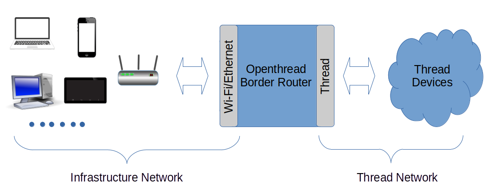
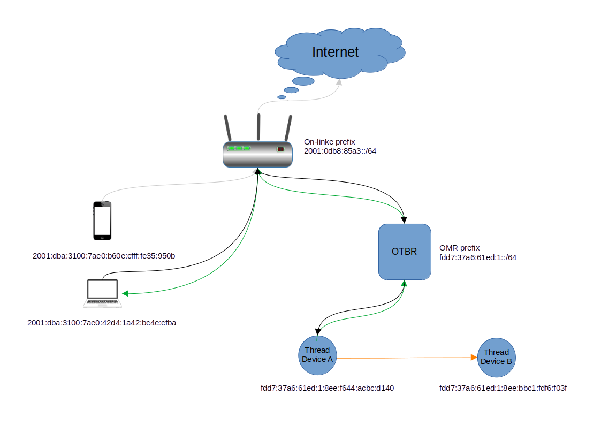
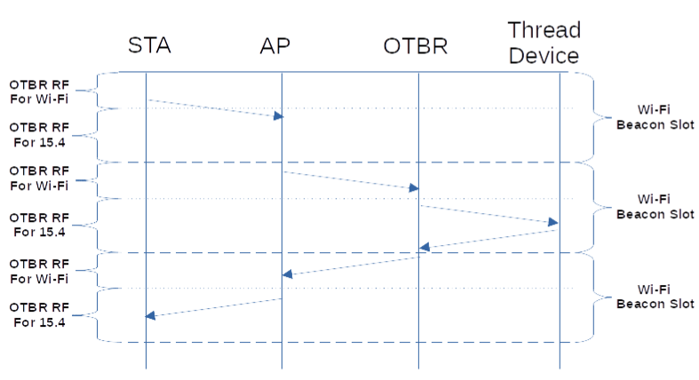

# Openthread Border Router

## General functions

A Thread Border Router bridges a Thread network to Infrastructure network. 

- The infrastructure network is an existing IP-based network that uses Wi-Fi and Ethernet.

A Thread Border Router (OTBR) provides the following functions:

- Bidirectional IPv6 connectivity between Thread and Infrastructure networks.
  - The Thread network is an IPv6 network. OTBR provides IPv6 packets forwarding between the Thread network and infrastructure networks.
- Bidirectional service discovery via mDNS (on an Infrastructure network link) and SRP (on a Thread network).
  - Service discovery is a common technology in infrastructure networks that uses the mDNS protocol.
  - OTBR registers and discovers mDNS services for Thread network devices, including itself.
  - The Thread network uses the SRP protocol to communicate with OTBR for registering mDNS services and requesting mDNS service discovery on OTBR.
- DNS64 and NAT64 allow Thread devices to initiate communications to IPv4-only server.
  - The Internet still has IPv4-only servers existed. Thread devices behind OTBR can obtain their IPv4 addresses and access them using DNS64 and NAT64.
- Thread-over-infrastructure to merge Thread network partitions.
  - A single Thread network can be divided into several Thread network partitions if IEEE 802.15.4 connections lost between them.
  - Different partitions can reunite through their OTBRs on the same infrastructure network.
- External Thread Commissioning to authenticate and join a Thread device to a Thread network.
  - OTBR enables external Thread commissioners (for example, a mobile phone)  to use the Thread Commissioning protocol to commission a Thread device into the Thread network.

## IPv6 packet forwarding flow

The infrastructure network and Thread network have different IPv6 address prefixes, which can be distinguished by OTBR and devices during packet routing and forwarding.

- Off-mesh routable (OMR) prefix on Thread network side
  - With OMR prefix provided by OTBR, each Thread device can use SLAAC to auto-configure an IPv6 address, called an OMR prefix.
  - Devices require use OMR address to communicate with IPv6 host on Infrastructure network outside the local Thread network.
  - OTBR also advertise it has routine for this prefix using ICMPv6 router advertisement.
- On-link prefix on Infrastructure network side
  - On-link prefix could be provided by Router or by OTBR if Router has not IPv6 function

Packet forwarding flow shows as above chart:

- Thread device A sends packet with destination address as *fdd7:37a6:61ed:1:8ee:bbc1:fdf6:f03f* goes routing as orange line.
  - *fdd7:37a6:61ed:1:8ee:bbc1:fdf6:f03f* is OMR address and it is also an On-mesh address, it can use to communicate with Thread devices.
  - Thread device B is neighbor of Thread device A, and it can send packet to Thread device B directly.
- Thread device A sends packet with destination address as *2001:dba:3100:7ae0:42d4:1a42:bc4e:cfba* goes routing as green line.
  - *2001:dba:3100:7ae0:42d4:1a42:bc4e:cfba* is an On-link address. Thread device A send the packet to OTBR for routing to out of Thread network.
  - Then, OTBR sends this packet to the station with that IPv6 address.
  - At last, Router sends the packet to the laptop.
- Laptop sends packet with destination address as *fdd7:37a6:61ed:1:8ee:f644:acbc:d140* goes as black line 
  - *fdd7:37a6:61ed:1:8ee:f644:acbc:d140* is a Thread network OMR address.  Laptop sends packet to Router.
  - Then, the Router sends packet to OTBR.
  - At last, OTBR forwards the packet to Thread device A.
- Phone sends a packet to Internet as destination address *2001:dba:3100:7a00:2de:8af1:32df:173c*
  - Phone sends packet to Router. Router distinguish it is belong current network, it forwards to upper Router. 

## IPv6 packet forwarding flow on BL616 Wi-Fi OTBR

BL616 Wi-Fi OTBR is a single chip solution which makes Wi-Fi and IEEE 802.15.4 share a same RF on time-slot using Wi-Fi power saving mode.

BL616 RF usage is divided into two parts within a single Wi-Fi beacon slot timeline: one part is for Wi-Fi to synchronize with the AP beacon and transmit/receive packets, while the other part is for IEEE 802.15.4 to transmit/receive packets with other Thread devices. Take ping command from STA to a Thread deivce as example:

- The STA sends a ping request to the AP for forwarding to the OTBR.
- The OTBR receives the ping request from the AP during the second Wi-Fi beacon slot when its RF is available for Wi-Fi.
- It then sends the ping request to the Thread device when its RF is available for IEEE 802.15.4.
- Ideally, the Thread device may respond to the ping within the same Wi-Fi beacon slot while the OTBR RF is still available for IEEE 802.15.4.
- The OTBR sends the ping reply during the third Wi-Fi beacon slot.
- Finally, the AP forwards the ping reply to the STA.
