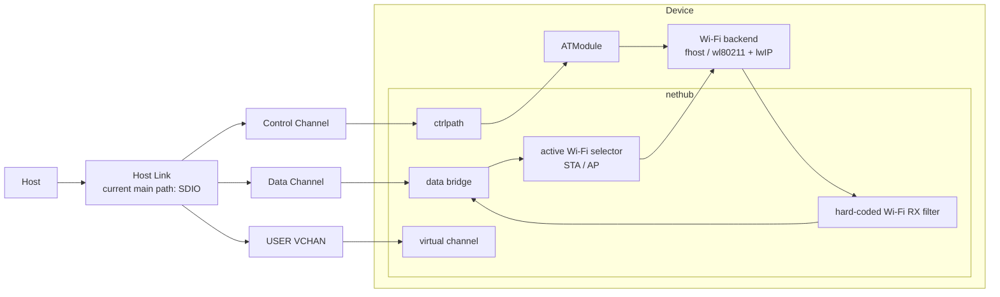
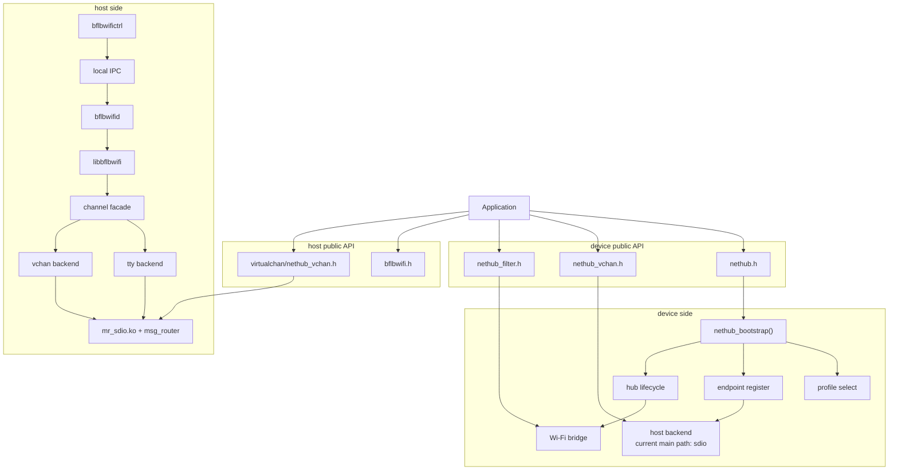

# NetHub Architecture Guide

This document is for developers who need to understand module boundaries and
APIs.

## 1. Current Architecture Conclusions

- The current physical primary path is `SDIO`
- `USB / SPI` still keep backend skeletons and are not recommended bring-up
  paths for now
- The device-side Wi-Fi backend supports `fhost / wl80211`
- The control channel and `USER virtual channel` are logical channels on the
  current host link, not separate physical interfaces
- The host control backend is selected at runtime: `tty` or `vchan`

## 2. Functional Architecture Diagram

From a functional view, `nethub` mainly does four things:

- maintain the `Wi-Fi <-> HostLink` data bridge
- use a hard-coded filter to decide whether a packet is `local`, `host`, or
  `both`
- maintain the currently active Wi-Fi channel, `STA / AP`
- provide a control channel and an optional `USER virtual channel` on the same
  host link

## 3. Technical / API Architecture Diagram

## 4. device-side Public Interfaces

Headers:

- `components/net/nethub/include/nethub.h`
- `components/net/nethub/include/nethub_vchan.h`
- `components/net/nethub/include/nethub_filter.h`

Core APIs:

- `nethub_bootstrap()`
- `nethub_shutdown()`
- `nethub_get_status()`
- `nethub_set_active_wifi_channel()`
- `nethub_ctrl_upld_send()`
- `nethub_ctrl_dnld_register()`
- `nethub_vchan_user_send()`
- `nethub_vchan_user_recv_register()`
- `nethub_set_wifi_rx_filter()`

Boundary notes:

- `nethub_ctrl_*` maps to the logical control channel on the host link
- `nethub_vchan_user_*` maps to the logical `USER` channel on the host link
- `nethub_set_wifi_rx_filter()` fully replaces the built-in Wi-Fi RX filter and
  must be called before `nethub_bootstrap()`

## 5. host-side Public Interfaces

Headers:

- `bsp/common/msg_router/linux_host/userspace/nethub/bflbwifictrl/include/bflbwifi.h`
- `bsp/common/msg_router/linux_host/userspace/nethub/virtualchan/nethub_vchan.h`

Control-plane capabilities:

- `bflbwifi_ctrl_config_init()`
- `bflbwifi_ctrl_config_use_tty()`
- `bflbwifi_ctrl_config_use_vchan()`
- `bflbwifi_init_ex()`
- `bflbwifi_get_ctrl_status()`
- `bflbwifi_sta_connect()`
- `bflbwifi_sta_disconnect()`
- `bflbwifi_sta_get_state()`
- `bflbwifi_scan()`
- `bflbwifi_get_version()`
- `bflbwifi_restart()`
- `bflbwifi_ota_upgrade()`
- `bflbwifi_ap_start()`
- `bflbwifi_ap_stop()`

USER virtual channel capabilities:

- `nethub_vchan_init()`
- `nethub_vchan_deinit()`
- `nethub_vchan_user_send()`
- `nethub_vchan_user_register_callback()`
- `nethub_vchan_get_state_snapshot()`
- `nethub_vchan_register_link_event_callback()`

## 6. Key Data Flows

### 6.1 `connect_ap`

1. The user runs `bflbwifictrl connect_ap <ssid> <password>`
2. The CLI sends the command to `bflbwifid` through local IPC
3. The daemon calls `libbflbwifi`
4. `libbflbwifi` sends control messages through the `tty` or `vchan` backend
5. The device-side `ATModule` performs the Wi-Fi control operation
6. The device reports responses and state updates, and the host refreshes the
   state and returns the result

### 6.2 Data Plane

1. Host network traffic enters `mr_eth0`
2. The kernel / `msg_router` communicates with the device over SDIO
3. Device-side `nethub` forwards host data to the currently active Wi-Fi
4. After Wi-Fi RX packets pass through the `nethub` filter, they are handled
   locally, forwarded to the host, or both

## 7. Recommended Reading Order

- First-time bring-up: [NetHubQuickBringup.md](NetHubQuickBringup.md)
- Understanding the `USER` channel: [NetHubVirtualChannel.md](NetHubVirtualChannel.md)
- Top-level entry: [NetHub.md](NetHub.md)
