# README

# Spi WiFi Configuration and Usage

## How to Connect an STM32 Board and a BFLB Board Using Jumper Wires

The hardware wiring diagram between the STM32 HOST and BFLB is shown in the figure.

### Jumper Wires

If you are using the BL616/QCC744 development board, please connect the jumpers as follows：

| opt | bflb     | stm32      |
|---------------|---------------|---------------|
| CLOCK | GPIO29  | PA5  |
| MISO | GPIO30  | PA6  |
| MOSI | GPIO27  | PA7  |
| IRQ | GPIO20  | PE13  |
| CS(Wakeup) | GPIO28  | PD14  |


## NCP (Network Co-Processor)

#### Compile

Compile spiwifi porject:

```bash
make
```

### Flashing

To flash your project onto the target device, use the following command, where `xxx` is your serial port name:

```bash
make flash COMX=xxx # xxx is your com port name
```

## RCP (Radio Co-Processor)

### Host API Introduction (Basics)

```bash
Brief: Create SPI Virtual Network Interface Device.

Return: NULL - Failure; Non-NULL - Virtual NIC Operation Object

virt_net_t virt_net_spi_create(void);
```

```bash
Brief: Device initialization.

Return: 0 - Success, Non-Zero - Failure

int virt_net_initial(virt_net_t obj);
```

```bash
Brief: Device Enables DHCP.

Return: 0 - Success, Non-Zero - Failure

int virt_net_dhcp_start(virt_net_t obj, uint32_t timeout);
```

```bash
Brief: DHCP Completed.

Return: 0 - Success, Non-Zero - Failure

int virt_net_dhcp_done(virt_net_t obj);

```

```bash
Brief: Get  Virtual Network Interface IP Information.

Return: 0 - Success, Non-Zero - Failure

int virt_net_get_ip(virt_net_t obj, uint32_t *ip, uint32_t *mask, uint32_t *gw);
```

```bash
Brief: Get Device Current Operation Mode: 0-RCP Mode, 1-NCP Mode

Return: 0 - Success, Non-Zero - Failure

int virt_net_get_netmode(virt_net_t obj, int *netmode);
```

### Usage Example

Create and Initialize an SPI Network Interface Card (NIC) Device:

```bash
static void virl_net_init_task(void *arg)
{
    g_virt_eth = virt_net_spi_create();
    virt_net_initial(g_virt_eth);

    ...
}
```

When WiFi Connection Succeeds, Enable DHCP if Currently in RCP Mode:

```bash
static int _at_to_console(uint8_t *buf, uint32_t len, void *arg)
{
   ...

   if (strstr((char *)buf, "+CW:CONNECTED\r\n") != NULL) {
      virt_net_get_netmode(g_virt_eth, &netmode);
      if (netmode == VIRTNET_NET_MODE_RCP) {
         virt_net_dhcp_start(g_virt_eth, 15*1000);
      }
   }
   return len;
}
```

Set callback to be called when interface is brought up/down or address is changed while up.

```bash
static void netif_status_callback(struct netif *netif)
{
	struct virt_net *obj = (struct virt_net *)netif->state;

	if (ip4_addr_isany(netif_ip4_addr(netif))) {

	} else {
		printf("IP Address: %s\r\n", ipaddr_ntoa(netif_ip4_addr(netif)));
		printf("Netmask:    %s\r\n", ipaddr_ntoa(netif_ip4_netmask(netif)));
		printf("Gateway:    %s\r\n", ipaddr_ntoa(netif_ip4_gw(netif)));
		virt_net_dhcp_done(obj);
	}
}

netif_set_status_callback(&obj->netif, netif_status_callback);
```

### Compile

Enter the build command under the `spiwifi`​ example directory:

```bash
make CONFIG_RCP_ENABLE=1 CONFIG_MQTT=0 CONFIG_HTTP=0 CONFIG_NETWORK=0
```

### Flashing

To flash your project onto the target device, use the following command, where `xxx` is your serial port name:

```bash
make flash COMX=xxx # xxx is your com port name
```

### Runing

DHCP is enabled by default on the host side in RCP mode, and an IP address is automatically acquired upon WiFi connection command execution.

```bash
AT+CWMODE=1
OK
```

```bash
AT+CWJAP="ssid","pwd"
OK
```

```bash
+CW:CONNECTED

IP Address: 192.168.31.157
Netmask:    255.255.255.0
Gateway:    192.168.31.1
```

## Low Power Mode Configuration and Usage

To enable low power mode, you need to set the `CONFIG_USE_LPAPP` variable in your configuration. This can be done by uncommenting or adding the following line in your project's configuration file:

```bash
set(CONFIG_USE_LPAPP 1)
```

After making the necessary changes, you need to recompile your project:

```bash
make
```

## How to Test PWR Mode

### PWR Mode Commands

Reference: atmodule.rst

All commands about low power in atmodule.rst are supported

#### AT+PWR Command

Command Format:

```bash
AT+PWR=<power mode>[,<level>]
```

Response:

```bash
OK
```

Parameters:

- `<power mode>`:

  - 0: normal mode.
  - 1: hibernate mode.
  - 2: standby mode.
- `[<level>]`: In hibemate mode, power level ranging from 0 to 2. default value is 0.

#### Examples

```bash
AT+PWR=0              // Normal mode
AT+PWR=1              // Hibernate mode, level 0.
AT+PWR=2              // Standby mode.
```

### Testing PWR Mode

#### Pre-Testing Steps

1. Connect an stm32 board and a bflb board using jumper wires.
2. Use a power analyzer to supply power to the bflb board.
3. Reset stm32 board and bflb board.
4. As shown in the image, use a micro USB cable to connect the STM32 demo board to a PC. Open a PC serial port tool. Set the serial port baud rate to 961200.

#### Testing PWR Step

1. Execute the command `AT+PWR=1`
2. You can see that the current has decreased, and then measure the subsequent average power consumption.

#### Testing IO Wakeup(support gpio 16, 28. only supoport standby mode now)

1. Reset the demo board.
2. Execute the command `AT+SLWKIO=16,0` in serial port tool.
3. Execute the command `AT+PWR=2` in serial port tool.
4. Execute the any command in serial port tool.

NOTE:The current implementation uses a five-wire SPI low-power solution, so the wake-up method is not configurable and only supports high-level wake-up.

#### Testing Timer Wakeup from standby mode.

1. Reset the demo board.
2. Execute the command `AT+SLWKTIMER=0,5000` in serial port tool.
3. Execute the command `AT+PWR=2` in serial port tool.

#### Testing Timer Wakeup from hibernate mode.

1. Reset the demo board.
2. Execute the command `AT+SLWKTIMER=1,5000` in serial port tool.
3. Execute the command `AT+PWR=1` in serial port tool.

#### Testing DTIM Step

1. Reset the demo board.
2. Connect to the Access Point (AP).
3. Execute the command `AT+SLWKDTIM=10` in serial port tool.
4. Execute the command `AT+PWR=2` (enter standby mode) in serial port tool.
5. You can see that the current has decreased, and then measure the subsequent average power consumption.

#### Enable keepalive

1. Reset the demo board.
2. Connect to the Access Point (AP).
3. Execute the command `AT+START_KEEPALIVE=55` in serial port tool.You have enabled the 55-second keep-alive. The STA will send a null packet every 55 seconds.

## OTA Test

Ensure that the PC and bflb are connected to the same router.

### PC Command

1. Enable TCP server on the PC side and specify the OTA file for transmission.

   Execute commands in the directory examples/wifi/spi_wifi:

   ```bash
   ncat -klp 3365 < build/build_out/spi_wifi_bl616.bin.ota
   ```

### HOST UART Command

2. Query OTA partition status

   ```bash
   AT+PART？
   ```

   Responds:

   ```bash
   +PART=0,0,"   Boot2",0x00000000,0x00000000,57344,0
   +PART=0,0,"      FW",0x00010000,0x00210000,2097152,1474560
   +PART=0,0,"     mfg",0x00210000,0x00000000,1474560,0
   +PART=0,0,"   media",0x00378000,0x00000000,462848,0
   +PART=0,0,"     PSM",0x003e9000,0x00000000,32768,0
   +PART=0,0,"     KEY",0x003f1000,0x00000000,8192,0
   +PART=0,0,"    DATA",0x003f3000,0x00000000,20480,0
   +PART=0,0," factory",0x003f8000,0x00000000,32768,0

   OK
   ```

3. Start OTA.

    The default port is 3365.

   ```bash
    HOSTCMD ota_start 192.168.31.112
   ```

4. Waiting for transmission to complete.

   ```bash
    OTA start file_size:1444288
    OTA trans size:2920

    ...

    OTA trans size:1444288
    +CIP:0,CLOSED

    OK

    OK

    OK
    lramsync_reset

    ready
   ```


5. Recheck the OTA partition status.

    ```bash
    AT+PART？
    ```

    Responds:

    ```bash
    +PART=0,0,"   Boot2",0x00000000,0x00000000,57344,0
    +PART=1,1,"      FW",0x00010000,0x00210000,2097152,1474560
    +PART=0,0,"     mfg",0x00210000,0x00000000,1474560,0
    +PART=0,0,"   media",0x00378000,0x00000000,462848,0
    +PART=0,0,"     PSM",0x003e9000,0x00000000,32768,0
    +PART=0,0,"     KEY",0x003f1000,0x00000000,8192,0
    +PART=0,0,"    DATA",0x003f3000,0x00000000,20480,0
    +PART=0,0," factory",0x003f8000,0x00000000,32768,0

    OK
    ```

    OTA transfer times are as follows:

    |Firmware image|Image size|Upgrade time|
    | :------------------------| :-----------| :-------------|
    |spi_wifi_bl616.xz.ota|1.4M|15 S|
    |spi_wifi_bl616.bin.ota|0.8M|10 S|

## Throughput test

### NCP (Network Co-Processor)

#### TCP TX

1. PC Command

   ```bash
    iperf -s -i 1
   ```

2. HOST Command

   ```bash
    HOSTCMD ipc <remote_ip>
   ```

#### UDP TX

1. PC Command

   ```bash
    iperf -u -s -i 1
   ```

2. HOST Command

   ```bash
    HOSTCMD ipu <remote_ip>
   ```

#### TCP RX

1. HOST Command

   ```bash
    HOSTCMD ips <remote_ip>
   ```

2. PC Command

   ```bash
    iperf -c <remote_ip> -i 1 -t 10
   ```

#### UDP RX

1. HOST Command

   ```bash
    HOSTCMD ipus <remote_ip>
   ```

2. PC Command

   ```bash
    iperf -u -c <remote_ip> -i 1 -b 20M -t 10
   ```

### RCP (Radio Co-Processor)

#### TCP TX

1. PC Command

   ```bash
    iperf -s -i 1
   ```

2. HOST Command

   ```bash
    HOSTCMD iperf_c <remote_ip>
   ```

#### UDP TX

1. PC Command

   ```bash
    iperf -u -s -i 1
   ```

2. HOST Command

   ```bash
    HOSTCMD iperf_u_c <remote_ip>
   ```

#### TCP RX

2. HOST Command

   ```bash
    HOSTCMD iperf_s <remote_ip>
   ```

1. PC Command

   ```bash
    iperf -c <remote_ip> -i 1 -t 10
   ```

#### UDP RX

2. HOST Command

   ```bash
    HOSTCMD iperf_u_s <remote_ip>
   ```

1. PC Command

   ```bash
    iperf -u -c <remote_ip> -i 1 -b 20M -t 10
   ```

# Antenna Diversity

## Configuration Guide

### Overview

The BFLB SDK provides antenna diversity capabilities to optimize wireless performance through two complementary features:

* **Static Antenna Diversity**: Performs one-time antenna selection during connection setup using scan-based selection
* **Dynamic Antenna Diversity**: Enables runtime RSSI-based antenna switching to adapt to changing RF conditions

This guide explains how to configure and implement antenna diversity for BFLB boards equipped with an RF switch.

### Hardware Requirements

* BFLB development board with RF switch capability
* Minimum of two physical antennas
* RF switch for antenna selection
* Required test equipment (for validation):

  * RF shielding boxes
  * Variable and fixed attenuators
  * RF cables and connectors
  * Test access points (APs)

### Implementation Guide

#### 1. Hardware Analysis

Before implementation, gather the following information from your hardware design:

1. Locate the RF switch control GPIO pin(s) in your schematic，We assume the control pin is GPIO0. The following modifications are required on the DVK\_V40 version hardware:

    1. On the front side of the devkit, remove the corresponding jumpers based on the selected GPIO to disconnect GPIO0/1/3 from the CH347 JTAG connection and avoid conflicts.

        ​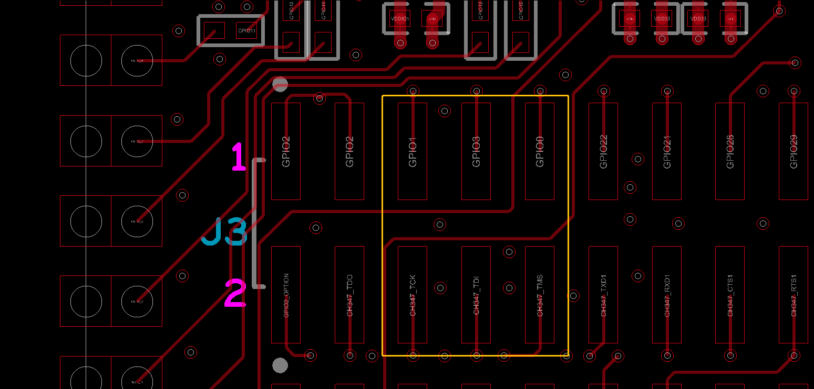​
    2. Back side of carrier board of BL616–P there is cap on GPIO30 as highlighted in red box

        ​​
    3. remove the cap highlighted in red box
    4. cut the trace between via and green highlighted capacitor pad.

        ​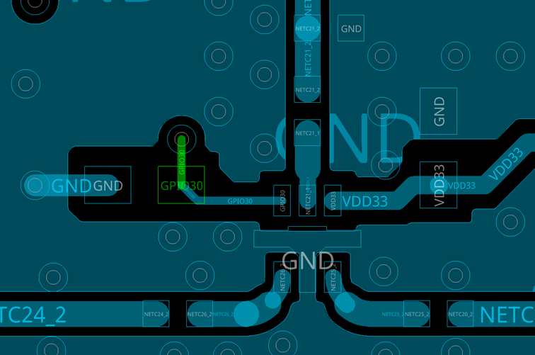​
    5. remove respective resistor on GPIO0 and GPIO1 as highlighted in yellow colored box.

        ​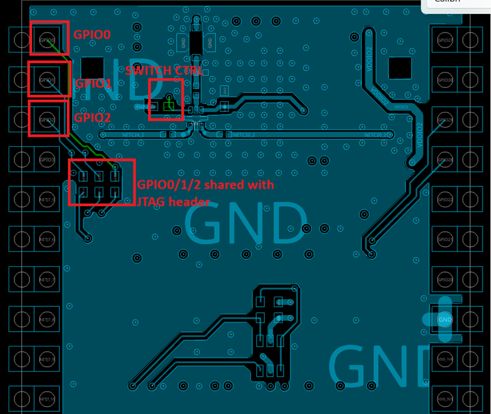​
    6. for GPIO0 as control signal for antenna diversity switch , blue wire for GPIO0 resistor pad to GPIO30 capacitor pad as shown in yellow line in below picture

        ​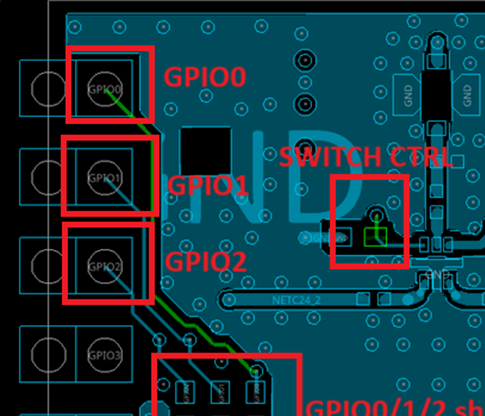​
2. Review the RF switch datasheet for:

    * Control voltage requirements
    * Switching timing specifications
    * Logic level requirements (active high/low)

#### 2. Dynamic Antenna Diversity

HOST AT Command

```bash
 AT+CWANTENABLE=1,0,0
 OK

 AT+RST
 OK

 AT+CWMODE=1
 OK

 AT+CWJAP="SSID","password"
 OK
 ...
```

#### 3. Static Antenna Diversity

HOST AT Command

```bash
 AT+CWANTENABLE=0,1,0
 OK

 AT+RST
 OK

 AT+CWMODE=1
 OK

 AT+CWJAP="SSID","password"
 OK

 AT+CWLAP
 ...
```

# SPISync Brief Design

## Design Background

Many customers desire an SPI-based communication solution with high throughput. Our analysis revealed that during SPI communication, the CS control signal consumes a significant amount of time on the SPI bus during high throughput. Therefore, a solution that fully utilizes the SPI link bandwidth is needed.

## Spi communication protocol

​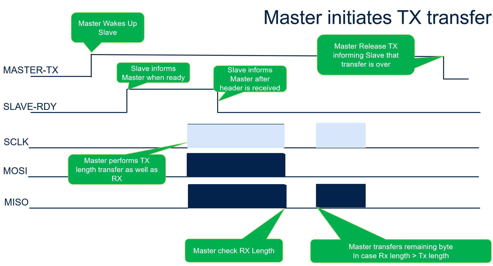​
​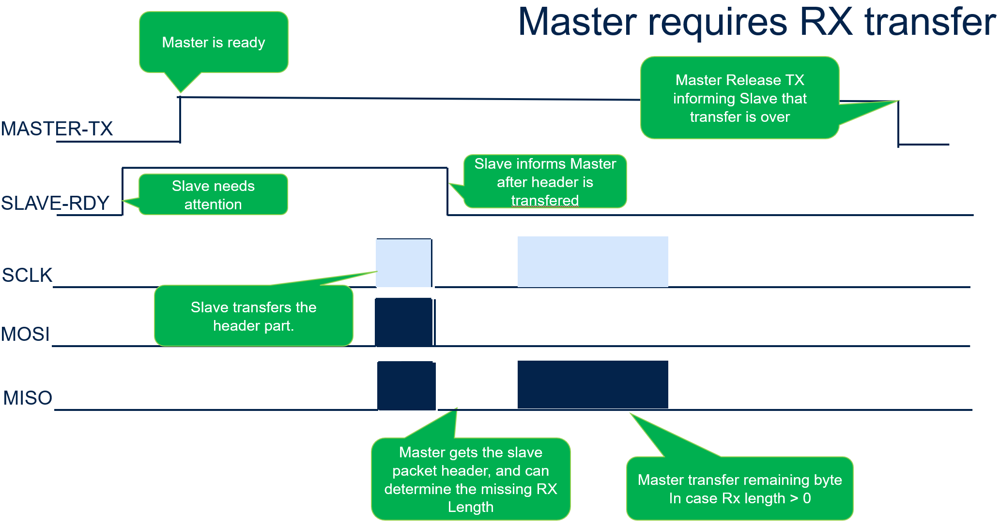​

## Spi State machine
​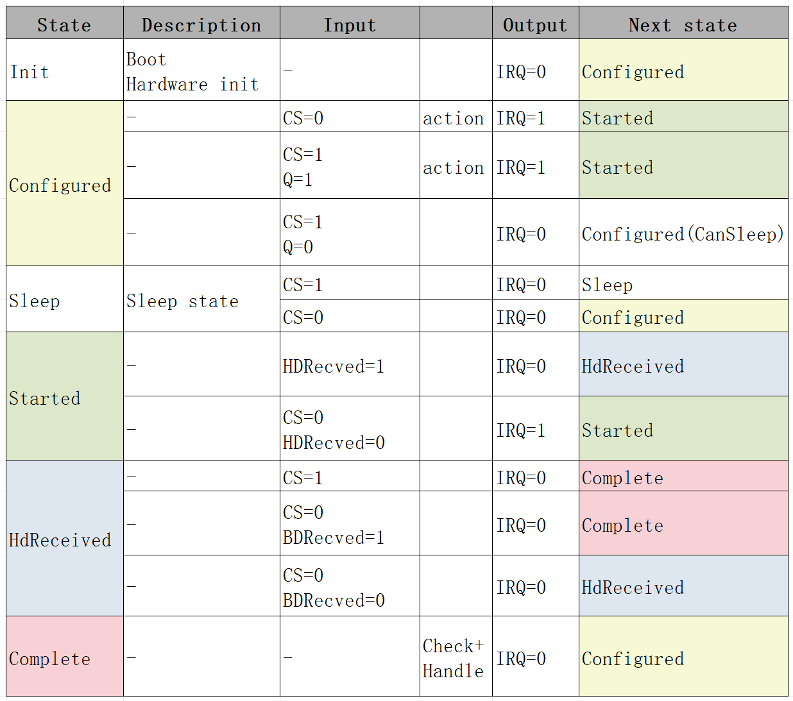​
​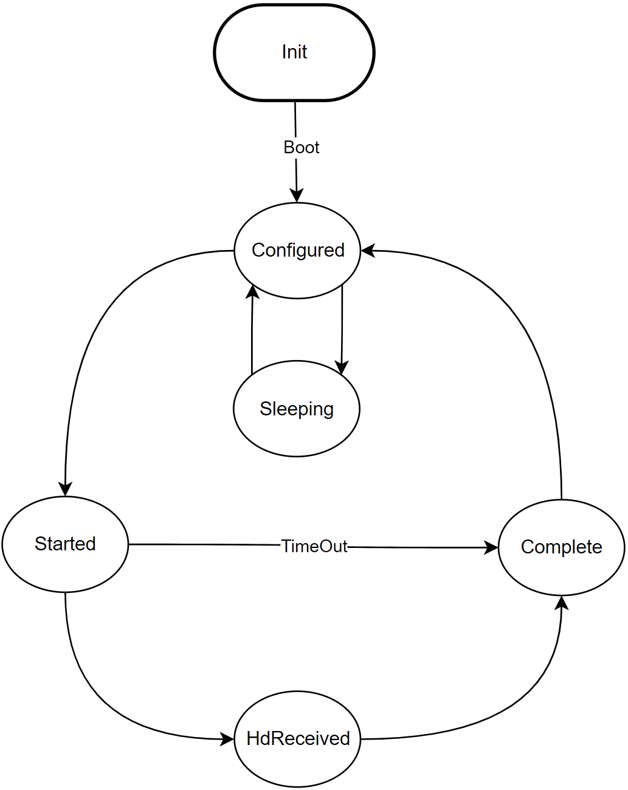​

## Performance and Configuration

The following are the SPI performance data corresponding to different stream\_buffer configurations, provided for reference only:

|TCP-TX(Mbps)|UDP-TX(Mbps)|TCP-RX(Mbps)|UDP-RX(Mbps)|
| -----------| -----------| -----------| -----------|
|12.8|12.9|10.8|11.4|


### Memory Involved in the Solution

* SLOT_COUNT
  For high throughput, we recommend customers configure 4 or more, with actual memory usage being 4*1564 Bytes.
* STRREAM_BUFFER
  For high throughput, we recommend configuring 8K or more, with actual memory usage being 8192 Bytes.
* TASK
  Responsible for externally providing a structure for reading and writing to the streambuffer, and internally for moving payload data to the streambuffer or moving the streambuffer data to the payload.We recommend configuring 2K.


## Clock Source Management

BFLB supports configuring different clock sources to optimize power consumption and performance. The following commands allow checking and changing the RTC clock source.

### AT+GET_CLOCK Command

Command Format:

```bash
AT+GET_CLOCK
```

Response:

+GET_CLOCK:<source>
OK

Parameters:

<source>: Current clock source ID
1: RC as the RTC clock source (internal RC oscillator)
2: Passive crystal oscillator as the RTC clock source
3: Active crystal oscillator as the RTC clock source

AT+SET_CLOCK Command
Command Format:

```bash
AT+SET_CLOCK=<source>
```

Response:
OK

Parameters:

<source>: Clock source to set
1: RC as the RTC clock source (internal RC oscillator)
2: Passive crystal oscillator as the RTC clock source
3: Active crystal oscillator as the RTC clock source

Testing Clock Source Configuration
Query current clock source:

```bash
AT+GET_CLOCK
```

Change to a different clock source (e.g., internal RC oscillator):
```bash
AT+SET_CLOCK=1
```

Notes:
The TWT feature can only be used when an external crystal oscillator is present.
If the internal RC is used, the TWT feature will not work.

# Qcc74x Low Power Solution Introduction

## 1. Overview of Low Power Design

The Qcc74x low power solution uses FreeRTOS's tickless mechanism to achieve low power consumption. When there are no other tasks to run, the system enters the IDLE task and then the hardware's PDS15 low power mode, thereby reducing power consumption. The system can wake up through deep sleep wake-up sources such as GPIO or RTC. The duration of sleep is determined using the tickless mechanism, avoiding the need to wake up at every system tick. When the module is used as a STA, the system will automatically enter sleep mode during idle periods, with sleep duration determined by the system's idle state, the associated AP's DTIM, and Beacon interval.

## 2. WiFi Power Save Mode

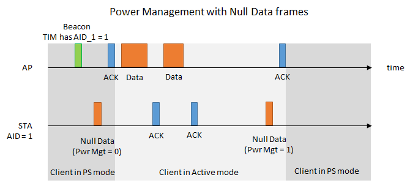

This diagram illustrates the power management process using null data frames, involving communication between the Access Point (AP) and the Station (STA). The detailed steps are as follows:

1. **Beacon Frame**: On the timeline, the AP first sends a beacon frame indicating that the TIM (Traffic Indication Map) includes AID_1 = 1, meaning the station has data to receive.
2. **Null Data Frame (Pwr Mgt = 0)**: After receiving the beacon frame, the STA sends a null data frame with the power management flag (Pwr Mgt) set to 0, indicating the STA is switching from Power Save (PS) mode to Active mode.
3. **ACK Frame**: The AP receives the null data frame and sends an acknowledgment (ACK) frame back to the STA, confirming receipt.
4. **Data Frame Transmission**:
    - The AP sends a data frame to the STA.
    - The STA receives the data frame and sends an ACK frame to the AP.
    - The AP sends another data frame.
    - The STA sends another ACK frame.
5. **Null Data Frame (Pwr Mgt = 1)**: After data transmission is complete, the STA sends another null data frame, this time with the power management flag set to 1, indicating the STA is switching back to PS mode.
6. **Final ACK Frame**: The AP receives this null data frame and sends a final ACK frame to the STA.

The diagram shows the STA switching between PS mode and Active mode, and the communication process between the AP and STA. PS mode is used to save battery power, while Active mode is used for data transmission. Through the transmission of null data frames and ACK frames, the AP and STA can efficiently manage power and ensure the efficiency of data transmission.

## 3. FreeRTOS Tickless Mode

In tickless mode, FreeRTOS decides whether to enter low power mode based on task scheduling needs and time constraints. If there are no imminent timers, delays, or other events, the system will enter sleep mode. When a task needs to run, the system will wake up immediately and handle the task.

### Qcc74x Power Saving States

The Qcc74x can be set to power-saving states based on application scenarios. The Qcc74x has the following power-saving modes:

#### 1. Unconnected State

After the system starts normally, executing `AT+PWR=2` sets the system to low power mode. The system can exit low power mode when woken up by a timer or IO.

In the unconnected state, the chip and system will only be woken up by system tasks or GPIO. After waking up, if there are no imminent timers, delays, or other events, the system will automatically enter sleep again.

**Configuring IO Wakeup:**


**IO Function Configuration:**

After entering low power mode, peripherals will lose power. Therefore, after exiting low power mode, peripherals need to be re-initialized if they are to be used.

#### 2. Connected State

**Introduction:**

After connecting to an AP, the Qcc74x can interact with the AP and enter power save mode. In power save mode, the Qcc74x periodically wakes up to receive beacon frames. When the beacon frame indicates that the connected Qcc74x has buffered data packets, the Qcc74x wakes up and receives the data. After receiving the data, it goes back to sleep. The Qcc74x can configure the DTIM interval for wakeup. The longer the beacon interval, the lower the wakeup frequency. For example, if each beacon interval is 102.4ms, setting DTIM3 means the Qcc74x receives a beacon every 102.4ms * 3. With DTIM10, it receives a beacon every 1.024s.

**Interface Functions:**

| Command Name     | Description           |
|------------------|-----------------------|
| AT+PWR=2         | Enter low power mode  |
| AT+SLWKIO=28,0   | Set IO wakeup         |
| AT+SLWKTIMER=0,5000 | Set timer wakeup    |
| AT+SLWKDTIM=10   | Set DTIM              |

**Development Process:**

The process for using low power mode is as follows:

1. **Step 1**: Set the wakeup source.
2. **Step 2**: Enter low power mode.
3. **Step 3**: Wake up from external conditions or timeout.


### Qcc743 Power Consumption Measuremen
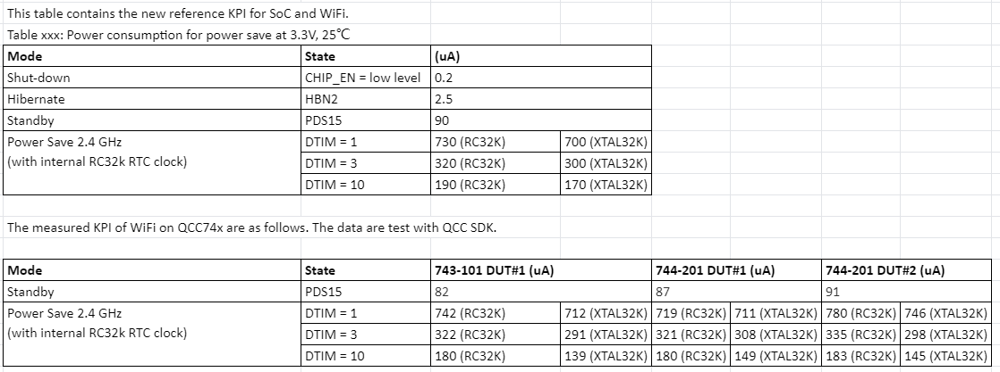


## 4. Possible Reasons for Not Entering Sleep Mode

1. **Incorrect Timer Usage**
    - **Example**: Starting a 10ms periodic timer.
    - **Analysis**: Before sleeping, the system checks if any timers are about to expire. If a timer is about to expire, the system does not allow entering low power mode.
    - **Suggestion**: Start timers based on actual business needs and stop them when idle, especially periodic timers.
2. **Incorrect Task Usage**
    - **Example**: A task loop without an active release action, such as calling blocking interfaces.
    - **Analysis**: If a task does not actively release, other low-priority tasks cannot execute, potentially causing a watchdog reset. Before sleeping, the system checks if any tasks are about to be scheduled. If there is insufficient task release, the system does not allow entering low power mode.
    - **Suggestion**: In business design, try to call blocking interfaces with infinite or reasonable timeout periods.
3. **Incorrect vTaskDelay Usage**
    - **Example**: Calling vTaskDelay with a 10ms parameter.
    - **Analysis**: This behavior is similar to starting a 10ms periodic timer. The task will be scheduled every 10ms, preventing the system from entering low power mode.
    - **Suggestion**: Use blocking interfaces with infinite or reasonable timeout periods, or use timers and stop them when idle.
4. **Not Calling `wifi_sta_ps_enter` When Connected to AP**
    - **Example**: Not calling `wifi_sta_ps_enter` when connected to an AP, preventing the Wi-Fi subsystem from entering power save mode.
    - **Analysis**: Enabling Wi-Fi subsystem low power is a prerequisite for the system to enter sleep mode. Without it, the system will not enter sleep mode even if low power mode is set.
    - **Suggestion**: When connected to an AP, enable Wi-Fi subsystem low power for low power strategy.

## 5. Why Does the System Malfunction After Waking from Sleep?

1. **Peripheral Not Reinitialized**
    - **Example**: Adding I2C interface calls results in normal operation after power-on but I2C malfunctions after waking from deep sleep mode.
    - **Analysis**: Peripherals lose power in deep sleep mode and need reinitialization after waking up.
    - **Suggestion**: In the `hi_lpc_register_wakeup_entry` registered interface, add I2C initialization and ensure it is called after UART and Flash initialization.
2. **Peripheral Business Occasional Message Transmission Failure**
    - **Example**: SPI device communication occasionally fails to receive data or send data as expected.
    - **Analysis**: Peripherals lose power in sleep mode, potentially causing missed data reception or incomplete data transmission before sleep.
    - **Suggestion**: Avoid enabling tickless mode before completing data transmission to prevent entering sleep mode.

## 6. Why Is Power Consumption Higher Than Expected?

Check both hardware and software aspects:

a. Verify if the base current meets expectations.
b. Confirm if any tasks are waking up frequently. Enable debug log in `tickless.c`.
c. Confirm if there is frequent traffic interaction.
d. Enable debug log in `tickless.c` to identify any events or reasons preventing sleep.

### Qcc743 Sleep And wakeup Timing

The BL616 receives a beacon indicating that the AP has buffered packets, and then the BL616 wakes up. It takes approximately 4ms to wake up and enter active mode. It then spends another 1.5ms sending null data to inform the AP that the BL616 has exited low power mode and is ready to receive the buffered packets. The wake-up time lasts approximately 10ms or more, depending on the current network environment and whether the AP sends the packets to the BL616 in a timely manner. After about 15ms, the BL616 sends null data to inform the AP that it is going to sleep, and then it enters PDS15 mode. It will wake up every 1024ms (DTIM10) to receive beacons. Each beacon reception takes approximately 3ms.
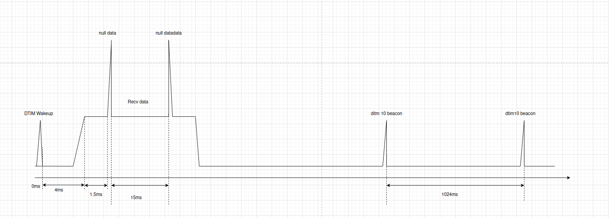

### Qcc743 Bluetooth Power Consumption Measuremen

Prerequisites for Bluetooth Power Consumption Testing: Prior to measuring the power consumption, ensure that the BL616 has transitioned into its low power state. It is imperative to sever the SPI GPIO and WAKEUP GPIO connections between the STM32 microcontroller and the BL616 device. Measurement should commence only after the power consumption has achieved a stable state.
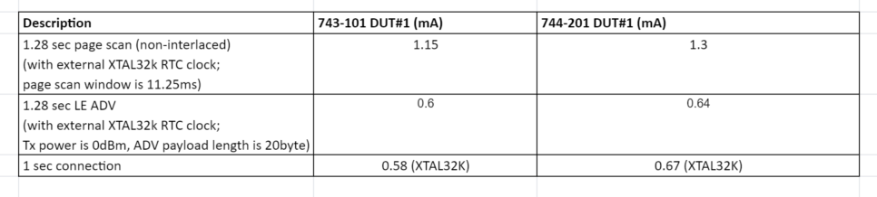

#### 1.28 sec LE ADV(20 Bytes) with RTC clock

| Command Name     | Description                                                        |
|------------------|--------------------------------------------------------------------|
| AT+BLEINIT=2     | BLE peripheral init                                                |
| AT+BLETXPWR=0    | Set BLE TX Power 0 dBm                                             |
| AT+BLEADVDATA="020106110957575757575757575757575757575757" | Set 20 Bytes ADV DATA    |
| AT+BLEADVPARAM=2048,2048,2,7   | Set 1.28 sec ADV interval                            |
| AT+BLEADVSTART   | Start BLE ADV                                                      |
| AT+PWR=2   | Enter low power mode                                                     |


#### 1.28 sec Bluetooth Classcic PageScan with  RTC clock

| Command Name     | Description           |
|------------------|-----------------------|
| AT+BREDR_INI     | BREDR Init            |
| AT+BREDR_CONNECTABLE=1 | Start PageScan  |
| AT+PWR=2   | Enter low power mode        |

#### 1 sec BLE connection interval with RTC clock

| Command Name     | Description                                                                      |
|------------------|----------------------------------------------------------------------------------|
| AT+BLEINIT=2     | BLE peripheral init                                                              |
| AT+BLETXPWR=0    | Set BLE TX Power 0 dBm                                                           |
| AT+BLEADVSTART   | Start BLE ADV                                                                    |
| AT+BLECONNPARAM=0,800,800,0,1500 | Set 1 sec connection interval after the connection is established|
| AT+PWR=2   | Enter low power mode                                                                   |


# Target Wake Time (TWT) Usage Documentation

## Overview
This chapter provides a comprehensive guide for configuring and testing the Target Wake Time (TWT) feature using BL616 and SPI Wi-Fi modules. It includes setup procedures, testing steps, command explanations, and notes on power consumption optimization.

---

## Testing Procedure
1. **Enable Configuration:**
   - Enable `CONFIG_USE_LPAPP` in the firmware.
   - Compile the SPI Wi-Fi firmware.
2. **Compile and Flash Firmware:**
   - Use appropriate tools to compile and flash the firmware onto the board.
3. **Connect to Access Point (AP):**
   - Establish a connection to a TWT-compatible router (e.g., ROG AX11000).
4. **Setup TWT on BL616:**
   - Execute the following command:
     ```shell
     wifi_mgmr_sta_twt_setup -s 1 -t 1 -e 13 -n 128 -m 1000
     ```
5. **Activate TWT:**
   - Enter the command:
     ```shell
     twt
     ```
6. **Measure Power Consumption:**
   - Record power usage using specialized equipment in a shielded environment.

---

## Command Explanations
### TWT Configuration Command:
```shell
wifi_mgmr_sta_twt_setup -s 1 -t 1 -e <WakeIntervalExponent> -n <WakeDuration> -m <WakeIntervalMantissa>
```
- **Setup type (s):** 0:REQUEST, 1:SUGGEST, 2:DEMAND.
- **Flow type (t):** 0:ANNOUNCED TWT, 1:UNANNOUNCED TWT. Only support unannounced twt.
- **Wake Interval Exponent:** Specifies the wake interval.
- **Wake Duration (n):** Minimum wake duration in microseconds.
- **Wake Interval Mantissa (m):** Mantissa value for precise interval adjustments.
- **Service Period (SP):** SP = WakeDuration * 256us.
- **Wakeup Interval:** Wakeup Interval = wake_int_mantissa << WakeIntervalExponent us.

### Example Commands(hostless):
1. **SP = 32.768 ms, Wake Interval = 8.192 seconds:**
   ```shell
   wifi_mgmr_sta_twt_setup -s 1 -t 1 -e 13 -n 128 -m 1000
   ```

### Host-Side Command:
The following host-side command corresponds to the TWT setup:
```plaintext
AT+TWT_PARAM=1,1,13,128,1000
AT+TWT_SLEEP
```

---

## Important Notes
1. **External Oscillator Requirement:**
   - Testing must be conducted on boards with external crystal oscillators to minimize RTC clock deviation.
   - Internal RC errors can result in wake interval inaccuracies (e.g., 60 ms deviation over 30 seconds).
2. **Environment for Power Testing:**
   - Ensure testing is conducted in a shielded environment to prevent external interference.
3. **Router Compatibility:**
   - Use a TWT-compatible router for testing (e.g., TP-Link AX5400).

---

## Power Consumption Optimization
1. **Pre-Wakeup Timing:**
   - To ensure accurate trigger frame reception, a slight pre-wakeup is implemented.
   - Further optimization is being worked on to reduce timing deviation after prolonged sleep.
2. **TCP/IP Thread Impact:**
   - The current firmware includes a periodic TCP/IP thread, contributing to power consumption.
   - A power-optimized firmware version will be released soon.

---

## Upcoming Enhancements
- Improved power consumption through refined wakeup timing.
- Reduced thread wake-ups to lower overall power usage.
- Enhanced TWT host commands for better configurability.

---
