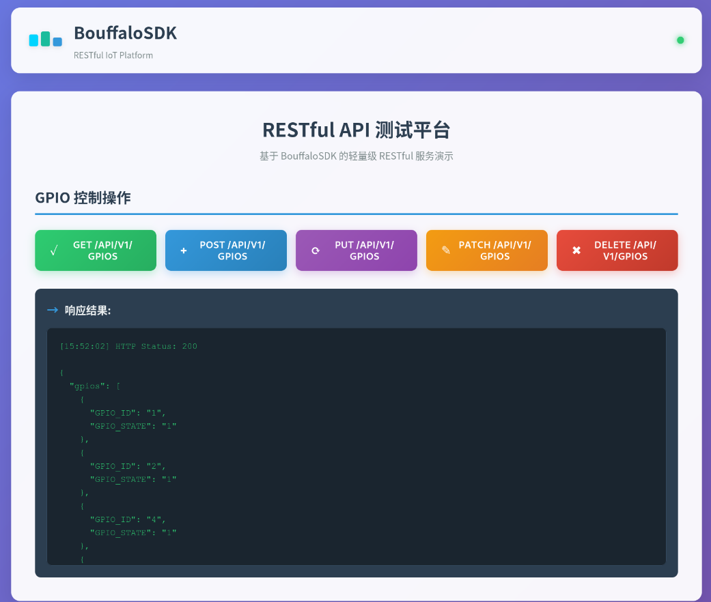

# HTTP RESTFUL API CASE


## Support CHIP

|      CHIP               | Remark |
|:-----------------------:|:------:|
|BL602/BL616/BL618/BL616d |        |

## Compile

- BL616/BL618/BL602

```bash
make CHIP=<chipname> BOARD=<boardname>
```

eg:
```bash
make CHIP=bl616 BOARD=bl616dk
```

- BL616d

```bash
make CHIP=bl616d BOARD=bl616ddk CPU_ID=ap CONFIG_ROMAPI=n
```

## Flash

- BL60x/BL61x

```bash
make flash CHIP=<chipname> COMX=xxx ## xxx is your com name, chipname is bl602/bl616...
```
## How use wifi tcp test


### 完整的使用流程

首先要将webpage转换为数组烧录进ROM中。
自带的fsdata.c是成品，进入makefsdata执行cp fsdata.c components/net/lwip/lwip/src/apps/http/fsdata.c 烧录即可。
然后登陆对应的网页进行简单操作：



或者：


# 1. 创建GPIO 3并设置为高电平
curl -X POST http://localhost/api/v1/gpios \
  -H "Content-Type: application/json" \
  -d '{"pin":3,"value":1}'

# 2. 获取所有GPIO状态
curl -X GET \ http://192.168.28.165/api/v1/gpios
  -H "Content-Type: application/json" \

# 3. 更新GPIO 3为低电平
curl -X PUT http://localhost/api/v1/gpios/3 \
  -H "Content-Type: application/json" \
  -d '{"value":0}'

# 4. 部分更新GPIO 3为高电平
curl -X PATCH http://localhost/api/v1/gpios/3 \
  -H "Content-Type: application/json" \
  -d '{"value":1}'

# 5. 删除GPIO 3
curl -X DELETE http://localhost/api/v1/gpios/3
```
curl --insecure -X DELETE https://192.168.210.124/api/v1/gpio/3 \
-H "Content-Type: application/json" \

```
## TLS
tls 加密由 http_server_restfulAPI.h 中的 HTTP_USE_MBEDTLS 宏控制

基本连接验证：
 openssl s_client -connect 192.168.1.1:443\
  -servername 192.168.1.1 \
  -tls1_2 \
  -CAfile ca.crt

## 注意事项
1. **引脚范围**: 支持的GPIO引脚编号范围为 0-6
2. **电平值**: 所有电平值必须为 0 (低电平) 或 1 (高电平)
3. **HTTP方法**: 使用正确的HTTP方法 (GET, POST, PUT, PATCH, DELETE)
4. **Content-Type**: POST、PUT、PATCH请求必须设置 `Content-Type: application/json`


