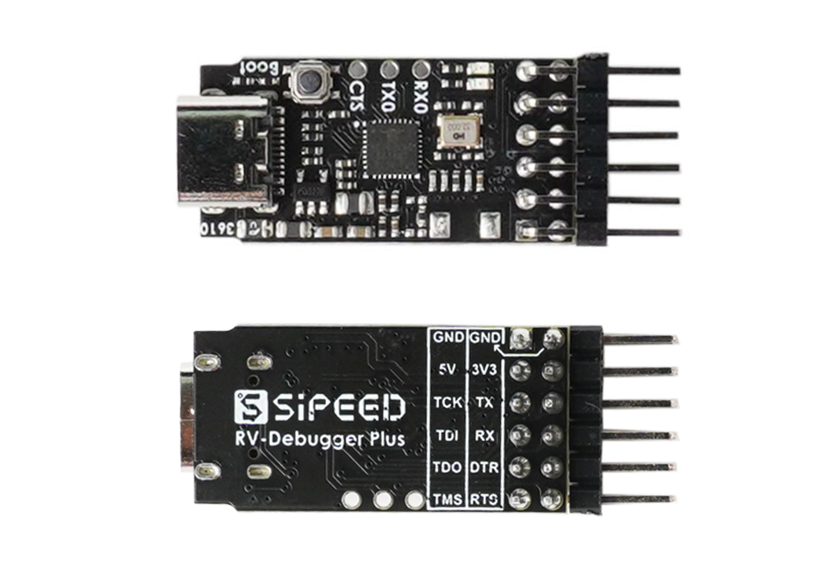
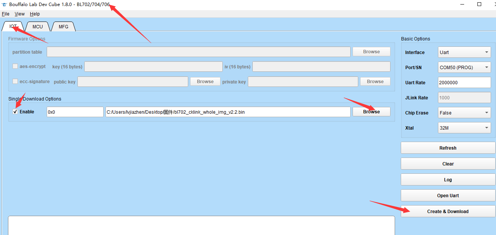

# Bouffalo CKLink

This is the instructions for the cklink firmware used with BL702 or BL616.

## Hardware

## Sipeed RV-Debugger-Plus

- Use BL702C-A0

## Flash download (via BLDevCube)

- Open BL Devcube
- Select IOT UI and select single download
- Load firmware
- Press and hold the boot pin then plug the usb in the computer to go to the boot mode.
- Download

## Flash download (via blisp)

- Download latest blisp [here](https://github.com/pine64/blisp/releases/latest).
- Press and hold the boot pin then plug the usb in the computer to go to the boot mode.
- Execute `blisp iot -c bl70x --reset -s bl702_cklink_whole_img_v2.2.bin -l 0x0`

## CKLink driver

CKLink driver version must be higher than 5.16.0. Download link is here.

- [T-Head-DebugServer-windows-V5.16.5](https://occ-oss-prod.oss-cn-hangzhou.aliyuncs.com/resource//1666331581133/T-Head-DebugServer-windows-V5.16.5-20221021-1018.zip)

- [T-Head-DebugServer-linux-x86_64-V5.16.5](https://occ-oss-prod.oss-cn-hangzhou.aliyuncs.com/resource//1666331533949/T-Head-DebugServer-linux-x86_64-V5.16.5-20221021.sh.tar.gz)

## Debug with Eclipse

See [BL_MCU_SDK DOC](https://bl-mcu-sdk.readthedocs.io/zh_CN/latest/get_started/debug.html)

## Default JTAG Pin

|   CHIP/Pin    |  BL602/BL604  |  BL702/BL704/BL706 | BL616/BL618 |   BL808  |
|:-------------:|:-------------:|:------------------:|:-----------:|:--------:|
|TMS            |     GPIO12    |      GPIO0         |    GPIO0    |   GPIO6  |
|TCK            |     GPIO14    |      GPIO2         |    GPIO1    |   GPIO12 |
|TDO            |     GPIO11    |      GPIO9         |    GPIO2    |   GPIO7  |
|TDI            |     GPIO17    |      GPIO1         |    GPIO3    |   GPIO13 |
